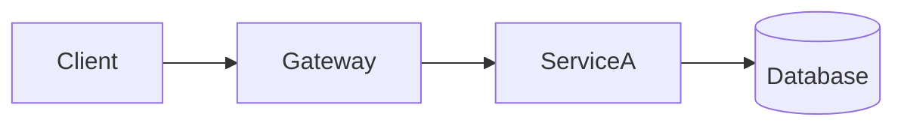

# <Company>: <one-line hook, e.g. "How Uber finds you a driver in under 5 seconds">

> **In 60 seconds:** 3–5 sentence plain-English summary of how the system works end to end.

**Last reviewed:** September 2026 · **Difficulty:** Beginner / Intermediate / Advanced · **Reading time:** ~N min

## Table of contents

- [The problem](#the-problem)
- [Scale](#scale)
- [Requirements](#requirements)
- [How it evolved](#how-it-evolved)
- [High-level design](#high-level-design)
- [Low-level design](#low-level-design)
- [Deep dives](#deep-dives)
- [What happens when things break](#what-happens-when-things-break)
- [Key design decisions](#key-design-decisions)
- [Interview takeaways](#interview-takeaways)
- [Glossary](#glossary)
- [Sources](#sources)

## The problem

Open with a story: one real user action (e.g. "You tap *Request* in Lagos at 6pm on a Friday...") and what has to happen in the next few seconds. End with the 2–3 hard questions this page will answer, so the reader wants to keep going.

## Scale

| Metric | Number | Source |
|---|---|---|
| e.g. Daily active users | ~X M (year) | [1](#sources) |

Only numbers a source states. No guesses. Follow the table with 2–3 sentences on what the numbers *mean* (e.g. "that's N requests every second, more than one server could ever handle").

## Requirements

**Functional:** what users can do (bullets).
**Non-functional:** latency, availability, consistency, scale targets (bullets), each with one line on *why* it matters for this product.

## How it evolved

Timeline (table or `timeline` Mermaid diagram) from the first version to today: what broke at each stage and what they replaced it with. Most companies started simple: show that.

## High-level design

Walk through the diagram step by step (numbered list). Name the real tech the company uses, with a source.

## Low-level design

At least three diagrams, each followed by a step-by-step explanation:

1. **Core flow:** `sequenceDiagram` of the most important request (e.g. "request a ride").
2. **Data model:** `erDiagram` or `classDiagram` of core entities / tables / partition keys, with why the keys were chosen.
3. **Signature component:** the one clever algorithm or piece (geo-index, fan-out, ranking...) with its own diagram.
4. *(more if useful)*: secondary flows, state machines (`stateDiagram-v2`), etc.

## Deep dives

One `###` subsection per major component or technology (3–6 of them). Each covers: what it is, the problem it solved, how it works inside, and what it costs. Use `> **Why this matters:**` callouts and small code/pseudo-code snippets where they help.

## What happens when things break

Failure scenarios (a data center dies, a hot key, a traffic spike, a network split): what the system does and which design choice makes that possible.

## Key design decisions

| Decision | Why | Trade-off |
|---|---|---|

## Interview takeaways

5–8 bullets: patterns from this company you can reuse in a system design interview, and the question each one answers.

## Glossary

Plain-English definitions of every jargon term used above, e.g. **Sharding**: splitting one big database into smaller pieces by some key so each machine holds only part.

## Sources

Numbered list. Prefer the company's own engineering blog, conference talks, papers. Mark anything not from the company as *(third-party)*.
