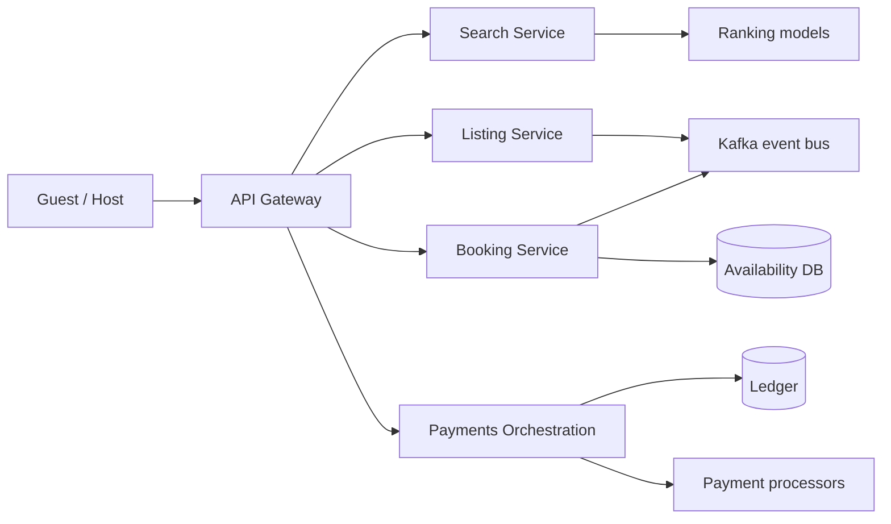

# Airbnb cheat sheet

> Full breakdown: [companies/airbnb.md](../companies/airbnb.md)

## In 60 seconds

Airbnb matches guests searching for a place to stay against millions of host listings, ranks results with a machine-learned model, and then has to get one thing perfectly right under concurrency: never let two guests book the same night on the same listing. A booking touches four systems in sequence — search (find candidates), availability (hold and confirm nights), payments (capture money, then split and pay out the host days later), and a ledger (record who owes what). Airbnb used to run all of this out of one giant Rails app ("Monorail"); as the company and engineering org grew, it split that monolith into hundreds of services organized as a service-oriented architecture (SOA), each owning its own data, talking over Thrift RPC and Kafka events.

## The picture

## Numbers worth remembering

| Metric | Number | Source |
|---|---|---|
| Active listings | ~9M (2025) | [Airbnb Statistics — DemandSage](https://www.demandsage.com/airbnb-statistics/) |
| Nights + Experiences booked | 492M (2024) | [Airbnb Statistics — DemandSage](https://www.demandsage.com/airbnb-statistics/) |
| Payment countries / currencies supported | 191 countries, 70+ currencies | [Scaling Airbnb's Payment Platform](https://medium.com/airbnb-engineering/scaling-airbnbs-payment-platform-43ebfc99b324) |
| Engineers (2015 to 2018) | ~90 to 1,000+ | [Airbnb's Great Migration — QCon SF 2018](https://www.infoq.com/presentations/airbnb-soa-migration/) |
| Services on the SOA IDL framework (2018) | 250+ | [Airbnb's Great Migration — QCon SF 2018](https://www.infoq.com/presentations/airbnb-soa-migration/) |
| Weekly production deploys (before to after SOA) | ~3,000 to ~10,000 | [Airbnb's Great Migration — QCon SF 2018](https://www.infoq.com/presentations/airbnb-soa-migration/) |
| Blocked-deploy time on Monorail (~200 engineers, 2015) | ~15 hours/week average | [Airbnb's Great Migration — QCon SF 2018](https://www.infoq.com/presentations/airbnb-soa-migration/) |

## Signature ideas

- **Hold nights before charging money** — the availability check runs before payment, so nobody gets charged for a stay they can't get.
- **Data-ownership rule in the SOA** — only the owning service writes its own tables; everyone else calls its API.
- **Orpheus idempotency framework (pre-RPC / RPC / post-RPC phases)** — got Airbnb to "five nines" of payment consistency despite external processors that don't support 2PC.
- **Domain-decomposed payments platform (pay-in, payout, ledger, settlement)** — lets country/processor teams ship independently across 191 countries.
- **Two-tower embedding retrieval (IVF over HNSW) + two-stage GBDT-then-DNN ranking** — IVF chosen specifically because it tolerates Airbnb's real-time listing-update rate.
- **Viaduct federated GraphQL** — one schema, but each backend team owns its own module, so ownership stays decentralized even though the query layer is unified.

## If an interviewer asks "design Airbnb"

1. Clarify scope: search/rank listings, guarantee no double-booking, capture guest payment, pay the host out later, across 191 countries.
2. Split reads that can be stale (search) from the one write that can't (availability) — they need different consistency models.
3. Retrieval narrows millions of listings via keyword/geo index plus embedding-based retrieval, then a two-stage ranking model (GBDT then DNN) orders results.
4. In the booking flow, hold the specific night(s) in a strongly-consistent Availability DB before touching payment at all.
5. Only after the hold succeeds, call Payments through an idempotency framework: record intent, call the processor, then record the outcome.
6. Record every money movement in an append-only, double-entry ledger, since payouts land days later, possibly in a different currency, and must be auditable.
7. Decompose payments into pay-in/payout/ledger/settlement subdomains so different countries and processors can ship independently.
8. Call out the SOA discipline underneath it all: data ownership per service, Kafka/CDC for async propagation, so search staleness never breaks booking correctness.

## Common follow-up questions

- **Why can search be stale but availability can't?** A late search result costs a click; a wrong availability answer costs a double-booked room or a charge for nothing.
- **How does hold-before-charge prevent double charges?** If the hold fails, payment never runs, so nobody pays for nights they didn't get.
- **Why domain-decompose payments instead of one payments service?** 191 countries, 70+ currencies, 24+ processor integrations — one team can't ship every country's rules.
- **Why SOA and not "pure" microservices?** Airbnb deliberately kept more shared libraries and coarser boundaries; the invariant that mattered was data ownership, not service size.
- **What replaced SmartStack?** AirMesh, an Istio-based service mesh, migrated in over multiple years.

## Gotchas

- The `CALENDAR_NIGHT` schema/state machine in companies/airbnb.md is a labeled reference design — Airbnb has confirmed calendar data is its own partitioned domain, not the exact schema or locking primitive.
- Airbnb explicitly does not call its architecture "microservices" — it calls it SOA, on purpose, with more shared libraries than pure microservices would use.
- The FX/ledger-adjustment scenario in "what happens when things break" is a reasonable inference from the documented delayed multi-currency payout model, not a confirmed internal mechanic.
- Don't confuse Viaduct (federated GraphQL, 2019+) with the SOA migration itself (2015-2018) — Viaduct exists specifically to fix the integration tax the SOA migration created.
