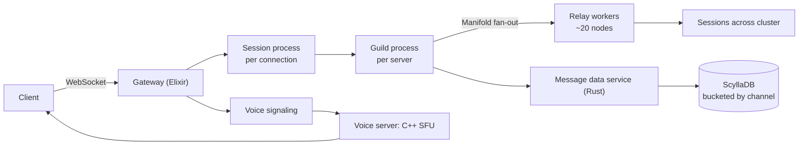

# Discord cheat sheet

> Full breakdown: [companies/discord.md](../companies/discord.md)

## In 60 seconds

Discord's real-time layer runs on Elixir/BEAM: every connected user gets a lightweight session process, every server ("guild") gets its own process that fans messages out to members. Naive fan-out (send to every member directly) falls over past tens of thousands of concurrent members, so Discord built Manifold to route fan-out through a small number of per-node relay workers instead. Messages are persisted by a Rust data tier into ScyllaDB (migrated from Cassandra in 2022 after outgrowing it at 177 nodes). Voice/video rides a completely separate path: a custom C++ Selective Forwarding Unit that relays encrypted media without decoding or mixing it centrally.

## The picture

A guild process never talks to sessions directly — Manifold's relay workers do the actual per-node fan-out.

## Numbers worth remembering

| Metric | Number | Source |
|---|---|---|
| Concurrent users (chat infra) | 5 million (2017) | [Discord Engineering](https://discord.com/blog/how-discord-scaled-elixir-to-5-000-000-concurrent-users) |
| Elixir microservices | 20+, run by a 5-person team (Oct 2020) | [elixir-lang.org](https://elixir-lang.org/blog/2020/10/08/real-time-communication-at-scale-with-elixir-at-discord/) |
| Monthly active users | 200 million+ (2023-2024) | [Business of Apps](https://www.businessofapps.com/data/discord-statistics/) |
| WebSocket events sent/sec | 26 million (Oct 2020) | [elixir-lang.org](https://elixir-lang.org/blog/2020/10/08/real-time-communication-at-scale-with-elixir-at-discord/) |
| ScyllaDB cluster size (post-migration) | 72 nodes, down from 177 on Cassandra | [Discord Engineering](https://discord.com/blog/how-discord-stores-trillions-of-messages) |
| Largest guild (Maxjourney) | 10 million+ members, 1 million+ concurrently online | [Discord Engineering](https://discord.com/blog/maxjourney-pushing-discords-limits-with-a-million-plus-online-users-in-a-single-server) |
| Concurrent voice users | 2.6 million | [Discord Engineering](https://discord.com/blog/how-discord-handles-two-and-half-million-concurrent-voice-users-using-webrtc) |
| Search query latency, p50 | <100ms, down from ~500ms | [Discord Engineering](https://discord.com/blog/how-discord-indexes-trillions-of-messages) |
| March 25, 2026 voice outage | 17% of sessions lost, 3h17m total | [Discord Engineering](https://discord.com/blog/behind-the-scenes-of-the-3-25-26-voice-outage) |

## Signature ideas

- **Manifold hierarchical fan-out:** group recipients by destination node, one send per node — turns an O(members) cost into a small, roughly constant one.
- **Passive vs. active sessions (Maxjourney):** members not looking at a server get a stripped-down stream instead of the full one, cutting fan-out work ~90% for huge guilds.
- **Guild process + session process:** a process per connection *and* a process per unit-of-fan-out (the room), not just per connection.
- **Bucketed partition keys** (`channel_id, bucket, message_id`): keeps database partitions small and evenly loaded regardless of how long a channel has existed.
- **Shard-per-core storage (ScyllaDB):** each CPU core owns its own data slice, isolating a hot partition instead of letting it cascade cluster-wide.
- **Custom SFU + trimmed WebRTC:** forwards encrypted media without decoding it centrally, and skips ICE/full SDP negotiation for lower call-setup overhead.

## If an interviewer asks "design Discord"

1. Clarify scope: text channels inside "guilds" ranging from 3 to 10 million members, plus voice/video and search.
2. Pick the connection model: one process per connection (session) and one process per guild, on an actor-model runtime (Elixir/BEAM) for crash isolation.
3. Name the fan-out problem explicitly: "loop and send to every member" doesn't finish before the next message arrives once a guild is huge — this is the crux of the question.
4. Fix it with node-grouped fan-out (Manifold-style): one send per destination node, then cheap local delivery from there.
5. For the very largest guilds, cut the *number of full-fidelity recipients* (passive/active sessions) rather than only optimizing delivery further.
6. Pick a storage engine for messages: partition by channel + time bucket to avoid hot partitions, and justify why an unsharded store hits a ceiling.
7. Split voice/video onto its own real-time media path (SFU), because it has an opposite scaling shape from text.
8. Cover a failure mode: what happens if a chunk of session-management infrastructure disappears at once (graceful draining, backpressure).

## Common follow-up questions

- *Isn't Manifold just sharding applied to fan-out?* — Yes: group work by a key (destination node) so no single unit does disproportionate work.
- *Why rewrite Read States from Go to Rust instead of tuning the garbage collector?* — A service checked hundreds of thousands of times a second can't tolerate periodic stop-the-world pauses; Rust removes that pause class entirely instead of shrinking it.
- *Why does Discord need its own SFU instead of off-the-shelf WebRTC?* — Off-the-shelf stacks pay for generality (peer discovery, standard negotiation) that a server-relay-only, huge-scale setup doesn't need.
- *Why 40 small Elasticsearch clusters instead of 2 big ones?* — Avoids Lucene's ~2-billion-document-per-index ceiling and shrinks the blast radius of any one node/cluster failure.
- *Why did Read States need its own service instead of living inside message storage?* — It's checked on nearly every connect, send, and read (hundreds of thousands of times/sec) — a completely different access pattern from storing message content.
- *Why does Discord run four different languages (Python, Elixir, Rust, C++) instead of one?* — Each workload has an opposite shape (CRUD vs. millions of long-lived connections vs. a GC-sensitive hot path vs. real-time media), and no single runtime is good at all four.

## Gotchas

- "Just add more nodes" doesn't explain the ScyllaDB move — Cassandra was still scaling fine; the *operational cost* (GC pauses, compaction, on-call load) at 177 nodes was the real trigger.
- Passive sessions are easy to mistake for a caching trick — they're really about cutting the number of full-fidelity recipients, not caching a response.
- The March 2026 outage wasn't one bug — it cascaded through four separate systems (pods, Gateway, voice syncer, call routing) because none had a graceful-degradation plan for "a third of my peers just vanished."
- Manifold and Maxjourney are easy to conflate — Manifold (2017) solved fan-out up to tens of thousands of members; Maxjourney (2022) solved a harder version of the *same* problem two more orders of magnitude later.
- "Passive session" doesn't mean disconnected — the client still holds an open connection, it just receives a stripped-down event stream instead of the full one.

## See also

- [WhatsApp cheat sheet](whatsapp.md) — the process-per-connection pattern Discord's session process builds on, one layer down.
- [Slack cheat sheet](slack.md) — the same "connection tier vs. data tier" split, called Gateway Servers and Channel Servers there.
- [Twitter/X cheat sheet](twitter-x.md) — the same fan-out cost problem, solved with a hybrid push/pull split instead of node-grouped relays.
