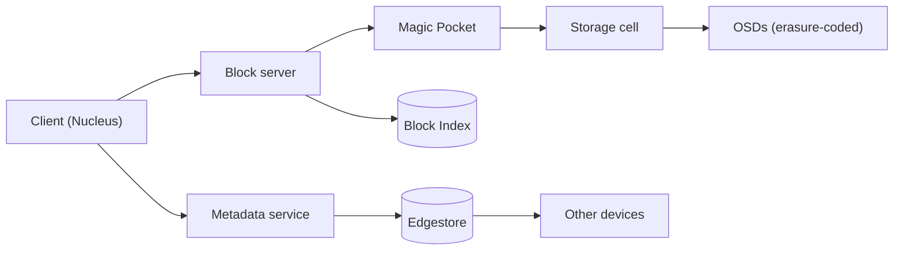

# Dropbox cheat sheet

> Full breakdown: [companies/dropbox.md](../companies/dropbox.md)

## In 60 seconds

When you save a changed file, Dropbox's desktop sync engine — a from-scratch Rust rewrite codenamed **Nucleus** — cuts it into 4MB blocks, fingerprints each with SHA-256, and asks the metadata service which of those fingerprints it has already seen anywhere on the account. Only genuinely new blocks get compressed and sent; everything else becomes a pointer to a block Dropbox already has, whether from an older version of the same file or a completely different user's file. Metadata — names, folders, permissions, revisions — lives in **Edgestore**, a sharded, MySQL-backed store, with a newer system called **Panda** now generalizing its scaling model underneath. The actual file bytes live in **Magic Pocket**, Dropbox's own exabyte-scale block storage system, which replaced most of Dropbox's AWS S3 usage in 2015 and keeps hundreds of thousands of disks worth of data durable using erasure coding instead of paying for two or three full extra copies of everything.

## The picture

## Numbers worth remembering

| Metric | Number | Source |
|---|---|---|
| Magic Pocket storage drives (2023) | 600,000+ | [Magic Pocket: Dropbox's Exabyte-Scale Blob Storage System — QCon Plus](https://www.infoq.com/presentations/magic-pocket-dropbox) |
| Magic Pocket annual durability (2023) | over 12 nines | [Magic Pocket: Dropbox's Exabyte-Scale Blob Storage System — QCon Plus](https://www.infoq.com/presentations/magic-pocket-dropbox) |
| Magic Pocket theoretical durability target | "27 nines" | [Pocket Watch: Verifying exabytes of data](https://dropbox.tech/infrastructure/pocket-watch) |
| Edgestore total throughput (2018) | ~10 million requests/sec | [Cross shard transactions at 10 million requests per second](https://dropbox.tech/infrastructure/cross-shard-transactions-at-10-million-requests-per-second) |
| Content-hash block size | 4MB (4,194,304 bytes) | [Content Hash technical reference — Dropbox API docs](https://docs.dropboxapi.com/dropbox-api/docs/technical-reference/content-hash) |
| Nucleus rewrite duration | ~4-year project (2016 to March 2020) | [Rewriting the heart of our sync engine](https://dropbox.tech/infrastructure/rewriting-the-heart-of-our-sync-engine) |
| Broccoli client compression (2020) | ~30% less upload bandwidth, ~35% lower p50 upload latency | [Broccoli: Syncing faster by syncing less](https://dropbox.tech/infrastructure/-broccoli--syncing-faster-by-syncing-less) |
| Data-center blackhole test (Nov 2021) | 30-minute full outage of the SJC metro, zero global-availability impact | [That time we unplugged a data center to test our disaster readiness](https://dropbox.tech/infrastructure/disaster-readiness-test-failover-blackhole-sjc) |

## Signature ideas

- **Content-addressed block dedupe** (4MB blocks, SHA-256, ask-before-upload) — never send or store the same bytes twice, across users and across versions.
- **Erasure coding (Reed-Solomon 6+3, then LRC-(12,2,2))** instead of full replication — 1.33x-1.5x storage overhead instead of 3x+.
- **Cell-based fleet architecture** — independent 100+PB cells with their own coordinators contain the blast radius of any one failure.
- **Pocket Watch continuous verification** (three separate verifiers) — actively hunts for silent corruption instead of waiting for a customer to notice.
- **Edgestore colos + cross-shard 2PC with copy-on-write staging** — optimizes the common case (your own files) for free strong consistency.
- **Nucleus's three-tree sync model in Rust** — encodes sync invariants as enums the compiler forces you to handle, closing off a whole class of data-loss bugs.

## If an interviewer asks "design Dropbox"

1. Clarify scope: sync files across devices, move minimal bytes per change, keep revision history, never silently lose an edit on conflict, exabyte-scale durability.
2. Split the problem in two: a metadata system (names, folders, permissions, revisions) and a completely separate blob store for file bytes.
3. On save, the client splits the file into fixed-size blocks, hashes each one, and asks the server which hashes it already has — only new blocks get uploaded.
4. New blocks land in an object/blob store; group them into large volumes so per-block metadata doesn't itself become a metadata-scale problem.
5. Once a volume is full, close it (immutable) and erasure-code it into data-plus-parity fragments spread across many storage nodes.
6. Run continuous, active verification against stored fragments, not just alerts on hardware failure, so silent corruption is caught before it's unrecoverable.
7. Push change notifications to other devices instead of polling, and keep metadata strongly consistent — it's the one place staleness isn't acceptable — while search/other reads can lag.
8. Handle conflicting concurrent edits by keeping both copies and renaming the loser — never silently discard a user's edit.

## Common follow-up questions

- **Why fixed-size blocks instead of content-defined chunking?** Simple and fully deterministic, but a small insert near the start of a file shifts every later block boundary and silently breaks dedupe until a re-chunk.
- **Why erasure coding instead of just replicating three times?** Comparable durability at 1.33x-1.5x storage overhead instead of 3x+, at the cost of CPU/network to rebuild a lost fragment.
- **Why does Dropbox need active verification if erasure coding already provides durability?** Erasure coding only helps if you notice a fragment is missing before you lose too many at once; some corruption is silent and trips no alarm.
- **Why is Edgestore active-passive across regions while Magic Pocket is active-active?** Strong-consistency-by-default plus async cross-region replication means two regions can't safely accept conflicting metadata writes at once; blobs don't have that constraint.
- **Why rewrite the sync engine from scratch (Nucleus) instead of patching it?** The old engine's bugs (weak move semantics, thread/lock races) were structural properties of its data model, not isolated bugs.

## Gotchas

- The metadata ER diagram in companies/dropbox.md collapses two real, separate systems (a dedicated Filesystem service and the more generic Edgestore) into one simplified schema — don't cite it as Dropbox's literal table layout.
- Dropbox's blocks are fixed-size, not content-defined chunks — nothing in their public engineering blog indicates they've adopted content-defined chunking.
- "27 nines" is a theoretical verification-design target from 2016, not a currently-claimed durability figure — the 2023 QCon talk cites "over 12 nines" as the actual annual durability number.
- Magic Pocket's "bucket"/"volume" terminology has nothing to do with an S3 bucket — it's Dropbox's own aggregation unit (1-2GB of blocks).
