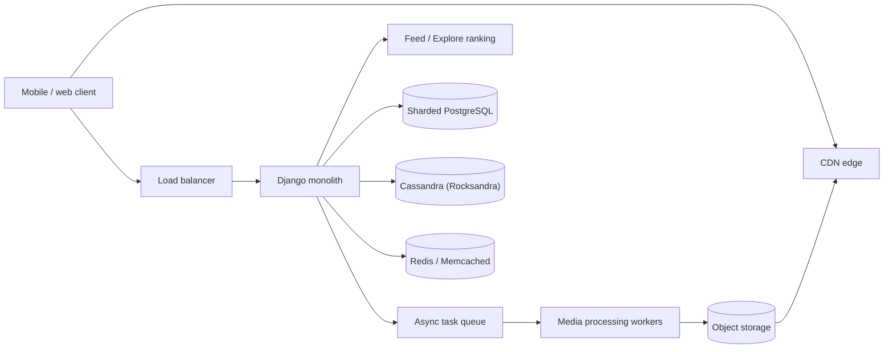

# Instagram cheat sheet

> Full breakdown: [companies/instagram.md](../companies/instagram.md)

## In 60 seconds

Instagram started in 2010 as a single Django + PostgreSQL box and grew into a Django monolith with millions of lines of code serving over a billion users, deployed 30-50 times a day. Unique IDs are minted independently inside thousands of sharded PostgreSQL schemas using a scheme conceptually like Twitter's Snowflake, but implemented with plain PL/pgSQL instead of a separate ID service. Feed, Stories, Reels, comments, and notifications are each ranked by one of 1,000+ machine-learning models running in a multi-stage retrieval-then-ranking funnel. Write-heavy social data (activity, feed edges) lives in Apache Cassandra, whose storage engine Instagram rebuilt on RocksDB ("Rocksandra") to cut tail latency 3x. Photos are stored in object storage and served through a CDN, entirely off Instagram's application servers.

## The picture

## Numbers worth remembering

| Metric | Number | Source |
|---|---|---|
| Photo/like write rate, 2011 | ~25 photos/sec, ~90 likes/sec | [Sharding & IDs at Instagram](https://medium.com/instagram-engineering/sharding-ids-at-instagram-1cf5a71e5a5c) |
| Deploys per day, 2016 | 30-50 deploys/day across thousands of machines | [Continuous Deployment at Instagram](https://www.infoq.com/news/2016/04/continuous-deployment-instagram) |
| Photos moved off AWS, 2014 | 20 billion+ photos migrated to Facebook's own data centers | [Instagram moves 20 billion images](https://siliconangle.com/2014/06/30/instagram-migrates-20-billion-images-shifted-to-facebooks-servers/) |
| Cassandra tail latency, before/after Rocksandra | P99 read latency ~60ms -> ~20ms (3x reduction) | [Open-sourcing a 10x reduction in Cassandra tail latency](https://medium.com/instagram-engineering/open-sourcing-a-10x-reduction-in-apache-cassandra-tail-latency-d64f86b43589) |
| ML models in production, 2025 | 1,000+ models across Feed, Stories, Reels, comments, notifications | [Journey to 1000 models](https://engineering.fb.com/2025/05/21/production-engineering/journey-to-1000-models-scaling-instagrams-recommendation-system/) |
| Explore candidate-to-shown ratio, 2023 | billions of candidate posts narrowed to the ~100 best that the heavy second-stage model scores | [Scaling Instagram Explore recommendations](https://engineering.fb.com/2023/08/09/ml-applications/scaling-instagram-explore-recommendations-system/) |
| Explore scale, 2019 | ~65 billion features evaluated, ~90 million predictions/sec | [Powered by AI: Instagram's Explore recommender](https://ai.meta.com/blog/powered-by-ai-instagrams-explore-recommender-system/) |

## Signature ideas

- **Sharded PL/pgSQL ID scheme** — encode timestamp + shard ID + local sequence directly in the ID, so no shard ever coordinates with another to mint one.
- **Retrieval-then-ranking funnel** — spend cheap compute on billions of candidates, expensive compute on the ~100 that survive, instead of one model scoring everything.
- **Stay a monolith, invest in tooling** — canary deploys plus static analysis let hundreds of engineers ship into one Django codebase daily instead of splitting into microservices.
- **Rocksandra** — swap Cassandra's JVM storage engine for RocksDB (C++, no GC pauses) while keeping its distributed-systems layer, cutting P99 read latency 3x.
- **Model Registry + calibration/normalized-entropy monitoring** — automatically flag any of 1,000+ models the moment it silently degrades, instead of waiting for a human to notice.
- **Media bytes never touch the app database** — only a pointer is stored; slow work (cross-posting, notifications, fan-out) happens asynchronously off the upload request.

## If an interviewer asks "design Instagram"

1. Clarify scope: upload photo/video, generate a ranked Feed/Stories/Reels/Explore, support the social graph (follow/like/comment), notify.
2. Mint unique IDs at write time inside each database shard (timestamp + shard + sequence bits) so no shard ever needs to coordinate with another.
3. Keep post/user metadata in sharded PostgreSQL; keep high-write, high-fan-out data (activity/feed events) in Cassandra instead.
4. On upload, write raw media to object storage and enqueue async work (fan-out, cross-posting, notifications) so the request returns fast.
5. On feed load, run candidates through a staged funnel: cheap retrieval over billions, then progressively heavier ranking on a shrinking shortlist.
6. Cache aggressively (Redis/Memcached) in front of both stores, since reads vastly outnumber writes.
7. Deploy continuously via canary (a small slice of servers first, then fleet-wide) instead of coordinating one big release train across a monolith.
8. Track every ranking model's health automatically (calibration, normalized entropy) so a silent regression gets caught without a human watching a dashboard.

## Common follow-up questions

- **Why not a central ID service (like Snowflake)?** Wanted the same collision-free property without operating a whole new distributed service — a function inside Postgres they already ran was cheaper.
- **Why did Instagram stay a monolith instead of going microservices?** No forcing function ever made a single service the bottleneck; canary deploys and static analysis scaled the *tooling*, not the service count.
- **Why swap Cassandra's storage engine (Rocksandra) instead of replacing Cassandra entirely?** The distributed-systems layer (replication, gossip) was fine — only the JVM-based storage engine's GC pauses were the problem.
- **Why account embeddings (ig2vec) instead of a content taxonomy for Explore?** Real interest communities don't fit a maintainable, ever-evolving label system; embeddings sidestep needing one.
- **How do you keep 1,000+ ranking models from silently rotting?** Track calibration and normalized entropy per model, flag automatically, and roll out every change gradually with traffic-shifting instead of a single cutover.

## Gotchas

- "Rocksandra" swaps the storage engine only — Cassandra's replication/gossip/query layer is unchanged; don't describe it as "replacing Cassandra."
- The exact current media-storage internals (post-2014) aren't publicly confirmed — Haystack is a plausible architectural analog, not a confirmed fact.
- The sharded ID scheme's timestamp bits make IDs only "roughly" sortable, not exactly — uniqueness comes from the shard + sequence bits, not the clock.
- Several 2014-migration and pre-2016 ranking-impact details are third-party-sourced, not Instagram's own engineering blog — don't cite them as primary-sourced facts.
