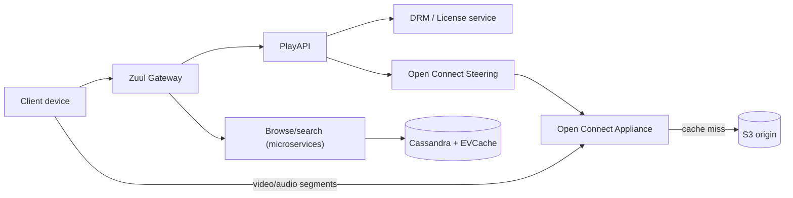

# Netflix cheat sheet

> Full breakdown: [companies/netflix.md](../companies/netflix.md)

## In 60 seconds

Netflix runs two systems that barely talk to each other. A control plane on AWS runs thousands of microservices behind Zuul (the gateway) that handle login, browsing, recommendations, and the "what to play and where from" decision (PlayAPI). A data plane called Open Connect is Netflix's own CDN: physical appliances racked for free inside ISP networks worldwide, pre-loaded overnight with the catalog those ISPs' users actually watch. On play, AWS authenticates the request, picks a manifest (available bitrates), and hands back a ranked list of nearby Open Connect Appliances (OCAs); video bytes then flow from inside the ISP's own network, never touching AWS. Each title is encoded many times at different quality/bitrate points — increasingly per-shot, not just per-title — so the bitrate ladder matches how visually complex that content actually is. This split, plus deliberately breaking things in production on purpose (chaos engineering), is how "press play" survives bad wifi, a dead cache box, or a whole AWS region disappearing.

## The picture

## Numbers worth remembering

| Metric | Number | Source |
|---|---|---|
| Paid memberships | ~341.5M (Q1 2026) (unverified — letter states no count) | [Q1 2026 Shareholder Letter](https://s22.q4cdn.com/959853165/files/doc_financials/2026/q1/FINAL-Q1-26-Shareholder-Letter.pdf) |
| Share of global internet traffic | ~15% (2022 data, Sandvine report Jan 2023) | [AppLogic Networks / Sandvine](https://www.applogicnetworks.com/inthenews/netflix-is-responsible-for-15-of-global-internet-traffic-consumption) |
| Open Connect footprint | 8,000+ appliances, 1,000+ ISP partners, 50+ internet exchange points | [Wikipedia: Open Connect](https://en.wikipedia.org/wiki/Open_Connect) |
| Storage Appliance specs | up to 120TB storage, ~200Gbps, ~400W | [Netflix Open Connect appliances](https://openconnect.netflix.com/en/appliances/) |
| Traffic delivered via direct ISP connections | ~95% globally (2018) | [APNIC blog](https://blog.apnic.net/2018/06/20/netflix-content-distribution-through-open-connect/) |
| Per-title encoding gain | ~20% average bitrate reduction vs. one fixed ladder (2015) | [Per-Title Encode Optimization](http://techblog.netflix.com/2015/12/per-title-encode-optimization.html) |
| Peak concurrent viewers, single live event | 65 million (Tyson vs. Paul, Nov 2024) | [Wikipedia: Mike Tyson vs. Jake Paul](https://en.wikipedia.org/wiki/Mike_Tyson_vs._Jake_Paul) |

## Signature ideas

- **Open Connect (own CDN)** — physical appliances racked free inside ISPs, proactively filled ahead of demand so most requests never leave the ISP's own network.
- **Control plane / data plane split** — AWS decides "can and what you can watch"; Open Connect just moves bytes, so a region loss barely touches streams already playing.
- **Per-title, then shot-based, encoding** — tailor the bitrate ladder to each title's, then each individual shot's, actual visual complexity instead of one fixed ladder for the catalog.
- **PlayAPI prioritized load shedding** — under overload, a real user-initiated play request beats a speculative prefetch guess.
- **Chaos engineering (Chaos Monkey/Kong)** — deliberately kill instances and simulate losing a whole AWS region in production, on purpose, so resilience is verified, not assumed.
- **Client-side adaptive bitrate** — the server hands over a manifest plus a ranked server list; the player decides quality moment-to-moment, keeping server and CDN stateless.

## If an interviewer asks "design Netflix"

1. Clarify scope: browse/search/recommend, authorize and DRM-license playback, stream adaptively, survive regional failure.
2. Split into a control plane (AWS: auth, catalog, recommendations, DRM/manifest) and a data plane (Open Connect: just serves bytes).
3. On press-play, PlayAPI resolves license and manifest first, then asks the steering service for a ranked list of nearby, healthy Open Connect Appliances.
4. Client fetches segments directly from an OCA from then on — AWS is out of the data path for the rest of the session.
5. Encode each title (and each shot within it) into a bitrate ladder tuned to its own complexity, so adaptive streaming has fine-grained quality options.
6. Client-side ABR logic picks and switches quality per segment from its own measured bandwidth — server and CDN stay stateless.
7. Under overload, shed speculative prefetch requests before real user-initiated play requests.
8. Continuously rehearse failure (kill instances, simulate a full region loss) instead of only designing for it on paper.

## Common follow-up questions

- **Why build your own CDN instead of paying Akamai/Limelight?** Volume made it cheaper and gave control over the actual network path; a forecasted, proactive cache also hits far higher offload than a reactive one.
- **Why does license/manifest resolution happen before steering?** Little point picking the closest server for a request that's about to be rejected because the account isn't entitled to watch.
- **Why keep quality decisions on the client, not the server?** The server can't see real-time bandwidth; keeping it stateless also keeps every cache in front of it fully cacheable.
- **What happens to an already-playing stream during an AWS region outage?** Nothing — it already has a manifest and a ranked OCA list and doesn't need AWS again mid-segment.
- **Why shot-based over per-title encoding?** Complexity varies scene to scene within one title, not just between titles — a talking-head scene doesn't need action-scene bitrate.

## Gotchas

- Don't call Open Connect "just a CDN" — the defining trait is proactive, forecast-based prepositioning, not reactive caching on request.
- The exact steering weighting (proximity vs. load vs. content availability) isn't publicly documented — don't state a formula as confirmed.
- Chaos Kong tests the AWS control plane's region-loss recovery; Open Connect (already-playing streams) is largely insulated from a region loss already — don't conflate the two.
- "~95% of traffic via direct ISP connections" is a 2018 figure — don't present it as today's exact number.
