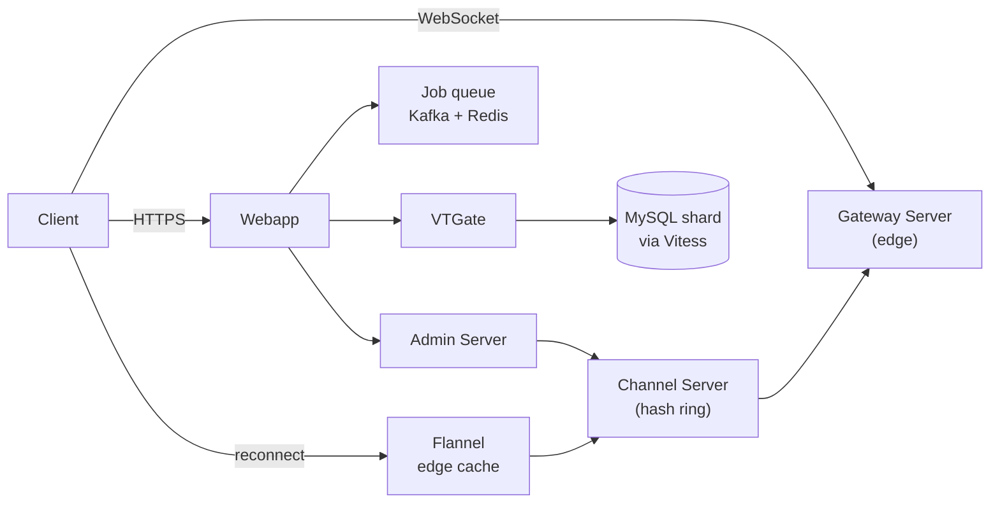

# Slack cheat sheet

> Full breakdown: [companies/slack.md](../companies/slack.md)

## In 60 seconds

Slack splits its real-time layer into Channel Servers (own a slice of channels and hold their recent history in memory, found via consistent hashing) and Gateway Servers (deployed at the edge, hold each client's WebSocket and channel subscriptions). A posted message flows client -> Webapp -> Admin Server -> the right Channel Server -> every subscribed Gateway Server -> client sockets, landing worldwide within ~500ms. Underneath, Slack ran MySQL sharded by workspace for years, then spent ~3 years migrating onto Vitess so it could reshard by *channel* instead, because a few huge customers each outgrew one shard's hardware. An edge cache called Flannel serves new/reconnecting clients a slimmed-down snapshot instead of a full reload, and a Kafka-backed job queue handles anything that shouldn't block a web request.

## The picture

Channel Servers only ever talk to Gateway Servers, never individual sockets — that's what lets connection count scale independently of channel count.

## Numbers worth remembering

| Metric | Number | Source |
|---|---|---|
| Peak Vitess query load | 2.3 million QPS (2M reads + 300K writes) | [Slack Engineering](https://slack.engineering/scaling-datastores-at-slack-with-vitess/) |
| Largest documented customers | 160,000+ active users, 5,000+ shared channels (2019) | [Slack Engineering](https://slack.engineering/how-slack-built-shared-channels/) |
| Vitess median / p99 latency | 2ms / 11ms | [Slack Engineering](https://slack.engineering/scaling-datastores-at-slack-with-vitess/) |
| Job queue volume | 1.4 billion jobs/day, peak 33,000/sec | [Slack Engineering](https://slack.engineering/scaling-slacks-job-queue/) |
| Flannel peak connections | 4 million simultaneous | [Slack Engineering](https://slack.engineering/flannel-an-application-level-edge-cache-to-make-slack-scale/) |
| Flannel data-size reduction | 7x (1.5K-user team) to 44x (32K-user team) | [Slack Engineering](https://slack.engineering/flannel-an-application-level-edge-cache-to-make-slack-scale/) |
| Channel Server failover time | new host serving in under 20 seconds | [Slack Engineering](https://slack.engineering/real-time-messaging/) |
| Global message delivery latency | worldwide within 500ms | [Slack Engineering](https://slack.engineering/real-time-messaging/) |
| Jan 4, 2021 outage duration | ~4 hours (6:57–10:40 AM PST) | [Slack Engineering](https://slack.engineering/slacks-outage-on-january-4th-2021/) |

## Signature ideas

- **Channel Servers vs. Gateway Servers:** split "storage of truth" (central) from "edge connections" (near users) so each scales independently.
- **Consistent hashing + CHARM:** losing one Channel Server only reassigns its slice of channels, and a replacement serves traffic within 20 seconds.
- **Flannel edge cache:** serves a slimmed-down team snapshot to new/reconnecting clients instead of a full reload, absorbing reconnect storms before they hit the core.
- **Vitess resharding by channel, not workspace:** fixes a sharding key that stopped working once a handful of customers each outgrew one shard's hardware.
- **Kafka-backed job queue (Kafkagate + JQRelay):** turns "processing falls behind" into a recoverable backlog instead of a Redis-out-of-memory outage.
- **Shared Channels as single-copy-plus-bridge-table:** avoids duplicating a channel's data across two organizations' shards.

## If an interviewer asks "design Slack"

1. Clarify scope: real-time messaging + presence + search, across workspaces from a handful of people to 160,000+.
2. State the non-functionals: ~500ms global delivery, no noisy-neighbor workspace, elastic per-customer scaling, fast failover for stateful servers.
3. Split connection-holding from data-ownership: Gateway Servers at the edge hold sockets; Channel Servers centrally own a slice of channels via consistent hashing.
4. Walk the write path: client -> Webapp -> Admin Server -> Channel Server (hashed) -> fan out to subscribed Gateway Servers -> client sockets.
5. Justify consistent hashing for Channel Server placement: only a small slice of channels moves when a node changes, enabling fast automated failover.
6. Address the reconnect-storm problem separately with an edge cache (Flannel) serving a smaller snapshot, not the full team data.
7. Pick a sharding strategy for the database layer that isn't fixed to one dimension (Vitess resharding by channel, not just workspace).
8. Move anything non-blocking (search indexing, notifications, billing) to an async, durable job queue.

## Common follow-up questions

- *Why keep MySQL instead of a NoSQL/NewSQL database?* — Vitess kept MySQL's operational familiarity and transactional semantics while adding the sharding flexibility Slack actually needed.
- *Isn't Flannel just a cache?* — No: it actively stays current via its own live subscription and serves a genuinely smaller payload, not a passive TTL-based cache of the same response.
- *Why did a healthy, well-architected Vitess fleet still go down in Oct 2022?* — A single badly-scoped background job (querying all channels instead of a scoped subset) overloaded one shard — infrastructure scalability and query discipline are separate concerns.
- *What actually caused the Jan 2021 outage?* — An AWS Transit Gateway saturation (network layer), made dramatically worse by autoscaling misreading "network-starved" as "safe to remove capacity."
- *If Channel Servers hold state in memory, isn't that a scary single point of failure?* — Only without consistent hashing and CHARM's fast automated replacement; in-memory state is fine as long as losing it is cheap to recover from.
- *How does Shared Channels avoid duplicating a channel's data across two companies?* — It keeps one copy in the originating workspace and connects the second workspace through a lightweight bridge table instead.

## Gotchas

- People assume "in-memory, stateful server" automatically means fragile — it's fine as long as losing one is fast and cheap to recover from (consistent hashing + CHARM).
- The Jan 2021 outage is often summarized as "Slack went down" when the real story is automated systems (autoscaling, monitoring) reacting badly to a network problem one layer below them.
- A sharding key that was a perfectly reasonable choice at launch (workspace ID) became the constraint years later — the fix was a more flexible sharding layer, not "shard harder" with the same key.
- Search relevance at Slack is a genuinely different problem from web search — no spam to filter, tiny per-team corpora, and every user searches a unique document set.
- Unified Grid (2024) and Shared Channels (2019) are easy to confuse — one connects workspaces *within* one organization, the other connects two *separate* organizations' workspaces.

## See also

- [WhatsApp cheat sheet](whatsapp.md) — the process-per-connection idea Slack's Gateway/Channel Server split is built on.
- [Discord cheat sheet](discord.md) — the same connection-vs-data split, called sessions/guilds and Manifold fan-out there.
- [Twitter/X cheat sheet](twitter-x.md) — a different sharding-key crisis (workspace ID vs. an auto-increment counter), same lesson: the key you launch with isn't the key you keep.
