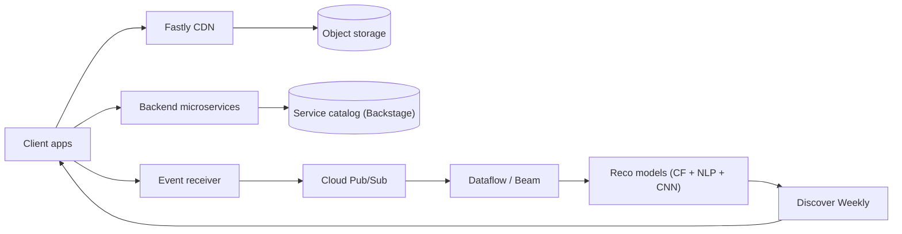

# Spotify cheat sheet

> Full breakdown: [companies/spotify.md](../companies/spotify.md)

## In 60 seconds

Spotify streams pre-encoded, chunked audio from CDN edge caches (standardized on Fastly in 2020), so a phone on bad mobile data still starts playback fast. Behind that sits thousands of independent microservices owned by autonomous "squads," cataloged through **Backstage** — an internal developer portal Spotify built after engineers could no longer find who owned what, later donated to the CNCF. Every user action (play, skip, search) becomes an event pushed through a cloud pipeline — self-hosted Kafka until 2017, then Google Cloud Pub/Sub and Dataflow — feeding data warehouses and ML feature stores. **Discover Weekly** blends three independently trained models (collaborative filtering, NLP, and an audio CNN) into one playlist per user, recomputed every Monday. All of it runs on Google Cloud Platform, which Spotify moved onto entirely between 2016 and 2018 rather than keep running its own data centers.

## The picture

## Numbers worth remembering

| Metric | Number | Source |
|---|---|---|
| Monthly active users | 777M (Q2 2026) | [Spotify Form 6-K, Q2 2026](https://www.sec.gov/Archives/edgar/data/0001639920/000162828026052543/spot-20260630x6xk.htm) |
| Premium subscribers | 300M (Q2 2026) | [Spotify Form 6-K, Q2 2026](https://www.sec.gov/Archives/edgar/data/0001639920/000162828026052543/spot-20260630x6xk.htm) |
| Event delivery throughput, GCP era | ~8M events/sec peak, 500B+ events/day | [Spotify's Event Delivery – Life in the Cloud](https://engineering.atspotify.com/2019/11/spotifys-event-delivery-life-in-the-cloud) |
| Distinct event types on the pipeline | 500-600+ | [Changing the Wheels on a Moving Bus](https://engineering.atspotify.com/2021/10/changing-the-wheels-on-a-moving-bus-spotify-event-delivery-migration) |
| Onboarding time reduction from Backstage | ~55% decrease | [How We Use Backstage at Spotify](https://engineering.atspotify.com/2020/04/how-we-use-backstage-at-spotify) |
| Services/data moved to GCP | 2,000+ services, 100+ PB stored data | [Views From The Cloud, Part 1](https://engineering.atspotify.com/2019/12/views-from-the-cloud-a-history-of-spotifys-journey-to-the-cloud-part-1-2) |
| Discover Weekly early adoption | ~100M active users at launch (2015), ~40M dedicated listeners within a year | [The Little Hack That Could — IEEE Spectrum](https://spectrum.ieee.org/amp/the-little-hack-that-could-the-story-of-spotifys-discover-weekly-recommendation-engine-2650274671) |
| CDN squad adoption | 60+ squads, 80+ services routed through Fastly (Feb 2020) | [How Spotify Aligned CDN Services](https://engineering.atspotify.com/2020/02/how-spotify-aligned-cdn-services-for-a-lightning-fast-streaming-experience) |

## Signature ideas

- **Pre-encode + chunk audio at ingest, cache at CDN edge** — makes range requests and adaptive bitrate simple; solves fast playback start on any network.
- **Backstage service catalog** — solves "who owns this" once you're past thousands of services and hundreds of autonomous teams.
- **Per-event-type isolated pipelines ("liveness over lateness")** — one broken event type can't block delivery of the other 500+.
- **Three-model recommendation blend (CF + NLP + audio CNN)** — covers collaborative filtering's blind spot for brand-new, low-play tracks.
- **Squads/tribes/chapters/guilds org model** — matches org structure to independently-owned microservices so "who owns this" has one answer.
- **Lift-and-shift GCP migration** — moved services as-is, let data pipelines rewrite freely, to avoid destabilizing live streaming mid-migration.

## If an interviewer asks "design Spotify"

1. Clarify scope: on-demand audio streaming, search/playlists, personalized recommendations, at global scale.
2. Split delivery from control: audio bytes go through a CDN backed by object storage; everything else goes through backend microservices.
3. Pre-encode tracks into multiple bitrate tiers at ingest time so playback adapts via range requests instead of live transcoding.
4. Emit a client event for every meaningful action, asynchronously and off the playback critical path, so analytics degradation never blocks a song from playing.
5. Route each event type into its own topic/pipeline/SLO tier so one broken event type can't block the rest.
6. Feed processed listening data into independently-trained recommendation models, blended into per-user playlists like Discover Weekly.
7. Catalog every service, pipeline, and owner centrally (Backstage) so a large, decentralized microservice fleet stays navigable.
8. Call out the reliability trade-off: keep a simpler fallback path alive alongside a more sophisticated one, and roll config/code changes out region-by-region, not globally at once.

## Common follow-up questions

- **Why isolate event pipelines per type instead of one shared pipeline?** "Liveness over lateness" — a stuck event type shouldn't block the other 500+.
- **Why does Spotify need a service catalog at all?** Past thousands of services and hundreds of squads, nobody can just "ask around" for an owner.
- **Why three separate recommendation models instead of one?** Collaborative filtering has no signal for brand-new or low-play tracks; NLP and audio cover that gap.
- **What actually caused the 2022/2023/2025 outages?** A shared low-level dependency (service discovery, DNS/config loading, an all-region proxy rollout) turning "unrelated" systems into single points of failure.
- **Why move off self-hosted Kafka to Cloud Pub/Sub?** Kafka 0.7 had no broker replication, leaving HDFS as the only durability layer — a known single point of failure.

## Gotchas

- The ER diagram / schema in companies/spotify.md is a labeled reference design, not published Spotify internals.
- The hot-partition/Cassandra failure scenario on the page is explicitly labeled a reference design, not a documented Spotify incident.
- "The Spotify model" (squads/tribes/chapters/guilds) was documented practice from 2012, not a framework Spotify claims to have invented — Kniberg wrote a follow-up disclaiming that.
- Backstage was open-sourced and donated to the CNCF in 2020 — it's not an internal-only Spotify tool anymore.
