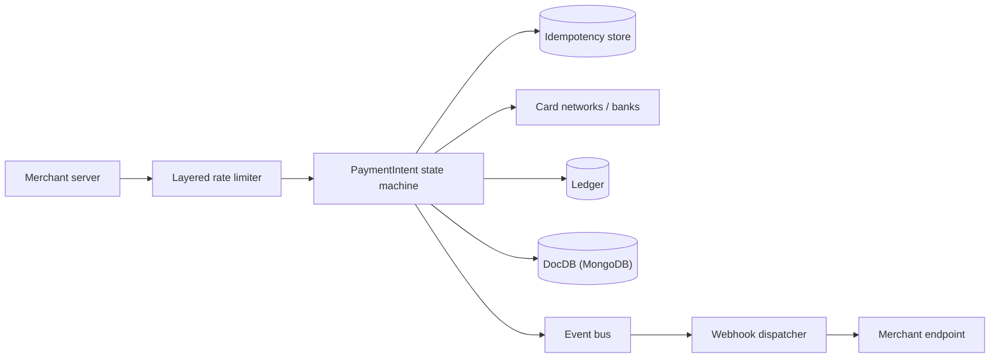

# Stripe cheat sheet

> Full breakdown: [companies/stripe.md](../companies/stripe.md)

## In 60 seconds

Stripe is an API that lets a business accept and move money without becoming a payments company itself. A merchant creates a `PaymentIntent` describing an amount and currency; Stripe drives it through a state machine that talks to card networks and banks, records the money movement in an internal double-entry ledger, and tells the merchant what happened over a signed webhook. Every mutating request carries a client-generated idempotency key so retries — a flaky network, a double-tapped "Pay" button, Stripe's own internal retries — never create a second charge. Underneath, a layered rate limiter protects the shared API fleet from any one caller, and a custom document-database layer (DocDB, built on MongoDB) stores product data at millions of queries per second across thousands of shards, with zero-downtime migrations keeping it that way as Stripe grows.

## The picture

## Numbers worth remembering

| Metric | Number | Source |
|---|---|---|
| Total payment volume processed | ~$1.4 trillion (2024) | [Stripe's Docdb: Zero-Downtime Data Movement — QCon SF 2025 (InfoQ)](https://www.infoq.com/presentations/docdb-online-database/) |
| Core datastore (DocDB) uptime | 99.999% (2023) | [How Stripe's document databases supported 99.999% uptime](https://stripe.dev/blog/how-stripes-document-databases-supported-99.999-uptime-with-zero-downtime-data-migrations) |
| DocDB query throughput | 5 million+ queries/sec | [How Stripe's document databases supported 99.999% uptime](https://stripe.dev/blog/how-stripes-document-databases-supported-99.999-uptime-with-zero-downtime-data-migrations) |
| Ledger event volume | 5 billion events/day | [Ledger: Stripe's system for tracking and validating money movement](https://stripe.dev/blog/ledger-stripe-system-for-tracking-and-validating-money-movement) |
| Global API rate limit | 100 requests/sec live mode per account | [Rate limits — Stripe docs](https://docs.stripe.com/rate-limits) |
| Idempotency key retention | keys removable after ≥24 hours | [Idempotent requests — Stripe docs](https://docs.stripe.com/api/idempotent_requests) |
| Webhook automatic retry window | up to 3 days, exponential backoff (live mode) | [Receive Stripe events in your webhook endpoint](https://docs.stripe.com/webhooks) |
| DocDB footprint | 2,000+ shards, 5,000+ collections | [How Stripe's document databases supported 99.999% uptime](https://stripe.dev/blog/how-stripes-document-databases-supported-99.999-uptime-with-zero-downtime-data-migrations) |

## Signature ideas

- **Idempotency keys with locked/cached first-response replay** — makes retrying a non-idempotent charge safe by construction.
- **PaymentIntent as an explicit multi-state machine** — replaces one-shot Charges, so a payment can pause for 3D Secure/SCA and resume later.
- **Immutable double-entry Ledger as the system of truth** — the database is a cache of current state; the append-only log is what actually happened.
- **Four layered rate limiters** (token bucket, concurrency cap, fleet shedder, worker shedder) — each catches what the previous layer let through.
- **DocDB: custom proxy + routing-metadata layer over MongoDB, version-gated cutovers** — zero-downtime resharding at trillion-dollar scale.
- **Webhooks: signed, at-least-once, explicitly unordered** — pushes dedupe-by-ID onto merchants instead of promising a guarantee that's expensive to keep.

## If an interviewer asks "design a payments API like Stripe"

1. Clarify scope: accept payment across many methods/currencies/countries, guarantee retries never double-charge, prove money moved, notify merchants asynchronously, protect a shared API fleet.
2. Require an idempotency key on every mutating request; check the key store before running any business logic, and cache-and-replay the first response.
3. Model a payment as an explicit state machine, not one boolean, so it can pause mid-flow for an extra step (3D Secure) and resume later.
4. Wrap every outbound call to an external processor with its own idempotency key too — the same pattern recurses one layer down (reference design; unverified for Stripe).
5. Write every money movement as an immutable, balanced, double-entry ledger entry — never mutate a balance in place.
6. Put a layered rate limiter in front of business logic: per-account token bucket, then concurrency cap, then fleet-wide and incident-priority shedders.
7. Notify merchants asynchronously via signed webhooks, at-least-once and unordered, and make merchants acknowledge fast, then process later.
8. Scale the underlying datastore horizontally with zero downtime, using a proxy plus routing-metadata layer and version-gated cutovers instead of a maintenance window.

## Common follow-up questions

- **Why doesn't a `500` necessarily mean "nothing happened"?** Stripe documents it as genuinely indeterminate; engineers reconcile after the fact and roll state forward or back to match what the network shows.
- **Why four rate limiters instead of one?** Each catches a different failure mode: sustained overuse, a few expensive slow requests, fleet-wide capacity crunch, and incident-time priority shedding.
- **Why is Ledger append-only instead of a mutable balances table?** Auditability — any historical state must be reconstructable and provably correct across independently-operated producer systems.
- **Why isn't webhook delivery ordered or exactly-once?** Guaranteeing that across the open internet and many independent internal systems is prohibitively complex; dedupe-by-ID is cheap and good enough.
- **Why build DocDB instead of just using MongoDB Atlas?** Atlas didn't exist when Stripe adopted MongoDB in 2011, and DocDB's custom proxy enforces access control and query-shape limits raw MongoDB doesn't.

## Gotchas

- The idempotency-key "locking" mechanics in the low-level design are a reference implementation from a named third-party engineer, not Stripe's confirmed literal schema.
- The Ledger/BalanceTransaction ER diagram is a reasonable reference design built around Stripe's public `BalanceTransaction` object, not the literal internal tables.
- Charges still exist today, but only as an implementation detail behind PaymentIntents, kept for backward compatibility — don't present Charges as removed.
- Rate limiting has two different mechanisms that look similar: the per-second/concurrency limiters, and a separate 30-day rolling read quota measured against transaction volume — don't conflate them.
