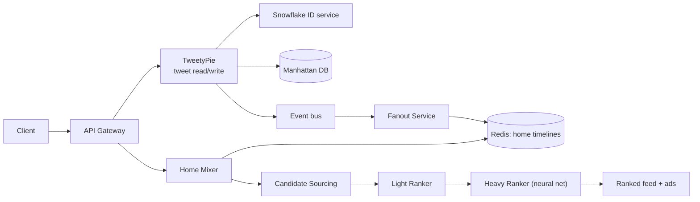

# Twitter/X cheat sheet

> Full breakdown: [companies/twitter-x.md](../companies/twitter-x.md)

## In 60 seconds

Posting a tweet gets it a unique 64-bit Snowflake ID (a distributed generator needing no central coordinator), a durable write to Manhattan (Twitter's own distributed database), and an event onto an internal bus. A fan-out service then either pushes the tweet ID directly into followers' precomputed Redis timelines (normal accounts) or leaves it to be fetched at read time (the "celebrity problem," for huge-follower accounts). Opening a "For You" timeline runs Home Mixer: candidates from search and graph-based recommenders get narrowed to ~1,500, scored first by a cheap Light Ranker and then a neural-network Heavy Ranker, then filtered and blended with ads — all in under 1.5 seconds, even though a single pipeline run burns ~220 seconds of CPU time behind the scenes.

## The picture

The write path (top) returns as soon as Manhattan acks; fan-out and ranking are decoupled from it entirely, off an event bus.

## Numbers worth remembering

| Metric | Number | Source |
|---|---|---|
| Peak tweets per second | 143,199 TPS, Aug 3 2013 | [Twitter Engineering](https://blog.x.com/engineering/en_us/a/2013/new-tweets-per-second-record-and-how) |
| Manhattan deployment footprint | clusters of thousands of physical hosts, multiple datacenters | [Twitter Engineering](https://blog.x.com/engineering/en_us/topics/insights/2016/manhattan-software-deployments-how-we-deploy-twitter-s-large-scale-distributed-database) |
| Recommendation pipeline executions | ~5 billion/day, <1.5s avg latency | [X Engineering](https://blog.x.com/engineering/en_us/topics/open-source/2023/twitter-recommendation-algorithm) |
| CPU time per pipeline run | ~220 seconds (parallelized) | [X Engineering](https://blog.x.com/engineering/en_us/topics/open-source/2023/twitter-recommendation-algorithm) |
| Candidates scored per "For You" request | ~1,500, from a pool of hundreds of millions | [GitHub: twitter/the-algorithm](https://github.com/twitter/the-algorithm/blob/main/README.md) |
| Per-host throughput after Rails-to-JVM | ~200-300 req/sec/host to ~10,000-20,000 req/sec/host | [High Scalability, third-party](https://highscalability.com/scaling-twitter-making-twitter-10000-percent-faster/) |
| Monetizable daily active users | 237.8 million (Q2 2022) | [Statista, third-party](https://www.statista.com/statistics/970920/monetizable-daily-active-twitter-users-worldwide/) |
| Sept 2022 datacenter outage | Sacramento fully offline, 2 of 3 core DCs left standing | [The Register, third-party](https://www.theregister.com/2022/09/13/twitter_datacenter_labor_heat/) |

## Signature ideas

- **Snowflake IDs:** pack a timestamp + machine ID + sequence number into one 64-bit integer, so any machine mints unique, roughly time-sortable IDs with zero coordination.
- **Hybrid fan-out:** push for normal accounts, pull-and-merge at read time for huge-follower accounts — avoids the "celebrity problem" of millions of synchronous writes.
- **Manhattan:** one multi-tenant database offering both eventually-consistent and strongly-consistent (quorum CAS) operations per call, instead of two separate systems.
- **Two-stage ranking funnel:** a cheap Light Ranker (logistic regression) narrows hundreds of millions of candidates to ~1,500 before the expensive Heavy Ranker (neural net) runs.
- **Nested Home Mixer pipelines** (Product/Mixer/Recommendation/Candidate): new content types plug in at the matching layer instead of touching one giant scoring function.
- **Clos network topology:** many small switches instead of a few big "core" ones, shrinking the blast radius of any single device failure.

## If an interviewer asks "design Twitter/X"

1. Clarify scope: post + durably store a tweet, deliver it to followers' timelines, serve both reverse-chronological and ranked feeds.
2. Nail the ID problem first: a single auto-increment counter can't survive sharding — use a distributed generator (Snowflake) instead.
3. Pick a storage layer that's multi-tenant and supports tunable consistency per operation (Manhattan-style), not one-size-fits-all.
4. Walk the write path: the write succeeds durably first, then an event bus decouples "accept the tweet" from "fan it out," so a spike doesn't block new posts.
5. Name the celebrity problem explicitly and fix it with hybrid fan-out (push for most, pull-and-merge for huge accounts).
6. For the ranked feed, describe the funnel: candidate sourcing (in-network + out-of-network) -> cheap Light Ranker -> expensive Heavy Ranker -> filtering/ads mixing.
7. Justify the funnel shape by the latency budget: you cannot run a neural net over hundreds of millions of candidates in under a second.
8. Cover a failure mode: losing an entire datacenter, and why N-1 redundancy (not N) is the real bar to design for.

## Common follow-up questions

- *Why not a single fan-out strategy for every account?* — Pure push means tens of millions of synchronous writes for a celebrity tweet; pure pull makes every read expensive — the follower-count split is the actual answer.
- *Why build Manhattan instead of just using Cassandra?* — Needed a single shared service offering both eventual and strong (quorum) consistency per operation, instead of bolting extra tooling onto Cassandra per use case.
- *Why does the ranking pipeline need two stages instead of one?* — The expensive model (neural net) can only afford to run on the ~1,500 candidates the cheap model already filtered down to, not the full pool.
- *How many datacenters is "enough"?* — N-1: losing one of Twitter's three core sites in 2022 left it "non-redundant" for days, showing the real bar is surviving the loss of one more, not just running more than one.
- *Why migrate the hottest Rails paths to the JVM first instead of a full rewrite?* — A full rewrite would have frozen feature work for years; migrating just the message queue and tweet storage first fixed the worst bottleneck without stopping the site.
- *Isn't Manifold-style fan-out (Discord) basically the same idea as hybrid fan-out here?* — Both refuse to treat every recipient identically at write time, but Twitter's split is by follower count (push vs. pull), while Discord's is by destination node (still push, just batched).

## Gotchas

- Snowflake IDs are only *approximately* time-ordered, not strictly sequential — clock skew across machines is a designed-for possibility, not an edge case.
- "Hybrid fan-out" isn't "pick one global follower-count threshold and you're done" — the threshold is a tuned, moving target as accounts cross it in either direction.
- "220 seconds of CPU time" sounds like it contradicts "under 1.5 seconds latency" — it doesn't, because that CPU time is parallelized across many cores, not wall-clock time on one.
- People assume Snowflake's bit layout (41/10/12) is universal — it's tuned to Twitter's own fleet size and per-machine burst rate; a different company would size the split differently.
- "Non-redundant state" doesn't mean "down" — the Sept 2022 heat wave outage didn't take the site offline, it removed the safety margin that would have prevented a *second* datacenter loss from doing so.

## See also

- [WhatsApp cheat sheet](whatsapp.md) — a very different "reach millions of recipients from one write" problem, solved with E2E encryption instead of fan-out.
- [Discord cheat sheet](discord.md) — the same fan-out cost problem, solved with node-grouped relays instead of a push/pull split.
- [Slack cheat sheet](slack.md) — another sharding-key crisis (workspace ID vs. Snowflake's coordination-free IDs), same underlying lesson.
