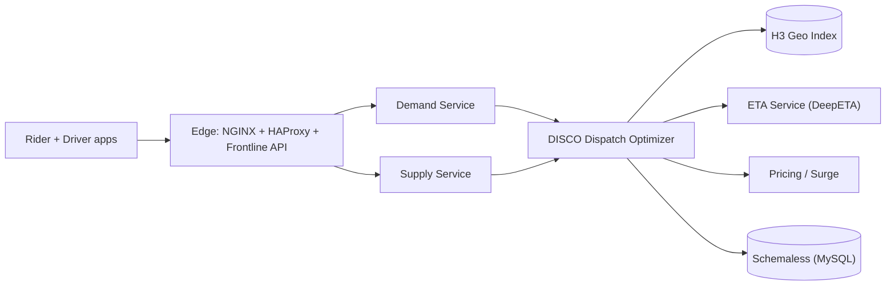

# Uber cheat sheet

> Full breakdown: [companies/uber.md](../companies/uber.md)

## In 60 seconds

Uber matches moving riders to moving drivers in real time. **H3** (a hexagonal map grid) turns "who's nearby" into a cheap cell lookup instead of geometry. **DISCO** batches a few seconds of open requests and available (or soon-to-be-available) drivers and solves them together, instead of greedily grabbing the nearest idle car. **Schemaless**, an in-house datastore on plain MySQL, stores the durable trip/billing record. **Ringpop** turns a fleet of Node.js processes into one self-healing, in-memory cluster so live driver location never needs a database round-trip. Around this: a location pipeline that fuses noisy GPS with other sensors, a pricing service reading local supply/demand for surge, and DeepETA, a deep-learning model answering "how long until pickup" in milliseconds. The whole stack has been rewritten at least twice as scale grew by orders of magnitude — most recently swapping the original NoSQL/Ringpop fulfillment stack for Google Cloud Spanner.

## The picture

## Numbers worth remembering

| Metric | Number | Source |
|---|---|---|
| Trips per day | >40 million (Q4 2025) | [Uber Q4 2025 results](https://investor.uber.com/news-events/news/press-release-details/2026/Uber-Announces-Results-for-Fourth-Quarter-and-Full-Year-2025/default.aspx) |
| Gross bookings | $54.1 billion (Q4 2025 quarter) | [Uber Q4 2025 results](https://investor.uber.com/news-events/news/press-release-details/2026/Uber-Announces-Results-for-Fourth-Quarter-and-Full-Year-2025/default.aspx) |
| Geofence lookup peak load | 170,000 queries/sec across 40 machines at 35% CPU, p95 <5ms, p99 <50ms | [Go geofence service](https://www.uber.com/us/en/blog/go-geofence-highest-query-per-second-service/) |
| Location-update write target | ~1 million writes/sec design goal, drivers pinging roughly every 4 seconds | [Scaling Uber's Real-time Market Platform](https://www.infoq.com/presentations/uber-market-platform/) |
| Schemaless shard count | 4,096 shards, production since October 2014 | [Schemaless part two](https://www.uber.com/us/en/blog/schemaless-part-two-architecture/) |
| H3 resolution levels | 16 resolutions (0 coarsest to 15 finest), 122 base cells | [H3](https://www.uber.com/us/en/blog/h3/) |
| Edge API surface | 600+ stateless Frontline HTTP endpoints (2016) | [Uber tech stack part II](https://www.uber.com/us/en/blog/uber-tech-stack-part-two/) |

## Signature ideas

- **H3 hexagonal geo-index** — turns "who's near this rider" into a cheap cell lookup instead of geometry over raw coordinates; uniform neighbor distance avoids edge/corner special-casing.
- **DISCO batch dispatch** — solves many requests and drivers together every few seconds instead of matching greedily, and can offer a trip to a driver who's still mid-trip but about to free up.
- **Schemaless on plain MySQL** — in-house append-only datastore built when Cassandra/Riak/MongoDB each failed at least one of Uber's hard requirements.
- **Ringpop (gossip + consistent hashing)** — lets stateless-looking Node.js processes act as one sharded, self-healing cluster so live driver state stays in memory, not a database.
- **DeepETA (linear-attention transformer)** — fits a deep-learning ETA model into a few-millisecond budget by discretizing features and hashing locations, trading a little accuracy for speed.
- **Driver phone as backup state store** — an encrypted state digest pushed to the phone lets a trip survive an entire datacenter dying mid-ride.

## If an interviewer asks "design Uber"

1. Clarify scope: rider requests a trip, gets matched to a driver, both track live location, price adjusts for demand, the trip is billed durably.
2. Turn the rider's GPS point into a geo-index cell (H3) to find nearby drivers cheaply instead of scanning every driver in the city.
3. Batch a few seconds of open requests plus available/soon-available drivers (DISCO) rather than matching the instant a request lands.
4. Score every candidate driver with a low-latency ETA model before the batch optimizer picks assignments.
5. Read the same local supply/demand signal to decide surge pricing at request time.
6. Push the winning offer to a driver; on reject/timeout, silently re-run the batch without that driver — never surface it to the rider as an error.
7. Persist the trip as a durable, append-only record (Schemaless-style) once matched, since it's a legal/financial artifact.
8. Split consistency by data lifetime: the live location/dispatch layer favors availability (AP) over strict consistency; the trip/billing store needs strong guarantees.

## Common follow-up questions

- **Why hexagons instead of squares for the geo-index?** Every neighbor is equidistant, so "expand the search by one ring" needs no edge-vs-corner special case.
- **Why batch instead of matching instantly?** Global optimization across the whole batch beats greedy nearest-match, and lets mid-trip drivers be considered as future candidates.
- **Why build Schemaless instead of adopting Cassandra/MongoDB?** None cleared all five bars Uber set at once: linear scale, write availability, change notifications, secondary indexes, operational trust.
- **How does a trip survive a datacenter dying mid-ride?** An encrypted state digest already pushed to the driver's phone gets replayed to reconstruct state on failover.
- **Why is the real-time layer AP but the trip store closer to CP?** A stale driver position is harmless; losing or duplicating a billing record is not.

## Gotchas

- DISCO's exact internal pipeline stage names in most diagrams (Candidate Filter/ETA Calculator/Optimizer/Dispatch) come from a third-party write-up, not an Uber blog post — don't cite them as Uber's literal internal naming.
- Ringpop being AP doesn't mean "flaky" — gossip convergence is fast; it means briefly stale, not broken.
- H3's "cell" and Schemaless's "cell" are unrelated concepts that share a name — one's a geo-hexagon, the other's an immutable JSON blob.
- "The Hungarian algorithm" is a commonly guessed answer for DISCO's assignment method, but it's not Uber-confirmed — Uber's own sources describe the goal (batched, forward-looking optimization), not the algorithm.
