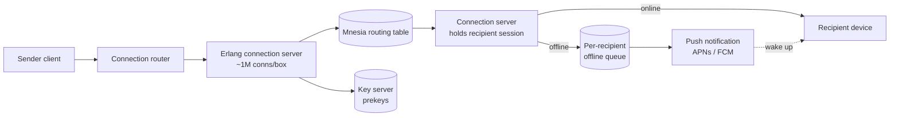

# WhatsApp cheat sheet

> Full breakdown: [companies/whatsapp.md](../companies/whatsapp.md)

## In 60 seconds

WhatsApp routes messages through a fleet of Erlang processes on tuned FreeBSD boxes — one lightweight, crash-isolated process per connection — which is how ~550 servers held 147 million concurrent connections back in 2014. Every message is end-to-end encrypted on the sender's device with the Signal Protocol before it leaves, so the server only ever touches ciphertext. An online recipient gets the message pushed straight through; an offline one gets it queued per-device until they reconnect or a push notification wakes them, and then the server deletes its own copy — there's no permanent message archive. Multi-device (2021) gave each linked device its own identity key, so the sender encrypts once per device instead of trusting the phone to relay to the rest.

## The picture

One connection server routes to another via the shared Mnesia table; an offline recipient waits in a small queue until a push notification wakes their phone.

## Numbers worth remembering

| Metric | Number | Source |
|---|---|---|
| Monthly active users | 3 billion+ (Apr 2025) | [TechCrunch](https://techcrunch.com/2025/05/01/whatsapp-now-has-more-than-3-billion-users/) |
| Community size limit | up to 100 groups / 2,000 members (2022) | [WhatsApp Blog](https://blog.whatsapp.com/communities-now-available) |
| Peak concurrent connections | 147 million (2014) | [High Scalability](https://highscalability.com/how-whatsapp-grew-to-nearly-500-million-users-11000-cores-an/) |
| Connections per server | ~1,000,000 average (2014) | [High Scalability](https://highscalability.com/how-whatsapp-grew-to-nearly-500-million-users-11000-cores-an/) |
| Backend/ops engineers | ~10, ~40M users each (2014) | [High Scalability](https://highscalability.com/how-whatsapp-grew-to-nearly-500-million-users-11000-cores-an/) |
| Group size limit | 1,024 members (2022) | [WhatsApp Blog](https://blog.whatsapp.com/communities-now-available) |
| Linked devices per account | up to 4 extra, 5 total (2021) | [Meta Engineering](https://engineering.fb.com/2021/07/14/security/whatsapp-multi-device/) |
| Peak messages sent/sec | 712,000 (2014) | [High Scalability](https://highscalability.com/how-whatsapp-grew-to-nearly-500-million-users-11000-cores-an/) |
| 2021 global outage duration | ~6 hours, Oct 4 2021 | [Cloudflare](https://blog.cloudflare.com/october-2021-facebook-outage/) |

## Signature ideas

- **Process-per-connection (Erlang/BEAM):** one crash-isolated lightweight process per socket, not an OS thread — one bad connection can't take down another, and a box holds ~1M of them.
- **Signal Protocol (X3DH + Double Ratchet + Sender Keys):** lets two devices agree on a key while one is offline, then rotates the key every message — the server structurally cannot read content.
- **No server-side message store:** the server keeps routing info and undelivered ciphertext, not a searchable history — minimizes what a breach or subpoena could expose.
- **Client-fanout for multi-device:** the sender encrypts once per recipient *device*, keeping the server blind to plaintext even across 5 linked devices.
- **Sender Keys for groups:** avoids O(n²) pairwise sessions in a group by having each member distribute one shared key once, at the cost of weaker per-message guarantees.
- **Capped group/Community size (1,024 / 2,000):** bounds the re-keying burst that happens whenever someone is removed from a group.

## If an interviewer asks "design WhatsApp"

1. Clarify scope: 1:1 + group messaging, multi-device, end-to-end encryption, delivery receipts — not the calling stack unless asked.
2. State the non-functionals up front: E2E encryption by default, sub-second delivery when online, millions of idle connections per box, minimal server-side state.
3. Pick process-per-connection on a runtime built for it (Erlang/BEAM or an equivalent like goroutines) as the connection layer — justify why a thread-per-connection server doesn't scale here.
4. Add a routing table (in-memory, replicated) mapping user/device to whichever connection server currently holds them.
5. Layer in the Signal Protocol: X3DH for offline key agreement, Double Ratchet for forward secrecy, Sender Keys for groups.
6. Handle offline delivery with a small per-recipient queue plus OS push notifications (APNs/FCM) to wake a closed app.
7. Explain what the server does NOT store (message content, long-term history) and why that's a deliberate design choice, not an omission.
8. Cover failure modes: a connection server crash (isolated, restarted by a supervisor), and a network/DNS failure one layer below the whole app (Oct 2021 outage).

## Common follow-up questions

- *Why not just decrypt on the server for spam scanning?* — Breaks the E2E guarantee entirely; abuse detection has to work off metadata/behavioral signals instead.
- *How does a message avoid getting lost if an ack is lost?* — Sender-generated message IDs let the recipient dedupe a redelivered message; acks flow through the same queue as messages, so a lost ack is a first-class case, not an edge case.
- *Why cap group size at 1,024?* — Removing a member forces every remaining member to regenerate and redistribute a fresh Sender Key; an unbounded group means an unbounded re-key burst.
- *What happens if a linked device is offline for a long time?* — Its own offline queue keeps draining independently; multi-device means N independent delivery problems per message, not one.
- *Why does multi-device need a device list at all instead of one shared account key?* — A shared key means compromising one device compromises all of them; per-device keys let you revoke exactly one device without touching the others.
- *Why not just use WebSockets and a normal database if the connection count is the hard part?* — WebSockets aren't the interesting choice here; the process-isolation model underneath (BEAM) is a runtime choice, not a protocol one.

## Gotchas

- "End-to-end encrypted" only covers content — the server still sees who talked to whom and roughly when (metadata), and that's a fundamental limit of E2E, not a WhatsApp flaw.
- People assume no message store means "nothing is stored" — device keys, routing state, and an encrypted app-state blob still live server-side.
- The 2021 outage is often misremembered as an app bug; it was a BGP/DNS failure one layer below the application entirely — a good reminder to check what's underneath your own design.
- People assume "no message store" means "no state at all" — routing tables, prekeys, and offline queues are still real, replicated server-side state.
- The Erlang/BEAM choice isn't about raw single-core speed — it's about a much slower-growing cost curve per additional connection, which is why ~550 machines did what a thread-per-connection stack couldn't.

## See also

- [Discord cheat sheet](discord.md) — the same process-per-connection idea, extended with a process per chat room ("guild") for fan-out.
- [Slack cheat sheet](slack.md) — a similar split between "who holds the connection" (edge) and "who owns the data" (center).
- [Twitter/X cheat sheet](twitter-x.md) — a different answer to "how do you reach millions of recipients from one write," using fan-out instead of E2E encryption.
