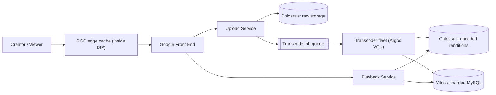

# YouTube cheat sheet

> Full breakdown: [companies/youtube.md](../companies/youtube.md)

## In 60 seconds

A creator uploads a raw video over a resumable, chunked upload; it lands in Google's Colossus file system and a transcode job is queued. A worker fleet — increasingly Google's custom Argos video-transcoding chips (VCUs) instead of plain CPUs — fans that one file out into a dozen-plus resolution/codec renditions plus thumbnails, writes each back to storage, and flips the video to public once enough renditions exist. Viewers never touch that pipeline: their player asks for a manifest, picks a resolution adaptively based on real-time bandwidth, and pulls segments from the nearest cache — often a Google Global Cache box inside their own ISP's network. Underneath the metadata (titles, views, ownership) sits Vitess, the sharded-MySQL layer YouTube built in 2010 and later open-sourced, hiding sharding behind a query-routing proxy so application code never has to know which of thousands of shards a row lives on.

## The picture

## Numbers worth remembering

| Metric | Number | Source |
|---|---|---|
| Video uploaded | 500+ hours of video uploaded every minute (2020) | [Reimagining video infrastructure](https://blog.youtube/inside-youtube/new-era-video-infrastructure/) |
| Transcoding efficiency gain (Argos VCU vs. CPU) | 20–33x compute efficiency (2020) | [Reimagining video infrastructure](https://blog.youtube/inside-youtube/new-era-video-infrastructure/) |
| YouTube's growth after adopting Vitess | Scaled by more than 50x | [Vitess history](https://vitess.io/docs/22.0/overview/history/) |
| Google Global Cache footprint | 1,300+ cities across 200+ countries and territories | [Google Cloud network edge points](https://cloud.google.com/blog/products/networking/understanding-google-cloud-network-edge-points) |
| Colossus scale | Exabytes of storage across tens of thousands of machines per cluster | [A peek behind Colossus](https://cloud.google.com/blog/products/storage-data-transfer/a-peek-behind-colossus-googles-file-system) |
| Bigtable scale | 6B+ requests/sec at peak, 10+ exabytes managed | [YouTube runs on Bigtable](https://cloud.google.com/blog/products/databases/youtube-runs-on-bigtable/) |
| Argos VCU chips | "Thousands" deployed; each chip has 10 encoder cores, each real-time 2160p60 (2021) | [9to5Google: Argos VCU chip](https://9to5google.com/2021/04/22/youtube-google-custom-chip/) |

## Signature ideas

- **Vitess query routing** — `vtgate`/`vttablet` hide sharding behind a proxy, so application code just sends normal SQL and never names a shard.
- **Custom transcoding silicon (Argos VCU)** — a purpose-built chip instead of a CPU, because upload volume outgrew what general-purpose compute could economically encode.
- **Resumable chunked upload** — 256KB+ chunks against a session URL, so a dropped connection resumes instead of restarting a huge file from zero.
- **Client-side ABR over DASH** — the player, not the server, picks and switches quality per segment, keeping the server and every CDN cache stateless.
- **Automatic failover via replication-position comparison (VTOrc/EmergencyReparentShard)** — promote only the most caught-up replica, skip stragglers that could never win anyway.
- **Google Global Cache inside ISPs** — push the cache physically as close to the viewer as the business relationship allows, instead of only caching in Google's own facilities.

## If an interviewer asks "design YouTube"

1. Clarify scope: upload durably, transcode into many renditions, store searchable metadata at huge read/write scale, deliver adaptively worldwide.
2. Accept uploads via a resumable, chunked protocol; write the raw file to durable storage (Colossus) before doing anything else.
3. Queue transcoding asynchronously; fan out each resolution/codec pair as an independent, retryable task across a worker fleet (increasingly custom ASICs).
4. Only flip a video's status to public once enough renditions exist — never expose a half-finished set.
5. Store video/channel metadata in a sharded MySQL layer (Vitess) behind a query-routing proxy, sharded on `video_id` to match the hottest access pattern.
6. Route reads by freshness need (replica vs. read-only tablets) so analytics batch jobs never compete with user-facing traffic.
7. Serve playback via a DASH manifest; let the client's ABR logic pick and switch quality, keeping server/CDN stateless.
8. Push the CDN cache physically close to viewers (Google Global Cache inside ISPs), falling back through peering points to origin only on a miss.

## Common follow-up questions

- **Why route every query through `vtgate`/`vttablet` instead of sharding in app code?** Keeps sharding logic in one place; shard topology can change without touching every application.
- **Why build a custom transcoding chip instead of scaling CPUs?** At YouTube's upload volume, a 20–33x compute-efficiency gain pays for the chip design/rollout; a smaller platform couldn't recoup that cost.
- **Why does the video-level state machine hide per-rendition failures?** So one failed/slow rendition (an unusual codec) never blocks the video from going public in its common resolutions.
- **How does automatic failover avoid promoting a stale replica?** It compares GTID (replication position), races only the most caught-up replicas, and skips stragglers that could never win anyway.
- **Why reshard via continuous replication instead of a bulk copy?** The old shard layout stays fully live serving traffic the whole time; cutover is a small, separate, reversible last step.

## Gotchas

- Don't assume YouTube always sends the device's highest supported resolution — ABR always trades off against measured real-time bandwidth.
- The "1,300+ cities" Google Global Cache figure describes Google's edge network broadly, not YouTube-only infrastructure — YouTube is the heaviest user of it, not the sole one.
- VReplication's progress percentage during resharding is an estimate that Vitess's own docs say can be off by 50–60% under load — don't treat it as a precise ETA.
- Vitess has been community-governed under the CNCF since 2018 — the resharding/failover mechanics described are current Vitess capabilities, not YouTube-specific claims.
