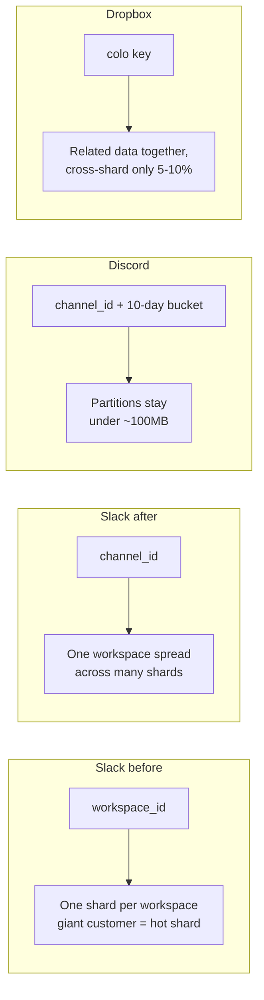
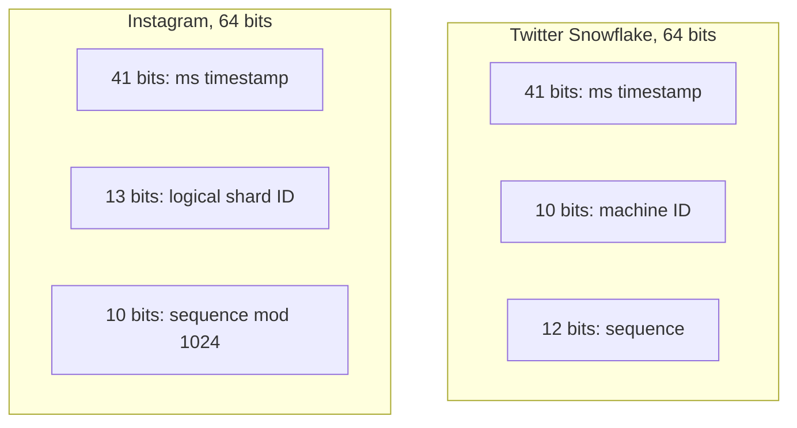
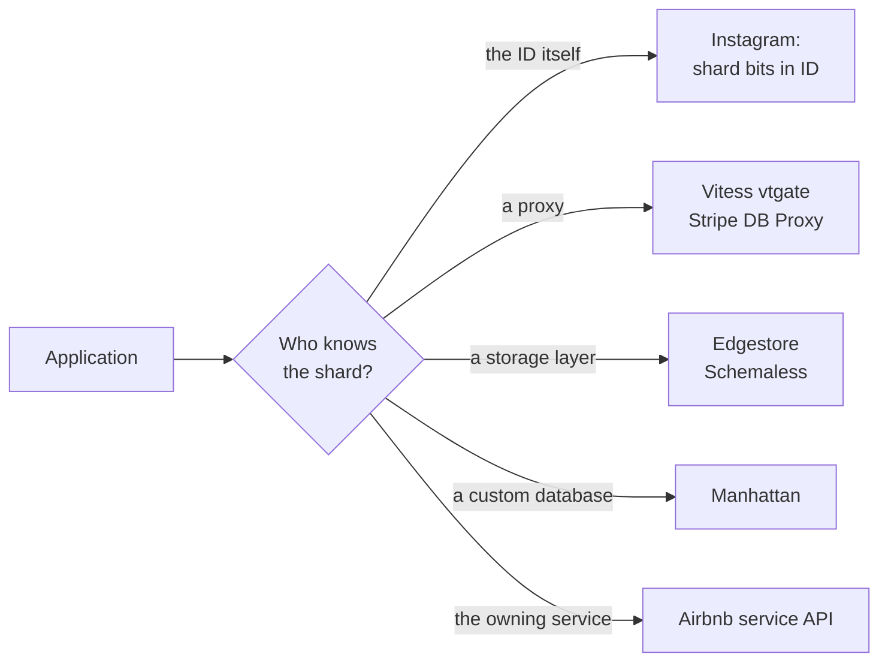
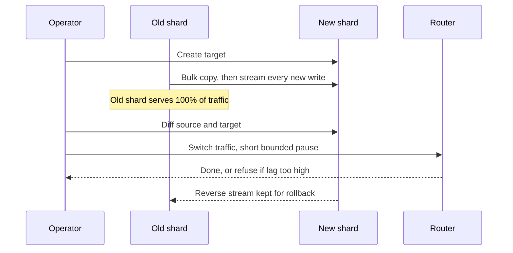

# Databases and sharding: when one database is not enough, how do nine companies split it, and what do they regret?

> **The hook:** almost every company on this site started with one ordinary database. Instagram hid
> the shard number inside every ID. Slack spent three years re-splitting MySQL by channel instead of
> by customer. Discord changed databases twice. Uber, Twitter, Stripe, and Dropbox each built their
> own storage layer. Why did "just add another database" turn into nine different answers?

**Companies compared:** [Instagram](../companies/instagram.md) · [Slack](../companies/slack.md) ·
[YouTube](../companies/youtube.md) · [Airbnb](../companies/airbnb.md) · [Uber](../companies/uber.md)
· [Discord](../companies/discord.md) · [Stripe](../companies/stripe.md) ·
[Dropbox](../companies/dropbox.md) · [Twitter/X](../companies/twitter-x.md)

**How to read this page:** every fact comes from the linked company pages, which cite their original
sources. "(see ...)" points at the exact section.

## The shared problem

A single database server has limits: how much fits in RAM, how many writes per second one machine
can accept, how much disk it holds. When a product outgrows those limits, the usual answer is
**sharding**: splitting the data into pieces (**shards**) by some key, so each server holds only
part of it.

Sharding immediately raises five questions, and every company on this page had to answer them:

1. **What do you split by?** The **shard key** (for example user ID, channel ID, video ID). Pick the
   one that matches your most common query, or every query has to visit every shard.
2. **How does a request find the right shard?** Application code, a routing proxy, or something
   baked into the ID itself.
3. **How do you make unique IDs** when there is no longer one counter?
4. **How do you re-split later** without downtime, when some shards grow hot and others sit idle?
5. **How strict does consistency need to be?** **Strong consistency** means every read sees the
   latest write. **Eventual consistency** means copies may briefly disagree but will catch up.
   Strong is safer and more expensive.

## At a glance

The table is split in two to stay readable. The first group kept a relational database (MySQL or
Postgres) and added a sharding layer. The second group adopted or built a different kind of store.

**Group A: relational at heart**

| Dimension | Instagram | Slack | YouTube | Airbnb | Uber |
|---|---|---|---|---|---|
| Started on | One Postgres box (2010) | MySQL sharded by workspace (2013) | One MySQL server (2005) | One shared database under the Rails monolith | One Postgres instance for trips |
| What broke | Write volume and dataset size by 2011 | Largest customers outgrew one shard's hardware | Replicas fell behind the primary; hand-rolled sharding everywhere | One team's queries could hurt every team | Projected to run out of capacity by end of 2014 |
| What they run now | Thousands of logical Postgres shards on a few physical servers | Vitess, sharded by channel for messages | Vitess (built at YouTube, 2010) | Each service owns its own database; calendar is its own partition | Schemaless on MySQL, then Google Cloud Spanner for fulfillment (2021) |
| Shard key | Chosen per row, usually by hashing the owning user | Channel ID for message data | `video_id` hash | Per-service; not published in detail | Trip UUID row key; fixed 4,096 shards |
| How requests are routed | Shard ID is inside the ID | VTGate proxy | vtgate proxy | Service API boundary | Schemaless routing by shard field |

**Group B: other kinds of store**

| Dimension | Discord | Stripe | Dropbox | Twitter/X |
|---|---|---|---|---|
| Started on | One MongoDB replica set (2015) | MongoDB Community (2011) | Hand-managed sharded MySQL | MySQL, then Cassandra for some workloads |
| What broke | Data and index stopped fitting in RAM at 100M messages | No safe live resharding; nothing stopped unbounded queries | Operational burden and noisy-neighbor problems | No one system gave both eventual and strong consistency |
| What they run now | ScyllaDB (from 2022), 72 nodes | DocDB: a proxy plus routing service in front of MongoDB, 2,000+ shards | Edgestore on MySQL, with Panda and Alki beneath/beside it | Manhattan, its own multi-tenant database |
| Shard key | `(channel_id, bucket, message_id)` | Chunks of each collection mapped to shards | A "colo" key that keeps related data together | Not detailed on the page |
| Headline number | p99 read 40-125ms to 15ms after migration | 5M+ queries/sec, 99.999% uptime | ~10M requests/sec (2018) | Thousands of hosts across datacenters |

## Dimension 1: what forced the change

None of these companies sharded early for fun. Each hit a specific wall.

| Company | The wall | Source |
|---|---|---|
| Instagram | ~25 photos/sec and ~90 likes/sec in 2011, too much for one Postgres | [Instagram: the startup years](../companies/instagram.md#the-startup-years-2010-2012) |
| YouTube | 2006: replicas replayed changes single-threaded on weaker hardware and fell behind (**replication lag**) | [YouTube: how it evolved](../companies/youtube.md#how-it-evolved) |
| Discord | Nov 2015: 100M stored messages, data and index no longer fit in RAM | [Discord: three databases](../companies/discord.md#from-mongodb-to-cassandra-to-scylladb-three-databases-in-under-a-decade) |
| Slack | 2016: busiest shards held the biggest customers on fixed hardware, thousands of other hosts idle | [Slack: the Vitess migration](../companies/slack.md#the-vitess-migration-from-one-shard-per-workspace-to-flexible-resharding) |
| Uber | Early 2014: trip Postgres on track to run out of room by year's end | [Uber: Schemaless](../companies/uber.md#schemaless-the-trip-datastore) |
| Airbnb | ~2015: a shared database made every team's reliability depend on every other team's queries | [Airbnb: SOA migration](../companies/airbnb.md#soa-migration-from-the-rails-monolith) |
| Stripe | Petabytes across thousands of collections, with no zero-downtime resharding | [Stripe: DocDB](../companies/stripe.md#docdb--mongodb-storage-layer) |
| Dropbox | Hand-managed MySQL shards; later, Edgestore could only grow by doubling the whole fleet | [Dropbox: Edgestore](../companies/dropbox.md#edgestore) |
| Twitter/X | Cassandra plus bolt-on tools for strong consistency, two operating models | [Twitter/X: Manhattan](../companies/twitter-x.md#manhattan-one-distributed-database-many-tenants-two-consistency-models) |

A pattern worth naming: Dropbox and Discord each hit a **second** wall after their first fix.
Edgestore scaled by splitting the entire fleet, doubling physical cost, the same shape as the MySQL
problem it replaced. Discord's Cassandra kept scaling but the operational cost of 177 nodes (hot
partitions, compaction backlogs, JVM garbage-collection pauses) outgrew the team. "We solved
scaling" has an expiration date.

## Dimension 2: choosing the shard key

The shard key decides which queries are cheap. A query that includes the key goes to one shard. A
query without it must ask every shard and merge the answers, a **scatter-gather**.

- **Slack** is the textbook case of a key going stale. Sharding by workspace kept each customer
  together and made most queries workspace-scoped. It stopped working when single customers were too
  big for any one machine. Vitess let Slack shard message data by **channel ID**, spreading one
  giant workspace across many shards. Slack rejected both NoSQL options (DynamoDB, Cassandra) and
  NewSQL options (Spanner, CockroachDB) because it wanted to keep MySQL's semantics and tooling (see
  [Slack: data model](../companies/slack.md#2-data-model-workspaces-channels-and-the-sharding-key)).
- **Discord** added time to the key. `(channel_id, message_id)` would put a busy channel's entire
  history in one ever-growing partition. `(channel_id, bucket, message_id)`, with a bucket of about
  ten days, keeps each partition under about 100MB. The cost: reading a long range means querying
  several buckets (see [Discord: data
  model](../companies/discord.md#2-data-model-messages-buckets-and-read-states)).
- **YouTube** shards the `VIDEO` table and its children by a hash of `video_id`, because nearly
  every read and write is about one video. A query like "all videos uploaded today" has no
  `video_id` and becomes a scatter-gather (see [YouTube: Vitess query
  routing](../companies/youtube.md#3-signature-component-vitess-query-routing)).
- **Dropbox Edgestore** uses a **colo** hint: data usually read together (a user's own files and
  folders) is placed on the same shard, so the common case gets strong consistency with no
  cross-machine coordination. Only the 5-10% of operations that span shards pay for a cross-shard
  transaction (see [Dropbox: Edgestore](../companies/dropbox.md#edgestore)).
- **Uber Schemaless** routes rows by a shard field that is expected never to change; a row cannot
  cheaply move between shards later (see [Uber:
  Schemaless](../companies/uber.md#schemaless-the-trip-datastore)).

## Dimension 3: IDs that carry routing and time

With many shards, one auto-increment counter no longer works: two shards would hand out the same
number, or they would have to coordinate, which puts a bottleneck back.

**Twitter's Snowflake (2010)** is a small service any machine can ask for an ID. Each ID packs a
millisecond timestamp, a machine ID, and a per-machine sequence. Because time is in the high bits,
sorting by ID is roughly sorting by time. The cost: clocks must stay roughly in sync, and machine
IDs must never be shared. (The exact 41/10/12 split comes from third-party write-ups, as the Twitter
page notes.) (See [Twitter/X:
Snowflake](../companies/twitter-x.md#snowflake-minting-unique-ids-without-a-central-counter).)

**Instagram (2011)** looked at Snowflake and decided not to run a new service. Instead a
**PL/pgSQL** function (code that runs inside Postgres) builds each ID from 41 bits of time, 13 bits
of logical shard ID, and 10 bits of per-shard sequence. The bonus over Snowflake: the shard ID is
**inside the ID**, so any service can route a read just by looking at the number, with no lookup
table. The cost: each shard can mint at most 1,024 IDs per millisecond (see [Instagram: the sharded
ID scheme](../companies/instagram.md#the-sharded-id-scheme-instagrams-alternative-to-snowflake)).

Instagram also separates **logical shards** (thousands of Postgres schemas) from **physical
servers** (a handful). A logical shard can move to a new physical server later without renumbering
anything, because its number never changes.

**Discord** uses Snowflake IDs for messages. **Stripe** takes a different angle: its public IDs
carry a type prefix (`pi_` for PaymentIntent, `ch_` for Charge), so a wrong-type ID is obvious in
any log (see [Stripe: the Payments API
surface](../companies/stripe.md#the-payments-api-surface-paymentintents-charges-paymentmethods)).

| Scheme | Needs coordination | Sorts by time | Shard in the ID |
|---|---|---|---|
| Database auto-increment | Yes, one counter | Yes | No, does not shard |
| Random UUID | No | No | No |
| Twitter Snowflake | No, once machine IDs are assigned | Roughly | No |
| Instagram PL/pgSQL | No | Roughly | Yes |

## Dimension 4: put a router in front, or build your own database?

Once data is spread out, something has to know where each piece lives. There are three broad answers
on this page.

**A. Put a routing proxy in front of an ordinary database.**

- **Vitess** (YouTube, Slack). The application connects to **vtgate** as if it were one MySQL
  server. vtgate reads the query, runs the shard key through a **vindex** (Vitess's name for the
  shard-picking function, usually a hash), and forwards it to the right **vttablet**, a helper that
  sits in front of each real MySQL instance, pools connections, and blocks dangerous queries.
  YouTube built it in 2010 and scaled by more than 50x on it; Slack reached 2.3 million queries per
  second at 2ms median latency (see [YouTube: Vitess sharding and query
  routing](../companies/youtube.md#vitess-sharding-and-query-routing)).
- **Stripe DocDB**. Every query to MongoDB passes through Stripe's own **Database Proxy** (not
  MongoDB's router), which enforces access control, blocks bad query shapes, and applies admission
  control. A routing metadata service maps chunks of each collection to shards. 5 million+ queries
  per second across 2,000+ shards (see [Stripe:
  DocDB](../companies/stripe.md#docdb--mongodb-storage-layer)).
- **Dropbox Edgestore** and **Uber Schemaless** are both layers on top of MySQL that hide sharding
  behind a simpler data model: Edgestore offers generic **entities** and **associations** (typed
  objects and typed links between them); Schemaless offers immutable JSON **cells** addressed by row
  key, column name, and version.

**B. Build a whole database.** Twitter's **Manhattan** (2014) is its own multi-tenant store: many
teams (tweets, DMs, ads) share the same clusters, and each operation picks its consistency level.
The page is blunt about the cost: owning a database means owning all its bugs and its roadmap,
including the later RocksDB storage-engine work (see [Twitter/X:
Manhattan](../companies/twitter-x.md#manhattan-one-distributed-database-many-tenants-two-consistency-models)).

**C. Split by service, and let each own its data.** Airbnb's rule during its move off the Rails
monolith was **data ownership**: each service owns its database and nobody else queries it directly.
Calendar data lives in its own partitioned domain, separate from the core booking tables, so it can
scale on its own (see [Airbnb: SOA
migration](../companies/airbnb.md#soa-migration-from-the-rails-monolith)).

When is building your own worth it? Uber's page gives a crisp rule. It evaluated Cassandra, Riak,
and MongoDB against five needs: linear scaling, write availability, change notifications, secondary
indexes, and in-house operational trust. None met all five, so it built Schemaless on the MySQL it
already knew how to run (see [Uber:
Schemaless](../companies/uber.md#schemaless-the-trip-datastore)).

## Dimension 5: resharding without downtime

Shards drift. Some get hot, some go cold. Moving data between machines while serving live traffic is
the hardest routine job in this space. Three companies describe it in detail, and their recipes
rhyme.

| Step | Vitess (YouTube, Slack) | Stripe Data Movement Platform | Dropbox Panda |
|---|---|---|---|
| Copy | VReplication copies and keeps applying changes | Bulk snapshot import sorted by index (~10x faster), then oplog replication both ways | Rebalances ~100GB ranges instead of splitting the whole fleet |
| Verify | VDiff compares rows | Point-in-time snapshot comparison | Not detailed |
| Cut over | SwitchTraffic; writes pause up to a timeout (30s default) and refuse if replicas are too far behind | Version-gated: each request carries a routing version, shards refuse stale ones; switch takes milliseconds, max ~2s | Not detailed |
| Roll back | Reverse replication is created automatically | Source was never stopped, so just keep replicating | Not detailed |

Sources: [YouTube: resharding and automatic
failover](../companies/youtube.md#keeping-vitess-alive-resharding-and-automatic-failover), [Stripe:
zero-downtime shard
migration](../companies/stripe.md#6-zero-downtime-shard-migration-data-movement-platform), [Dropbox:
Panda and Alki](../companies/dropbox.md#panda-and-alki-edgestores-successors).

The **oplog** is MongoDB's ordered log of every write. Stripe's page highlights a neat property:
replaying the same oplog entry twice has the same effect as once, which is what makes retries during
migration safe.

Real payoffs: in March 2020, pandemic remote work pushed Slack's query rate up 50% in one week, and
Vitess split the busiest shard live with no customer-visible downtime. Stripe uses the same platform
for routine **bin packing** (squeezing many underused shards onto fewer machines), not just
emergencies.

Discord's 2022 Cassandra-to-ScyllaDB move shows the whole-database version. ScyllaDB's own
Spark-based migrator estimated about three months. A small team wrote a custom Rust migrator that
hit 3.2 million records per second and finished in nine days, using **request coalescing** (many
simultaneous requests for the same hot row collapse into one query) to avoid recreating hot
partitions during the move (see [Discord: three
databases](../companies/discord.md#from-mongodb-to-cassandra-to-scylladb-three-databases-in-under-a-decade)).

## Dimension 6: consistency, chosen per piece of data

The mature answer on nearly every page is "strong where being wrong is expensive, eventual
everywhere else".

- **Twitter Manhattan** makes it a per-operation choice. **Global CAS** (compare-and-swap, "update
  only if the value is still what I read") coordinates a quorum across datacenters; **Local CAS**
  coordinates within one datacenter; the default is eventually consistent, used by most workloads.
  The page's example: a DM send might want Global CAS, a view counter uses the cheap default, both
  in the same cluster.
- **Uber** splits by data lifetime. A driver's live location lives in memory in **Ringpop**, a
  library using gossip and consistent hashing that favors availability (it is **AP**: keeps
  answering during a network split, maybe with stale data). The trip record, a legal and financial
  artifact, lives in durable storage. In 2021 Uber moved fulfillment to **Spanner**, a Google
  database with cross-shard transactions, because the older Cassandra and Redis stack gave only
  best-effort consistency. Spanner lacked built-in change notifications, so Uber built its own
  component (LATE) to replace what Schemaless triggers had provided (see [Uber:
  Ringpop](../companies/uber.md#ringpop-the-self-organizing-cluster)).
- **Airbnb** keeps search eventually consistent (a just-booked room may still show for seconds) and
  the calendar strongly consistent (a night can never be booked twice) (see [Airbnb: availability
  calendar](../companies/airbnb.md#availability-calendar)).
- **YouTube** reads from replicas when slightly stale is fine (view counts) and from the primary
  when it is not (who owns a video) (see [YouTube: Vitess sharding and query
  routing](../companies/youtube.md#vitess-sharding-and-query-routing)).
- **Dropbox Edgestore** is strongly consistent by default, and uses **two-phase commit** (2PC: all
  shards first confirm they can commit, then a leader tells them all to commit) only for the 5-10%
  of cross-shard writes. A copy-on-write trick stores only the pending change, cutting write
  amplification by up to 95% (see [Dropbox: Edgestore](../companies/dropbox.md#edgestore)).

## Dimension 7: storage engines and blobs

Two last moves recur.

**Swap the storage engine, keep the distributed layer.** Cassandra's original engine runs on the
JVM, and at large scale **garbage-collection pauses** (moments where the runtime stops to reclaim
memory) dominated tail latency.

- Instagram built **Rocksandra**: Cassandra's replication and query layers on top of RocksDB, a C++
  engine with no garbage collector. P99 reads went from ~60ms to ~20ms, and GC-stalled reads from
  2.5% to 0.3% (see [Instagram: Cassandra and
  Rocksandra](../companies/instagram.md#cassandra-and-the-rocksandra-storage-engine)).
- Discord moved to ScyllaDB, a C++ Cassandra-compatible database with a **shard-per-core** design
  (each CPU core owns its own slice of data), which also isolates hot partitions better.
- Twitter added RocksDB as a pluggable engine inside Manhattan in 2022.

**Keep big blobs out of the metadata database.** File bytes and metadata have opposite shapes:
metadata is small and constantly changing; bytes are huge and written once.

- **Dropbox** keeps metadata in Edgestore and bytes in **Magic Pocket**, its own blob store, which
  took 90% of user data off AWS S3 by 2015. Instead of storing 3 full copies, it uses **erasure
  coding**: split data into fragments plus parity fragments so lost pieces can be rebuilt by math.
  Reed-Solomon 6+3 costs 1.5x storage and survives losing any 3 of 9 fragments; a newer LRC-(12,2,2)
  scheme costs 1.33x (see [Dropbox: Magic Pocket](../companies/dropbox.md#magic-pocket)).
- **Instagram** and **YouTube** store only a pointer or path in the database; the bytes sit in
  object storage and CDNs. See [Media delivery](media-delivery.md).

## Why they differ

- **What the data is.** Chat history (Discord) is append-heavy and time-ordered, so a wide-column
  store keyed by channel and time fits. Payments (Stripe) and trips (Uber) are records of money that
  need strict correctness. Files (Dropbox) are two different problems, bytes and metadata.
- **What the team already knew.** Slack, YouTube, Uber, and Dropbox all stayed on MySQL underneath
  because they trusted their own operational experience with it. Instagram stayed on Postgres.
  Operational trust was an explicit deciding factor at Uber.
- **Era.** YouTube built Vitess for itself in 2010 and donated it to the CNCF (a foundation that
  hosts open-source infrastructure projects) in 2018. Slack adopted it in 2016. Stripe picked
  MongoDB in 2011 when no managed MongoDB service existed yet.
- **Scale of the biggest tenant.** Slack's key broke because of a few enormous customers. Discord's
  partitions broke because of a few enormous channels. The largest single unit, not the average,
  sets the design.

## What to take into an interview

- **Pick the shard key from your hottest query,** and say out loud which queries become
  scatter-gather.
- **Bound partition size.** If a key can grow forever (a channel's history), add a time bucket.
- **Put the shard in the ID** if you can (Instagram), or put a router in front (Vitess) so
  application code never learns shard layout.
- **Separate logical shards from physical machines,** so moving data never means renumbering it.
- **Resharding recipe:** copy, keep streaming changes, diff, cut over in a short bounded step, keep
  a reverse stream for rollback.
- **Choose consistency per operation or per data type,** not per company. Strong for money,
  bookings, and ownership; eventual for counters, search, and live location.
- **Buy before you build,** and build only when every off-the-shelf option fails more than one hard
  requirement.

## Read more

- Instagram: [Sharded ID
  scheme](../companies/instagram.md#the-sharded-id-scheme-instagrams-alternative-to-snowflake) ·
  [Sharded ID generator](../companies/instagram.md#3-signature-component-the-sharded-id-generator) ·
  [Rocksandra](../companies/instagram.md#cassandra-and-the-rocksandra-storage-engine)
- Slack: [Vitess
  migration](../companies/slack.md#the-vitess-migration-from-one-shard-per-workspace-to-flexible-resharding)
  · [Sharding key](../companies/slack.md#2-data-model-workspaces-channels-and-the-sharding-key)
- YouTube: [Vitess sharding and routing](../companies/youtube.md#vitess-sharding-and-query-routing)
  · [Resharding and
  failover](../companies/youtube.md#keeping-vitess-alive-resharding-and-automatic-failover)
- Discord: [MongoDB to Cassandra to
  ScyllaDB](../companies/discord.md#from-mongodb-to-cassandra-to-scylladb-three-databases-in-under-a-decade)
- Uber: [Schemaless](../companies/uber.md#schemaless-the-trip-datastore) ·
  [Ringpop](../companies/uber.md#ringpop-the-self-organizing-cluster)
- Stripe: [DocDB](../companies/stripe.md#docdb--mongodb-storage-layer) · [Zero-downtime shard
  migration](../companies/stripe.md#6-zero-downtime-shard-migration-data-movement-platform)
- Dropbox: [Edgestore](../companies/dropbox.md#edgestore) · [Panda and
  Alki](../companies/dropbox.md#panda-and-alki-edgestores-successors) · [Magic
  Pocket](../companies/dropbox.md#magic-pocket)
- Twitter/X:
  [Manhattan](../companies/twitter-x.md#manhattan-one-distributed-database-many-tenants-two-consistency-models)
  · [Snowflake](../companies/twitter-x.md#snowflake-minting-unique-ids-without-a-central-counter)
- Airbnb: [SOA migration and data
  ownership](../companies/airbnb.md#soa-migration-from-the-rails-monolith) · [Availability
  calendar](../companies/airbnb.md#availability-calendar)
- Original sources most worth reading: [Sharding & IDs at
  Instagram](https://medium.com/instagram-engineering/sharding-ids-at-instagram-1cf5a71e5a5c) ·
  [Scaling Datastores at Slack with
  Vitess](https://slack.engineering/scaling-datastores-at-slack-with-vitess/) · [How Discord Stores
  Trillions of Messages](https://discord.com/blog/how-discord-stores-trillions-of-messages) ·
  [Designing Schemaless](https://www.uber.com/us/en/blog/schemaless-part-one-mysql-datastore/) ·
  [How Stripe's document databases supported 99.999%
  uptime](https://stripe.dev/blog/how-stripes-document-databases-supported-99.999-uptime-with-zero-downtime-data-migrations)
  · [(Re)Introducing Edgestore](https://dropbox.tech/infrastructure/reintroducing-edgestore) · [How
  We Partitioned Airbnb's Main Database in Two
  Weeks](https://medium.com/airbnb-engineering/how-we-partitioned-airbnb-s-main-database-in-two-weeks-55f7e006ff21)
- Related comparisons: [Money and correctness](money-and-correctness.md) · [Monolith to
  microservices](monolith-to-microservices.md)
