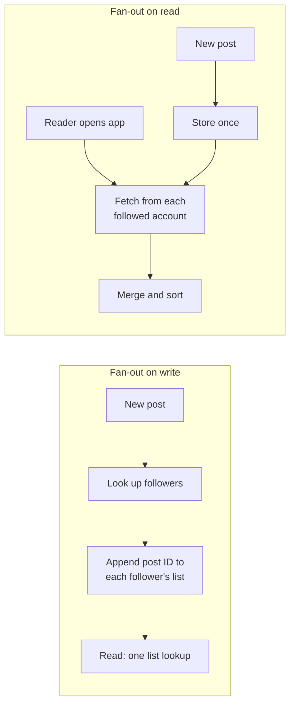
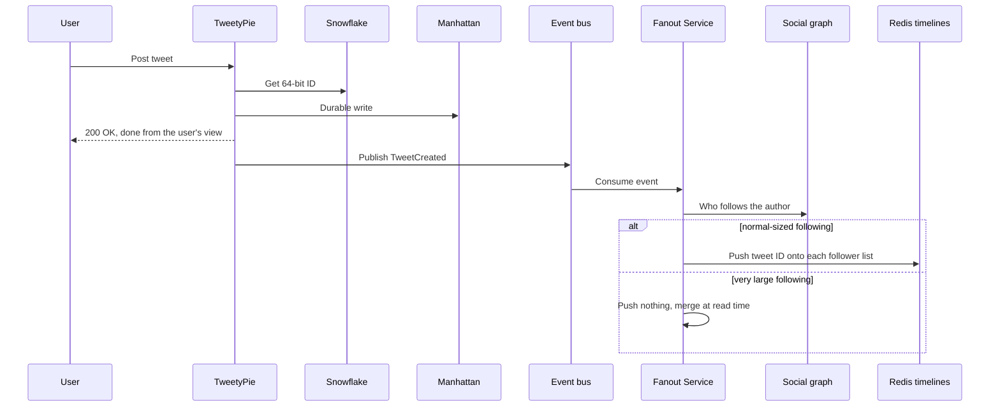
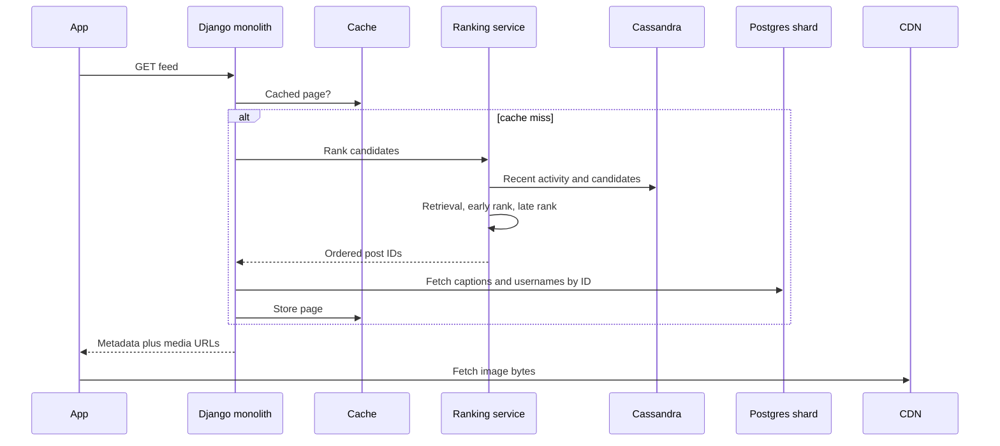
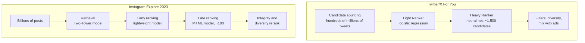
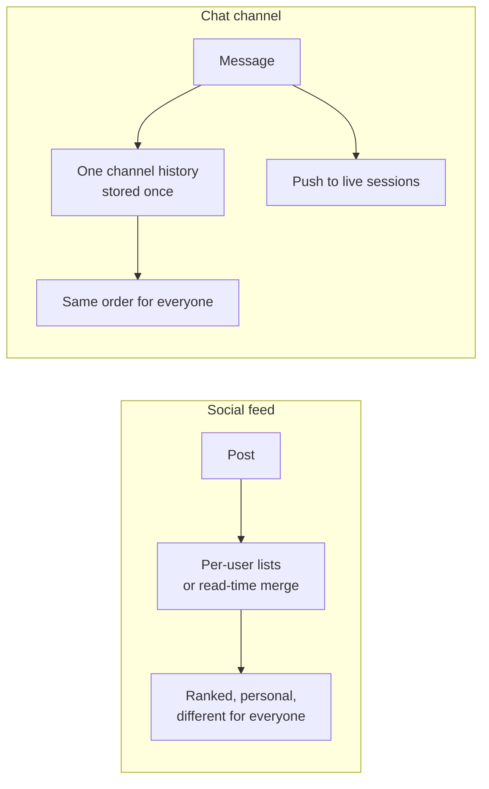

# Feeds and fan-out: when a celebrity posts, do you copy it into 30 million feeds, or make 30 million readers come and get it?

> **The hook:** Twitter/X and Instagram both show you "posts from people you follow", ranked.
> Twitter pre-builds your timeline at write time for most accounts and refuses to for celebrities.
> Instagram ranks at read time with over a thousand models. Discord and Slack skip stored feeds
> entirely. Same question, four answers.

**Companies compared:** [Twitter/X](../companies/twitter-x.md) ·
[Instagram](../companies/instagram.md), with [Discord](../companies/discord.md) and
[Slack](../companies/slack.md) as a contrast.

**How to read this page:** every fact comes from the linked company pages, which cite their original
sources. "(see ...)" points at the exact section.

## The shared problem

A **feed** (also called a timeline) is a personal list: "the newest or best posts from accounts I
follow". Building it means solving one question for every new post: how does this post get in front
of everyone who should see it?

There are two basic answers.

- **Fan-out on write (push).** The moment a post is created, copy a small pointer to it into every
  follower's personal list. Reading your feed later is then one quick lookup. The cost is paid by
  the writer, once per follower.
- **Fan-out on read (pull).** Store the post once. When a follower opens the app, go fetch recent
  posts from everyone they follow and merge them on the spot. The cost is paid by every reader, on
  every read.

Push is great until one account has 30 million followers. Then a single post turns into 30 million
writes at once, which can clog the path for everyone else posting in that second. That is the
**celebrity problem** (see [Twitter/X: fan-out on write vs. fan-out on
read](../companies/twitter-x.md#fan-out-on-write-vs-fan-out-on-read-the-celebrity-problem)).

A second, newer question sits on top: once you have the candidate posts, what **order** do you show
them in? Newest first is cheap. Ranking by "what will this person engage with" is expensive, and
both Twitter and Instagram ended up doing it.

## At a glance

| Dimension | Twitter/X | Instagram | Discord (contrast) | Slack (contrast) |
|---|---|---|---|---|
| Who you see posts from | Accounts you follow, plus out-of-network picks | Accounts you follow, plus Explore and Reels picks | Everyone in the channel | Everyone in the channel |
| Fan-out strategy | Hybrid: push for most accounts, pull for very high-follower accounts | Post goes through an async task queue (originally Gearman) that also did feed fan-out; ranking happens at read time | Push to live connected sessions only, no stored per-user feed | Push to live connected sessions only, no stored per-user feed |
| Where a pre-built feed lives | Redis lists, capped at about 800 entries per user | Cached feed pages in Redis/Memcached; activity/feed data in Cassandra | Not applicable | Not applicable |
| Celebrity handling | Not pushed at all; merged in at read time | Not publicly documented | Guild fan-out handled by Manifold relays and passive sessions | Channel Server pushes to subscribed Gateway Servers |
| Order | "Following" is reverse-chronological; "For You" is ranked | Ranked since 2016 | Chronological channel history | Chronological channel history |
| Ranking pipeline | ~1,500 candidates, cheap Light Ranker then neural Heavy Ranker | Retrieval, early ranking, late ranking, rerank; 1,000+ models across surfaces | None | None for the channel; search results are re-ranked |
| Headline number | ~30 billion Redis timeline writes/day (third-party estimate); ranking runs ~5 billion times/day | 1,000+ production models (2025) | 1M+ online in one guild | Worldwide delivery within 500ms |

## Dimension 1: Twitter's hybrid fan-out

Twitter started with pure push, on a single Ruby on Rails app. Rails ran on Ruby MRI, whose **global
interpreter lock** (GIL) lets only one thread of Ruby run at a time per process. Combine that with
pure push and a celebrity's tweet became an enormous burst of synchronous work. The visible symptom
was the "Fail Whale" error page of 2007 to 2010 (see [Twitter/X: the monolith
years](../companies/twitter-x.md#the-monolith-years-2006-2011)).

Today's write path looks like this:

Four things to notice (see [Twitter/X: posting a tweet and fanning it
out](../companies/twitter-x.md#1-core-flow-posting-a-tweet-and-fanning-it-out)):

1. **The user gets "200 OK" before fan-out starts.** TweetyPie, the service that owns tweet reads
   and writes, returns as soon as the tweet is durably stored in Manhattan, Twitter's own database.
   Fan-out runs later, off an **event bus** (a pipe services publish "something happened" messages
   onto). That is why the 143,199 tweets-per-second record in August 2013, about 25 times steady
   state, did not stop people posting: accepting a tweet and delivering it are decoupled.
2. **Each push is tiny.** The fanout daemon inserts the tweet ID (8 bytes), author ID (8 bytes), and
   a few bytes of metadata into a Redis list per follower. Each list keeps roughly the most recent
   800 entries.
3. **Celebrity tweets are never pushed.** A follower's timeline read merges their own Redis list
   with a small live fetch from the handful of high-follower accounts they follow.
4. **The cutoff is secret and moving.** Twitter has not published the follower-count threshold, and
   an account can cross it in either direction as it gains or loses followers.

| | Push only | Pull only | Hybrid (Twitter) |
|---|---|---|---|
| Normal account posts | 1 post, N cheap pushes | 0 pushes, N future reads pay | N cheap pushes |
| Celebrity posts | Tens of millions of pushes | 0 pushes | 0 pushes, merged at read |
| Reading a timeline | Always one list read | Always extra lookups | Cheap, a bit more work if you follow huge accounts |

The treatment of a celebrity is a **routing decision made once per account**, not once per tweet.
That is also what keeps one account from becoming a hot spot in storage (see [Twitter/X: a hot key /
hot partition](../companies/twitter-x.md#a-hot-key--hot-partition-a-celebrity-account)).

## Dimension 2: Instagram's queue and read-time ranking

Instagram's 2012 architecture already pushed the heavy part of posting off the request. The upload
request did two things: save the original bytes and drop a job on **Gearman**, a task queue. About
200 Python workers consumed that queue, resizing images, cross-posting, and fanning the post out to
followers. Because that work happened to the side, a brand-new account and a popular one both got
the same fast "your post is live" response (see [Instagram: media storage and
delivery](../companies/instagram.md#media-storage-and-delivery)).

Write-heavy, high-fan-out data such as the activity feed moved from Redis to **Cassandra** in 2012.
Redis keeps everything in RAM, which got expensive; Cassandra is disk-backed and was reported to cut
that cost by roughly 75% (a third-party figure) (see [Instagram: Cassandra and
Rocksandra](../companies/instagram.md#cassandra-and-the-rocksandra-storage-engine)).

The part that changed the most is **reading**. Until 2016 the feed was newest-first. Instagram later
disclosed that users were missing about 70% of all posts in their feed, and about 50% of posts from
friends. After switching to ranked order, users saw around 90% of friends' posts (third-party report
of Instagram's figures) (see [Instagram: the ranking
era](../companies/instagram.md#the-ranking-era-2016-2025)).

(See [Instagram: loading a ranked
feed](../companies/instagram.md#1-core-flow-loading-a-ranked-feed).) Two design points stand out.
The response carries **media URLs, not media bytes**; the phone fetches images straight from the
CDN. And the Postgres lookup needs no routing table, because Instagram's IDs have the shard number
built into them (see [Databases and
sharding](databases-and-sharding.md#dimension-3-ids-that-carry-routing-and-time)).

Instagram's page does not document how it handles a single account with a huge following, so this
page does not guess.

## Dimension 3: ranking funnels, side by side

Both companies ended up with the same shape: a **ranking funnel**. Each stage throws away most
candidates using a cheaper model, so the most expensive model only ever sees a small set.

| | Twitter/X "For You" | Instagram Feed and Explore |
|---|---|---|
| Candidate sources | In-network from Earlybird search index (about half), out-of-network from graph recommenders | Two-Tower retrieval over cached user and item embeddings |
| Cheap stage | Light Ranker, a **logistic regression** (simple weighted-sum model that outputs a probability) | Early-stage lightweight model; in 2019 Explore, a **distillation model** (small model trained to mimic a big one) cut 500 to 150 |
| Expensive stage | Heavy Ranker, a neural network (MaskNet), served by Navi, a Rust model server | MTML model: **multi-task multi-label**, one model predicting several outcomes (click, like, see less) |
| Final score | Weighted sum of P(like), P(reply), P(retweet), minus P(negative feedback) | Expected value: weighted P(click) + P(like) minus P(see less) |
| Scale | ~5 billion runs/day, under 1.5s average, ~220s of CPU per run | 2019 Explore: ~65 billion features and ~90 million predictions every second |
| Peak trick | Not documented; a Light-Ranker-only fallback is a labeled inference on the page | Precompute some users' Explore off-peak so peak hours stay affordable |

Sources: [Twitter/X: the For You ranking
pipeline](../companies/twitter-x.md#the-for-you-ranking-pipeline-candidate-sourcing-to-heavy-ranker),
[Instagram: from one sort order to 1,000+
models](../companies/instagram.md#feed-and-explore-ranking-from-one-sort-order-to-1000-models).

An **embedding** is a list of numbers representing a user or post so that similar things get similar
numbers; a **Two-Tower** model computes the user's embedding and each post's embedding separately,
which means post embeddings can be computed once and cached. That is what makes Instagram's first
stage cheap enough to run over billions of candidates.

The two diverge on **what they built around the funnel**:

- Twitter invested in **composability**. Home Mixer is built from nested pipelines (product, mixer,
  recommendation, candidate), so adding a new content type means writing one small candidate
  pipeline instead of editing a giant scoring function (see [Twitter/X: Home Mixer and Product
  Mixer](../companies/twitter-x.md#home-mixer-and-product-mixer-composing-a-feed-from-nested-pipelines)).
- Instagram invested in **model operations**. With 1,000+ models, the hard problem became noticing
  when one quietly degrades. Each model gets a criticality tier in a Model Registry, and two health
  metrics are checked automatically: **calibration** (predicted click rate divided by actual click
  rate, ideally 1) and **normalized entropy** (how well it separates action from inaction; near 1
  means guessing). Launch velocity went from a few per week to 10+ per week once rollout was
  automated.

And one important cheap path: Twitter's reverse-chronological "Following" tab skips the whole funnel
and just reads the precomputed Redis list. That is why it is so much cheaper to serve than "For
You".

## Dimension 4: the chat contrast (Discord and Slack)

Chat apps have followers too, in a sense: everyone in a channel. So why don't they build per-user
timelines?

Because a channel is **one shared, ordered history**, not a personal mix. Everyone in a channel sees
the same messages in the same order. There is nothing to personalize, so there is nothing to
precompute per user. The fan-out problem becomes "push this event to every connected session now",
and anyone offline simply reads the channel's history later.

That turns the celebrity problem into a **big-room problem**:

- **Discord** measured 900ms to 2.1 seconds to fan one message out to a 30,000-concurrent guild
  before Manifold. Its engineers note that fan-out work can grow roughly with the square of active
  participants, since more people means both more events and more recipients per event. The fixes
  were batching by destination node (Manifold) and sending slimmed-down updates to members not
  looking at the server (passive sessions, about 90% less work) (see [Discord:
  Maxjourney](../companies/discord.md#maxjourney-passive-sessions-and-relay-for-a-10-million-member-guild)).
- **Slack** pushes from the Channel Server to the Gateway Servers subscribed to that channel, and
  each gateway pushes to its own sockets (see [Slack: posting a message and fanning it
  out](../companies/slack.md#1-core-flow-posting-a-message-and-fanning-it-out)).

The full chat story is on [Real-time
messaging](real-time-messaging.md#dimension-3-fan-out-to-groups).

## Dimension 5: IDs that sort by time

Feeds are sorted lists, so the post ID matters. If the ID itself encodes creation time, "newest
first" is just "biggest ID first", with no separate timestamp index.

- **Twitter** built **Snowflake** in 2010: 64 bits made of a millisecond timestamp, a machine ID,
  and a per-machine sequence, handed out by a small service with no central counter (see [Twitter/X:
  Snowflake](../companies/twitter-x.md#snowflake-minting-unique-ids-without-a-central-counter)).
- **Instagram** generates similar 64-bit IDs inside each Postgres shard with a stored function: 41
  bits of time, 13 bits of shard ID, 10 bits of sequence (see [Instagram: the sharded ID
  scheme](../companies/instagram.md#the-sharded-id-scheme-instagrams-alternative-to-snowflake)).
- **Discord** uses Snowflake IDs for messages, which also makes its time-bucketed storage keys work.

The full comparison of these schemes is in [Databases and
sharding](databases-and-sharding.md#dimension-3-ids-that-carry-routing-and-time).

## Dimension 6: what breaks, and what absorbs it

| Scenario | Twitter/X | Instagram | Discord |
|---|---|---|---|
| Sudden posting spike | Event bus absorbs it; fan-out lags, posting stays fast (143,199 TPS record) | Async queue absorbs upload work; same fast response for every account | Pre-Manifold, one event took up to 2.1s to fan out |
| One enormous account or room | Routed to pull, never pushed | Not publicly documented | Manifold relays plus passive sessions |
| Ranking too expensive at peak | Light Ranker exists to shrink the pool first | Precompute some Explore results off-peak | Not applicable |
| A model silently degrades | Not documented | Calibration and NE checks flag it; rollouts shift traffic gradually | Not applicable |

Sources: [Twitter/X: a traffic spike](../companies/twitter-x.md#a-traffic-spike), [Instagram: what
happens when things break](../companies/instagram.md#what-happens-when-things-break), [Discord: what
happens when things break](../companies/discord.md#what-happens-when-things-break).

## Why they differ

- **Follow graph shape.** Twitter is asymmetric: one account can have tens of millions of followers
  who never follow back. That makes the celebrity problem unavoidable and a per-account push/pull
  switch the natural fix.
- **What the product promises.** Twitter kept a reverse-chronological "Following" tab, so it still
  needs cheap precomputed lists. Instagram went ranked-only in 2016 and chose not to ship a
  chronological toggle back, which makes read-time ranking the main event.
- **Era.** Twitter's fan-out design comes from the 2007 to 2010 Fail Whale era, before large ranking
  models. Instagram's big ranking investments came after joining Facebook, with Meta's model tooling
  underneath (Configerator for the Model Registry, FAISS for nearest-neighbor search).
- **Chat is not a feed.** Discord and Slack share one history per channel, so they never needed
  personal timelines. Their scaling fight is room size, not follower count.

## What to take into an interview

- **Say "it depends on follower count" before anyone asks about celebrities.** Hybrid fan-out is the
  standard strong answer: push for most accounts, pull and merge at read time for the few huge ones.
- **Return success before fan-out.** Persist the post, return 200 OK, and fan out asynchronously
  from an event bus or task queue. Twitter and Instagram both do this.
- **Store IDs in the feed, not posts.** Twitter's Redis entries are about 20 bytes. Instagram's feed
  response carries media URLs, never bytes.
- **Rank with a funnel.** Cheap and broad first, expensive and narrow last. State the rough sizes:
  hundreds of millions to ~1,500 at Twitter, billions to ~100 at Instagram.
- **Keep a cheap path.** A reverse-chronological view that is one list read is a valuable fallback
  and a cheaper product surface.
- **Know when there is no feed.** If everyone sees the same ordered history (a chat channel), skip
  per-user timelines and push to live connections.

## Read more

- Twitter/X: [Fan-out on write vs.
  read](../companies/twitter-x.md#fan-out-on-write-vs-fan-out-on-read-the-celebrity-problem) · [For
  You ranking
  pipeline](../companies/twitter-x.md#the-for-you-ranking-pipeline-candidate-sourcing-to-heavy-ranker)
  · [Home
  Mixer](../companies/twitter-x.md#home-mixer-and-product-mixer-composing-a-feed-from-nested-pipelines)
  · [Snowflake](../companies/twitter-x.md#snowflake-minting-unique-ids-without-a-central-counter)
- Instagram: [Feed and Explore
  ranking](../companies/instagram.md#feed-and-explore-ranking-from-one-sort-order-to-1000-models) ·
  [Loading a ranked feed](../companies/instagram.md#1-core-flow-loading-a-ranked-feed) · [Media
  storage and delivery](../companies/instagram.md#media-storage-and-delivery) · [The ranking
  era](../companies/instagram.md#the-ranking-era-2016-2025)
- Discord: [Manifold's hierarchical
  fan-out](../companies/discord.md#3-signature-component-manifolds-hierarchical-fan-out) ·
  [Maxjourney](../companies/discord.md#maxjourney-passive-sessions-and-relay-for-a-10-million-member-guild)
- Slack: [Posting a message and fanning it
  out](../companies/slack.md#1-core-flow-posting-a-message-and-fanning-it-out)
- Original sources most worth reading: [Twitter's Recommendation
  Algorithm](https://blog.x.com/engineering/en_us/topics/open-source/2023/twitter-recommendation-algorithm)
  · [Staple Yourself to a Tweet (30 billion Redis updates per
  day)](https://tanzu.vmware.com/content/blog/case-study-staple-yourself-to-a-tweet-to-understand-30-billion-redis-updates-per-day)
  · [Scaling the Instagram Explore recommendations
  system](https://engineering.fb.com/2023/08/09/ml-applications/scaling-instagram-explore-recommendations-system/)
  · [Journey to 1000
  models](https://engineering.fb.com/2025/05/21/production-engineering/journey-to-1000-models-scaling-instagrams-recommendation-system/)
- Related comparisons: [Real-time messaging](real-time-messaging.md) · [Databases and
  sharding](databases-and-sharding.md)
