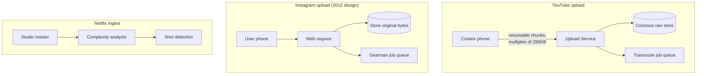
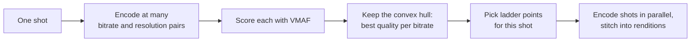
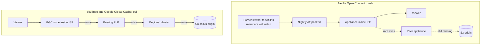
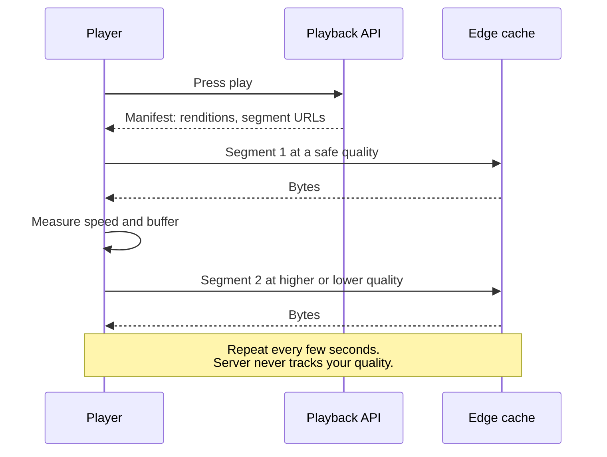

# Media delivery: how do Netflix, YouTube, Spotify, and Instagram get big files to your screen without buffering?

> **The hook:** two of these companies put their own servers inside your internet provider's
> building. One of them designed a custom chip just to convert video. One re-encodes each scene of a
> show separately. And one is mostly about getting a few seconds of audio to a phone on a subway
> platform. Same job, very different bets.

**Companies compared:** [Netflix](../companies/netflix.md) · [YouTube](../companies/youtube.md) ·
[Spotify](../companies/spotify.md) · [Instagram](../companies/instagram.md)

**How to read this page:** every fact comes from the linked company pages, which cite their original
sources. "(see ...)" points at the exact section. Where a company page says something is a reference
design or unconfirmed, this page says so too.

## The shared problem

Media files are big, they are written once, and they are read over and over by people all over the
world on wildly different connections. That shape leads every one of these companies to the same
four jobs:

1. **Ingest.** Get the original file in safely. For YouTube and Instagram that is a user upload over
   a flaky phone connection. For Netflix it is a studio master. For Spotify it is a licensed track.
2. **Encode.** Turn the one original into many versions: different resolutions, **bitrates** (how
   many bits per second a stream uses, which trades quality for bandwidth), and **codecs**
   (compression schemes such as H.264, VP9, AV1, Ogg Vorbis). This set of versions is often called a
   **bitrate ladder**.
3. **Place near viewers.** A **CDN** (content delivery network) is a set of servers spread around
   the world that keep copies close to users. The original copy sits in **origin storage**; a CDN
   server that does not have a file fetches it from origin, which is called a **cache miss**.
4. **Adapt while playing.** Networks change mid-stream. **Adaptive bitrate streaming (ABR)** means
   the player downloads short **segments** (a few seconds each) and picks the quality of the next
   segment based on how fast the last ones arrived.

The four companies agree on the shape and disagree on where to spend: encoding compute, custom
hardware, or physical boxes in other companies' networks.

## At a glance

| Dimension | Netflix | YouTube | Spotify | Instagram |
|---|---|---|---|---|
| Content source | Finite, licensed and produced catalog | Creators upload 500+ hours of video every minute (2020) | Licensed audio catalog | User photos and videos |
| Encoding approach | Per-title (2015), then per-shot "Dynamic Optimizer" (2020), tuned against Netflix's VMAF quality metric | Fan-out into a dozen-plus resolution/codec renditions, H.264 plus VP9 plus AV1 | Pre-encoded at ingest into fixed tiers: Ogg Vorbis 24/96/160/320 kbps, FLAC lossless, AAC for web | Multiple resolutions produced by async workers after upload |
| Encoding hardware | Parallel cloud encoding | Google's custom Argos VCU chips, 20-33x more compute-efficient than the prior CPU pipeline | Not described | ~200 Python workers on a Gearman task queue (2012) |
| Origin storage | S3 | Colossus, Google's cluster file system | Object storage | S3 until 2014, then Facebook's own data centers (internals not public) |
| CDN | Open Connect: Netflix-owned boxes inside ISPs, 8,000+ appliances | Google Global Cache inside ISPs in 1,300+ cities, plus peering PoPs | Fastly, standardized in 2020 after years of mixed vendors | CloudFront originally; later setup not publicly detailed |
| How the CDN gets content | Pushed overnight, before anyone asks (proactive fill) | Pulled up a tier on a cache miss | Pulled from origin on a cache miss | Not described |
| Who picks quality | The client, per segment | The client, per segment, via DASH | The client, per chunk, via HTTP range requests | Not described beyond multiple resolutions |
| Headline number | ~15% of global downstream internet traffic (2023) | 500+ hours uploaded per minute | 777M monthly users (Q2 2026) | 20 billion+ photos moved off AWS in 2014 |

## Dimension 1: ingest

**YouTube** uses a **resumable upload**. The client first sends the metadata and gets back a session
URL. It then streams the file in chunks that must be multiples of 256 KB. If the connection drops,
the client asks "how many bytes did you get?" and continues from there instead of starting over. The
raw file is written durably to Colossus before any processing begins, and transcoding is queued
rather than done inline, so the upload returns fast and a transcoder crash never loses the source
(see [YouTube: upload ingestion and the transcode
fan-out](../companies/youtube.md#upload-ingestion-and-the-transcode-fan-out)).

**Instagram** follows the same idea with older tools. The upload request does exactly two things,
store the original bytes and enqueue a job, and returns. Workers make the resized versions
afterward. For a short window after upload, not every resolution exists yet, a deliberate trade of a
small delay for a fast response (see [Instagram: media storage and
delivery](../companies/instagram.md#media-storage-and-delivery)).

**Netflix** has no upload problem, because a few studios deliver masters rather than millions of
phones. Its ingest effort goes into analysis: splitting a title into **shots** (a shot is one
continuous camera take; each cut starts a new one) so each can be encoded on its own (see [Netflix:
per-title and shot-based
encoding](../companies/netflix.md#signature-component-1-per-title-and-shot-based-encoding)).

**Spotify** pre-encodes each track into its bitrate tiers and chunks it at ingest time, so the CDN
can cache and serve pieces (see [Spotify: CDN and audio
delivery](../companies/spotify.md#cdn-and-audio-delivery-getting-bytes-to-a-phone-in-under-a-second)).

Shared pattern: **write the original durably, then do the slow work from a queue.** The upload path
should never wait for encoding.

## Dimension 2: encoding, and where the compute goes

The bet here is simple arithmetic. Encoding is a one-time cost per file. Bandwidth is paid on every
single play. So spending more on encoding can pay off forever.

**Netflix spends compute to save bandwidth.** A single fixed bitrate ladder has to be generous
enough for the hardest content in the catalog, which wastes bits on a quiet dialogue scene.
Netflix's 2015 **per-title encoding** built a ladder per title and reported about 20% average
bitrate savings at the same quality. The **Dynamic Optimizer** went further, per shot: for each shot
it tries many bitrate and resolution combinations and keeps the **convex hull**, the set of options
giving the best quality for each bitrate. A one-hour episode with 4-second shots is roughly 900
shots, each optimized separately, which is why the 2020 production rollout was mainly a
job-scheduling problem (see [Netflix: per-title and shot-based
encoding](../companies/netflix.md#per-title-and-shot-based-dynamic-optimizer-encoding)).

**YouTube spends on hardware, because the volume is unbounded.** 500+ hours uploaded per minute is
about 720,000 hours of new footage per day (the page's own arithmetic). Each upload fans out into
many independent tasks, one per resolution and codec pair, so a slow 4K/AV1 task never blocks the
144p/H.264 one. Codecs are chosen by value: cheap H.264 for everything and broad device support; VP9
at roughly 40-45% lower bitrate but about 5x the encode compute; AV1 lower still, saved for
higher-value content. To afford this, Google built the **Argos VCU**, an **ASIC** (a chip made for
one job) with 10 encoder cores per chip, 20 chips per server, reporting 20-33x better compute
efficiency than its prior software pipeline (see [YouTube: upload ingestion and the transcode
fan-out](../companies/youtube.md#upload-ingestion-and-the-transcode-fan-out) and [YouTube: adaptive
bitrate
delivery](../companies/youtube.md#adaptive-bitrate-delivery-codecs-dash-and-the-client-side-abr-loop)).

**Spotify uses a small, fixed ladder.** Audio files are much smaller than video, so a handful of
tiers covers every network: Low ~24 kbps, Normal ~96 kbps, High ~160 kbps, Very High ~320 kbps
(Premium only), and Lossless FLAC up to 24-bit/44.1kHz. The cost is storage: every track is stored
several times (see [Spotify: CDN and audio
delivery](../companies/spotify.md#cdn-and-audio-delivery-getting-bytes-to-a-phone-in-under-a-second)).

**Instagram** makes multiple resolutions per upload for different device sizes and connections, via
async workers. Its page does not detail codec choices.

| | Netflix | YouTube | Spotify | Instagram |
|---|---|---|---|---|
| Unit of encoding work | One shot (about 900 per hour of video) | One rendition (resolution plus codec) | One track per tier | One image or video per resolution |
| What they optimize | Bits per stream, per scene | Encode cost per hour uploaded | Simplicity and coverage | Fast upload response |
| Signature investment | Dynamic Optimizer and VMAF | Argos VCU custom silicon | SquadCDN tooling on Fastly | Async worker queue |

## Dimension 3: CDN strategy, push versus pull

This is the most interesting split. Netflix and YouTube both put servers **inside ISPs** (internet
service providers, the companies that connect your home). But they fill them in opposite ways.

**Netflix Open Connect pushes content before it is asked for.** Netflix designs its own **Open
Connect Appliances** (OCAs) and ships them for free to ISPs to rack in their own networks. Because
Netflix's catalog is finite and regional taste is predictable, it forecasts what each ISP's members
will watch and pushes that content during a nightly off-peak **fill window**. At peak hours the box
already holds almost everything it will be asked for. When a miss happens, Netflix classifies why
(title too new, box too new, or an unforecast spike) so the placement logic improves (see [Netflix:
Open Connect](../companies/netflix.md#open-connect-placement-fill-and-steering)).

Open Connect numbers: 8,000+ appliances, 1,000+ ISP partners, and about 95% of traffic delivered
over direct ISP connections by 2018, up from about 5% at launch in 2012. The current Storage
Appliance holds up to 120TB on SSDs and pushes about 200Gbps. ISPs saved an estimated $1.25 billion
by 2021 because the traffic never crosses their paid links to the wider internet.

**YouTube pulls through a hierarchy.** Google Global Cache (GGC) nodes sit inside ISPs in 1,300+
cities. Where an ISP will not host one, Google runs **peering points of presence** (PoPs), locations
where Google's network connects to others, linked back over Google's private backbone. A request
that misses climbs one tier at a time toward Colossus. Each tier absorbs most traffic so only a
shrinking fraction reaches the next, which stops a viral video from stampeding origin storage (a
**thundering herd**) (see [YouTube: CDN and edge
delivery](../companies/youtube.md#cdn-and-edge-delivery-google-global-cache-and-peering)).

**Spotify rents, and standardized.** For years different Spotify teams picked their own CDN setup
(Akamai, AWS, or exposing storage buckets directly). Nobody could see the whole request path. In
2020 Spotify consolidated onto Fastly and built **SquadCDN**, a self-service tool with deployment
reviews and central 24/7 monitoring; by February 2020, 80+ services and 60+ teams were onboarded.
Pre-chunked audio means the CDN caches small pieces and serves HTTP **range requests** (asking for
bytes 1,000,000 to 2,000,000 instead of the whole file) (see [Spotify: CDN and audio
delivery](../companies/spotify.md#cdn-and-audio-delivery-getting-bytes-to-a-phone-in-under-a-second)).

**Instagram** served media from S3 through CloudFront in 2012, then moved 20 billion+ photos into
Facebook's own data centers in 2014. Its page says the post-2014 storage internals are not public;
Facebook's Haystack photo store is named only as a plausible analog, not a confirmed one (see
[Instagram: media storage and delivery](../companies/instagram.md#media-storage-and-delivery)).

| | Netflix | YouTube | Spotify | Instagram |
|---|---|---|---|---|
| Who owns edge hardware | Netflix, inside ISPs | Google, inside ISPs | Fastly (rented) | CloudFront (2012); later not public |
| Fill model | Proactive push | Reactive pull, tiered | Reactive pull | Not described |
| Why it fits | Finite catalog, predictable demand | Unbounded, unpredictable uploads | Small files, many teams | User content, mostly fresh |
| Weak spot | Unforecastable demand, such as live events | Latency rises on a regional fallback | Less per-team flexibility | Not documented |

## Dimension 4: adaptive bitrate, the client decides

All four put the quality decision **on the client**, and the reason is the same everywhere: only the
device knows how fast bytes are arriving right now.

- **Netflix**: PlayAPI checks you may watch (subscription, region, device), issues a **DRM** license
  (digital rights management, the lock that limits playback to authorized devices), and returns a
  **manifest** (a file listing the available versions and where to fetch them) plus a **ranked
  list** of nearby appliances. If the first appliance stops answering, the client tries the next one
  directly without asking PlayAPI again (see [Netflix: pressing
  play](../companies/netflix.md#core-flow-pressing-play)).
- **YouTube**: serves **DASH** (Dynamic Adaptive Streaming over HTTP, a standard
  manifest-plus-segments format). Because all adaptation is client-side, the server and every cache
  stay **stateless**: they never need to remember which quality you are watching (see [YouTube:
  adaptive bitrate
  delivery](../companies/youtube.md#adaptive-bitrate-delivery-codecs-dash-and-the-client-side-abr-loop)).
- **Spotify**: if the network degrades mid-song, the client requests the next chunk at a lower tier.
  The page names this the same pattern as adaptive video streaming.
- **Instagram**: the feed response contains media URLs, and the phone fetches bytes straight from
  the CDN, never through app servers (see [Instagram: loading a ranked
  feed](../companies/instagram.md#1-core-flow-loading-a-ranked-feed)).

The cost of client-side ABR, stated plainly on the YouTube page: playback quality is only as good as
the client's guess. A bad heuristic stalls or flips between qualities even when every server is
healthy.

## Dimension 5: separating the control plane from the data plane

A **control plane** decides things (who you are, what you may watch, which server to use). A **data
plane** moves the bulk bytes. Netflix makes this split the center of its design.

- **Netflix**: the control plane runs on AWS as thousands of microservices behind the Zuul gateway.
  The data plane is Open Connect. The only handoff is the ranked list of appliance URLs in the
  manifest. Once playing, a client talks only to an appliance, so a whole AWS region failing mainly
  threatens new play presses and browsing, not streams already running (see [Netflix: an entire AWS
  region goes down](../companies/netflix.md#an-entire-aws-region-goes-down)).
- **YouTube**: the upload path and playback path share almost nothing except the edge and storage. A
  transcoding backlog delays new videos but does not affect millions already playing (see [YouTube:
  high-level design](../companies/youtube.md#high-level-design)).
- **Spotify**: play events are sent asynchronously, off the playback path. If the event pipeline is
  down, music still plays; only analytics and future recommendations are delayed (see [Spotify:
  playing a track](../companies/spotify.md#1-core-flow-playing-a-track)).

## Dimension 6: what breaks

| Scenario | Netflix | YouTube | Spotify |
|---|---|---|---|
| One edge box dies | Drops out of the ranked list; clients use the next candidate | Traffic falls back to the next tier over Google's backbone, slower but up | Not documented at this level |
| Huge simultaneous demand | Tyson vs. Paul live event (Nov 2024): 65M concurrent streams and ~90,000 Downdetector reports; live demand is hard to forecast for push-fill | A viral video: edge tiers absorb it; a row cache protects the metadata database | Apr 2025: an all-regions Envoy proxy config change crash-looped under client retries |
| Encoding falls behind | Not described | Queue depth grows; videos sit in "Processing" longer, uploads still succeed | Not described |
| Overload on the API | PlayAPI sheds speculative prefetch requests before real play presses | Not described | Not described |

Sources: [Netflix: what happens when things
break](../companies/netflix.md#what-happens-when-things-break), [YouTube: what happens when things
break](../companies/youtube.md#what-happens-when-things-break), [Spotify: a global rollout meets a
resource
limit](../companies/spotify.md#a-global-rollout-meets-a-resource-limit-under-load-april-16-2025).

The Netflix live event is the clearest lesson on this page. Open Connect is tuned for a catalog
whose demand can be forecast the night before. A live fight, with tens of millions requesting the
same content at the same second, is exactly the shape that design fits least well. The page labels
this reading as an inference from the public outcome.

## Why they differ

- **Catalog shape.** Netflix's catalog is finite and forecastable, so pushing it overnight wins.
  YouTube's catalog grows by 500+ hours a minute, so it must pull on demand. Instagram is similar to
  YouTube. Spotify's audio files are small enough that a rented CDN works.
- **Where the money goes.** For Netflix, bandwidth is the dominant cost, so it buys bandwidth
  savings with encoding compute and owned hardware. For YouTube, encoding volume is the problem, so
  it built a chip. Spotify's pain was organizational (many teams, many CDN setups), so its fix was
  standardization and tooling.
- **Business relationships.** Only a company with Netflix's or Google's traffic can get thousands of
  ISPs to host its boxes. Both pages call this out as something most companies cannot copy.
- **Era.** Netflix started on third-party CDNs (Akamai, Limelight, Level 3) and built Open Connect
  in 2012 when those could not keep up. YouTube, acquired by Google in 2006, delivers through
  Google's own edge (Google Global Cache and peering PoPs).

## What to take into an interview

- **Store the original durably, then encode from a queue.** Never make an upload wait for
  transcoding.
- **Fan encoding out into independent, retryable tasks.** One slow or failed rendition should never
  block the others.
- **Encoding is paid once, bandwidth on every play.** Extra encode compute is usually worth it at
  scale.
- **Push when demand is forecastable, pull when it is not.** Say which one your catalog is.
- **Let the client choose quality.** It keeps servers and caches stateless. Hand it several ranked
  servers so it can fail over without calling home.
- **Split control plane from data plane** when one side moves far more bytes than the other.
- **Name the weak spot of your cache model.** For push-fill, it is live or viral content nobody
  predicted.

## Read more

- Netflix: [Open Connect](../companies/netflix.md#open-connect-placement-fill-and-steering) ·
  [Per-title and shot-based
  encoding](../companies/netflix.md#per-title-and-shot-based-dynamic-optimizer-encoding) ·
  [PlayAPI](../companies/netflix.md#playapi-and-the-device-playback-request-flow) · [Pressing
  play](../companies/netflix.md#core-flow-pressing-play)
- YouTube: [Upload and transcode
  fan-out](../companies/youtube.md#upload-ingestion-and-the-transcode-fan-out) · [Adaptive bitrate
  delivery](../companies/youtube.md#adaptive-bitrate-delivery-codecs-dash-and-the-client-side-abr-loop)
  · [CDN and edge
  delivery](../companies/youtube.md#cdn-and-edge-delivery-google-global-cache-and-peering) ·
  [Thumbnails and storyboards](../companies/youtube.md#thumbnails-and-storyboards)
- Spotify: [CDN and audio
  delivery](../companies/spotify.md#cdn-and-audio-delivery-getting-bytes-to-a-phone-in-under-a-second)
  · [Playing a track](../companies/spotify.md#1-core-flow-playing-a-track)
- Instagram: [Media storage and delivery](../companies/instagram.md#media-storage-and-delivery) ·
  [The 2014 AWS-to-Facebook
  migration](../companies/instagram.md#the-2014-aws-to-facebook-migration-solving-an-ip-space-collision-without-downtime)
- Original sources most worth reading: [Per-Title Encode
  Optimization](http://techblog.netflix.com/2015/12/per-title-encode-optimization.html) · [Driving
  Content Delivery Efficiency Through Classifying Cache
  Misses](https://netflixtechblog.com/driving-content-delivery-efficiency-through-classifying-cache-misses-ffcf08026b6c)
  · [Reimagining video infrastructure to empower
  YouTube](https://blog.youtube/inside-youtube/new-era-video-infrastructure/) · [How Spotify Aligned
  CDN
  Services](https://engineering.atspotify.com/2020/02/how-spotify-aligned-cdn-services-for-a-lightning-fast-streaming-experience)
- Related comparisons: [Monolith to microservices](monolith-to-microservices.md) (Netflix's control
  plane) · [Databases and sharding](databases-and-sharding.md) (Dropbox's Magic Pocket, a different
  take on blob storage)
