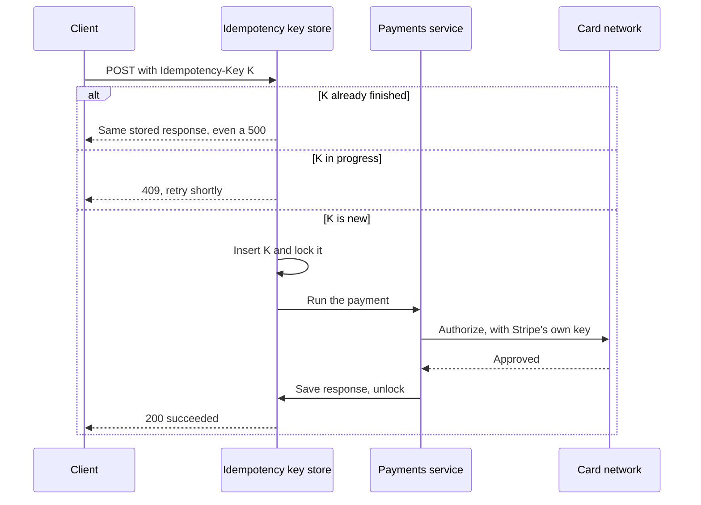
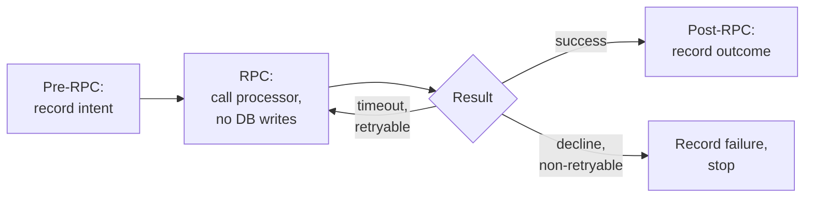
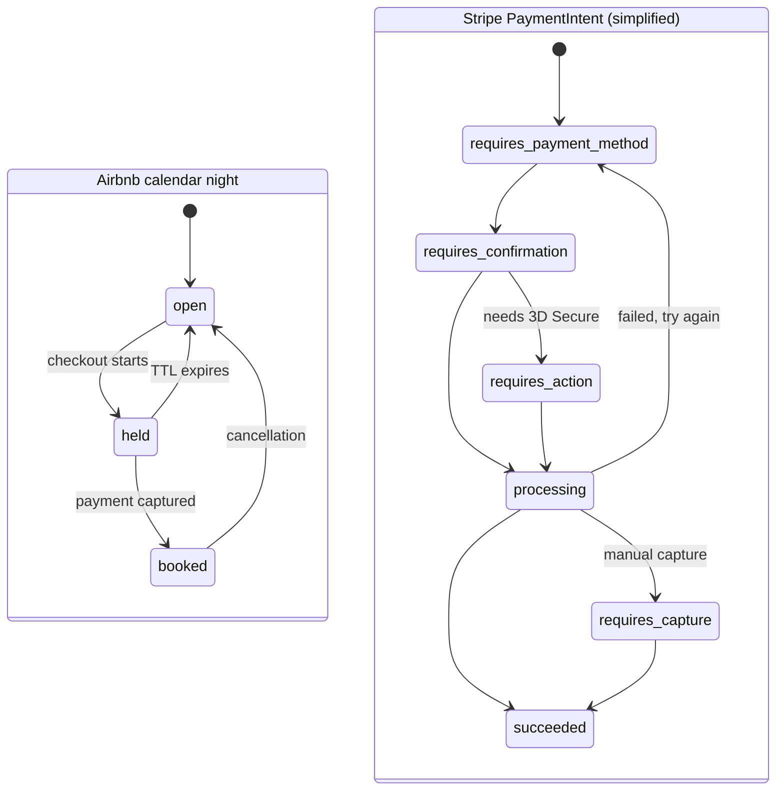
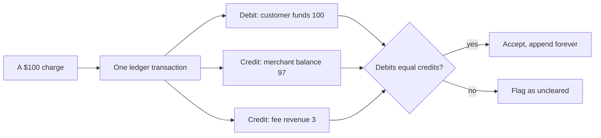
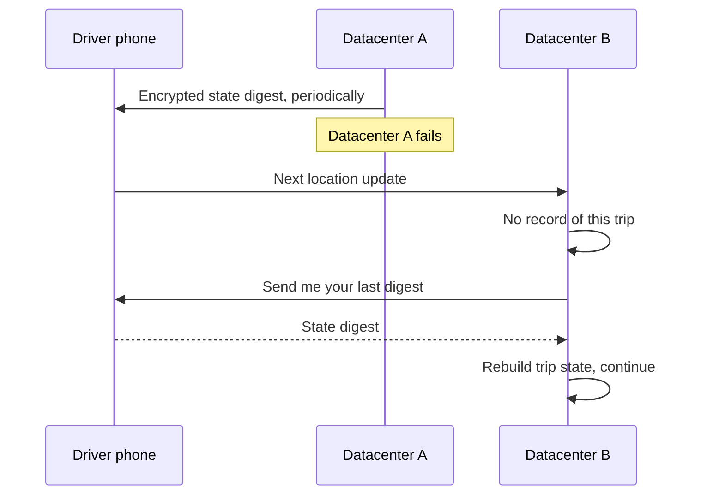

# Money and correctness: how do Stripe, Airbnb, and Uber avoid charging you twice when the network lies?

> **The hook:** a shopper taps Pay, the connection flickers, and they tap again. Two guests tap
> Reserve on the same loft for the same night. A datacenter dies while you are mid-ride. In each
> case the system must end with exactly one charge, one booking, one trip record. None of them can
> use a single database transaction to get there. So how do they?

**Companies compared:** [Stripe](../companies/stripe.md) · [Airbnb](../companies/airbnb.md) ·
[Uber](../companies/uber.md)

**How to read this page:** every fact comes from the linked company pages, which cite their original
sources. "(see ...)" points at the exact section. Several company pages mark parts of their
internals as reference designs, not confirmed production code; this page keeps those labels.

## The shared problem

Networks fail in an annoying way. When a request times out, the sender cannot tell which of these
happened:

1. The request never arrived.
2. It arrived and did the work, but the reply got lost.
3. It is still running.

If you retry, case 2 becomes a double charge. If you never retry, case 1 becomes a lost sale. So
"just retry" and "never retry" are both wrong.

Three more facts make it harder:

- **The work spans systems that do not share a database.** Stripe calls card networks and banks.
  Airbnb calls two dozen external payment processors. Uber's trip touches dispatch, pricing, and the
  driver's phone. A **distributed transaction** (one all-or-nothing commit across all of them) is
  not available.
- **Money needs an audit trail.** You must be able to prove, later, where every dollar went.
- **Some resources are scarce.** One night on one listing, one driver at one moment. Two people must
  not both get it.

The industry's practical answer is sometimes called **exactly-once-ish**: deliver or retry **at
least once**, and make the receiving side **idempotent**, meaning doing the same operation twice has
the same effect as doing it once. The three companies implement that idea in different places.

## At a glance

| Dimension | Stripe | Airbnb | Uber |
|---|---|---|---|
| What "correct" means | Never charge twice, never silently drop a charge | Never book one night twice, never charge twice | Never lose or duplicate a trip record (a legal and financial artifact) |
| Retry safety mechanism | Client-sent `Idempotency-Key` on every mutating request; first response cached | **Orpheus** framework: record intent, call processor, record result, with an idempotency key | Schemaless cells are immutable and versioned; a driver's reject just re-runs the batch |
| Concurrent duplicate | Second request gets `409 Conflict` while the first holds a lock | Second guest's hold on the same nights is rejected before payment | Not described at this level |
| Scarce resource | Funds can be authorized and held (`requires_capture`) before capture | Calendar night moves `open` to `held` (short TTL) to `booked` | A driver gets one offer at a time; decline or timeout re-runs matching |
| Source of truth for money | **Ledger**: immutable, append-only, double-entry, 5 billion events/day | Append-only double-entry payments ledger | Trip record in Schemaless (append-only cells), later Spanner |
| Telling other systems | Signed webhooks, at-least-once, unordered, retried up to 3 days | Kafka events via SpinalTap change-data-capture | Kafka streams; Schemaless triggers |
| Headline number | ~$1.4 trillion processed in 2024 | "Five nines" of payment consistency after Orpheus | >40 million trips per day (Q4 2025) |

## Dimension 1: making a retry safe

**Stripe** makes the client responsible for naming each logical operation. Every `POST` carries an
`Idempotency-Key` header, ideally a random UUID. Stripe's documented behavior (see [Stripe:
idempotency keys](../companies/stripe.md#idempotency-keys)):

- The **first** response for a key is stored and returned for every later request with that key,
  **even if it was a `500` error**.
- Reusing a key with **different parameters** is rejected as a client bug.
- Two requests racing with the same key: the first locks the key, the second gets `409 Conflict`.
- A request that fails basic validation never ran any logic, so it is not cached and can be retried
  freely.
- Keys can be pruned after about 24 hours.
- Stripe does the same thing one level down: its own calls to card networks carry their own
  idempotency keys, so a retry inside Stripe cannot double-charge either (unverified; Stripe has
  not documented this publicly).

The golden rule this creates for every integrator: **a timeout means "retry with the same key",
never "retry with a new key"**. (The internal locking details come from a reference implementation
by the engineer who wrote Stripe's idempotency post, and the Stripe page labels them as such.)

**Airbnb's Orpheus** puts the idempotency machinery around the dangerous call itself. Each payment
call is split into three phases (see [Airbnb: booking and payments
flow](../companies/airbnb.md#booking--payments-flow)):

1. **Pre-RPC:** durably record the intent to charge in a sharded database, before calling anyone.
2. **RPC:** call the external processor, with **no database writes** during this window, so a
   timeout cannot leave a half-written record.
3. **Post-RPC:** record the outcome.

Every failure is classified as **retryable** (a network timeout: replay against the recorded intent
with the same key) or **non-retryable** (a card decline: retrying will not help). Airbnb reports
this reached "five nines" of payment consistency.

**Uber** handles the same concern in its data model. Schemaless stores each piece of a trip as an
immutable **cell** addressed by row key, column name, and a version number (**ref key**). A change
is a new version, never an edit in place. Splitting a trip into columns (`BASE`, `STATUS`,
`FARE_ADJUSTMENTS`) means unrelated writes, say driver feedback and a fare adjustment, never race
each other (see [Uber: Schemaless](../companies/uber.md#schemaless-the-trip-datastore)).

| | Stripe | Airbnb Orpheus | Uber Schemaless |
|---|---|---|---|
| Who names the operation | The client, with a key | The payment call, with a key | The row key plus version |
| When is intent recorded | Before business logic runs | Before the external call | Every write is a new immutable cell |
| Concurrent duplicate | 409 | Hold on nights rejected first | Separate columns avoid races |

## Dimension 2: holding a scarce resource

Before money moves, something scarce often has to be reserved.

**Airbnb: hold before charge.** The Booking Service asks the calendar to hold the nights *before*
any payment attempt. If the hold fails because another guest got there first, the flow stops and
nobody is charged. The Airbnb page describes the calendar as one row per `(listing_id, night_date)`
with a status, and a database-enforced rule that at most one `booked` row exists per key. The `held`
state has a short **TTL** (time to live), so an abandoned checkout tab releases the nights by
itself. Airbnb has not published how the calendar is partitioned; the partitioning, locking and TTL
mechanics are a labeled reference design (see [Airbnb: availability
calendar](../companies/airbnb.md#availability-calendar)).

**Stripe: the payment itself is a state machine.** A `PaymentIntent` moves through named states
instead of succeeding or failing in one call. It can stop in `requires_action` for 3D Secure (an
extra bank authentication step required by European rules), and it can be authorized but held in
`requires_capture` until the merchant captures funds. A failed attempt loops back to
`requires_payment_method` so the same PaymentIntent, and its history, is reused with another card
(see [Stripe: PaymentIntent
lifecycle](../companies/stripe.md#3-paymentintent-lifecycle-state-machine)).

**Uber: an offer, not a lock.** DISCO, Uber's dispatch service, batches open requests and candidate
drivers every few seconds, proposes an assignment, and pushes an offer to one driver. If the driver
declines or times out, the rider never sees an error; DISCO re-runs the batch without that driver
(see [Uber: DISCO](../companies/uber.md#disco-the-dispatch-optimizer)).

Note the shared shape: a **named intermediate state** (held, requires_capture, an offered driver)
between "nothing" and "committed". That intermediate state is what lets a slow, multi-step process
pause, time out, or be retried without a distributed transaction.

## Dimension 3: the ledger as the source of truth

A normal database row says "balance: $120". If someone overwrites it by mistake, the history is
gone. A **ledger** records every movement instead, and the balance is computed from the movements.

**Double-entry bookkeeping** is the rule accountants have used for centuries: every transaction
debits at least one account and credits another by the same amount, so every transaction sums to
zero. Money cannot appear or vanish without breaking that sum.

**Stripe's Ledger** is an immutable, append-only, double-entry log that every internal system
(billing, payouts, disputes, Connect) publishes into. Nothing published can be edited or deleted;
mistakes are fixed with a new offsetting entry. On top of it, a data-quality platform checks three
things (see [Stripe: the ledger](../companies/stripe.md#the-ledger)):

- **Clearing:** do debits and credits balance? An uncleared balance is treated as a failure, not a
  curiosity.
- **Timeliness:** how long did an event take to land in the ledger?
- **Completeness:** did anything from an upstream system go missing? Checked by matching IDs and by
  spotting unusual arrival patterns.

It processes 5 billion events a day and targets 99.99% of dollar volume verified within 4 days.
Fixes go through a correction pipeline with mandatory two-phase review, described as approximating a
CI pipeline for data repair. The Stripe page sums up the mindset: the database is a cache of current
state; the append-only ledger is the truth, and current state can always be recomputed from it.

**Airbnb's payments ledger** is also append-only and double-entry. It matters because Airbnb charges
the guest at booking and pays the host days after check-in, possibly in another currency. The page
presents recording an exchange-rate change as its own ledger entry as a reasonable consequence of
this model, labeled as not confirmed in detail (see [Airbnb: what happens when things
break](../companies/airbnb.md#what-happens-when-things-break)).

**Uber's** trip record plays the same role for a ride. Schemaless cells are append-only and
versioned, so the trip's history is preserved rather than overwritten.

The diagram's amounts are illustrative only. The shape (one transaction, several balanced entries)
follows Stripe's described design; its page labels the exact schema a reference design.

## Dimension 4: when the answer is genuinely unknown

**Stripe is honest about uncertainty.** A `500` response is documented as indeterminate: even Stripe
may not know yet whether the card was charged. During incident cleanup, engineers compare Stripe's
records with what the payment network actually did, then roll Stripe's state **forward** (if the
charge went through) or **back** (if not). That comparison-and-repair step is **reconciliation**.
The cached `500` for that idempotency key never changes, but a webhook still fires for any object
created during reconciliation, which is why Stripe recommends putting your own ID in `metadata` so
you can match it later (see [Stripe: what happens when things
break](../companies/stripe.md#what-happens-when-things-break)).

**Airbnb's** Orpheus avoids most of the ambiguity by recording intent first, so after a timeout the
system replays against a known record instead of guessing. Airbnb's page explains the choice:
payments span internal services and external processors that do not support distributed
transactions, so idempotency keys plus retry classification give an exactly-once **effect** on top
of Kafka's at-least-once delivery.

**Uber** had the most dramatic version: an entire datacenter disappearing mid-trip. During a trip,
dispatch periodically pushes an encrypted **state digest** to the driver's phone. After a failover,
the next location update reaches a datacenter with no record of the trip; it asks the phone for its
last digest and rebuilds enough state to continue "like nothing happened" (see [Uber: what happens
when things break](../companies/uber.md#what-happens-when-things-break)).

Later, Uber moved its fulfillment platform to **Spanner**, a database with strongly consistent
cross-shard transactions, precisely because the earlier stack's consistency was only best-effort and
coordinating writes across trip and driver entities needed ad hoc choreography. A Business
Transaction Coordinator now handles cross-entity changes (see [Uber: how it
evolved](../companies/uber.md#how-it-evolved)).

## Dimension 5: telling everyone else

After money moves, other systems need to know: the merchant, the host, search, analytics.

**Stripe webhooks** are the most carefully specified (see [Stripe:
webhooks](../companies/stripe.md#webhooks)):

- **At-least-once, unordered.** Events can arrive twice and out of order, even `invoice.paid` before
  `invoice.created`. Merchants must deduplicate by event ID.
- **Signed.** Each delivery carries an **HMAC** signature (a hash of the payload mixed with a shared
  secret) over a timestamp plus the body. Because the timestamp is signed, an old captured message
  cannot be replayed; libraries reject anything older than 5 minutes.
- **Retried** with exponential backoff for up to 3 days in live mode.
- **Acknowledge fast.** Verify, store the event, return `2xx`, then process. A slow reply looks like
  a failure and triggers a retry.

Stripe deliberately chose this weaker guarantee because exactly-once, ordered delivery across the
open internet is prohibitively complex, and "dedupe by ID" is cheap for the receiver.

**Airbnb** propagates changes with **SpinalTap**, which reads a service's database change log and
publishes each row change as a Kafka event. Services never call each other just to announce a change
(see [Airbnb: SOA migration](../companies/airbnb.md#soa-migration-from-the-rails-monolith)).

**Uber's** Schemaless has **triggers**: downstream services register to be called asynchronously
when a cell changes, effectively an event bus inside the datastore. Trip data and rider/driver status
also stream through Kafka (into surge pricing). When Uber moved to Spanner, which has no built-in change capture, it
built its own component (LATE) to get trigger-like behavior back.

## Dimension 6: protecting the money path under load

Correctness also means not letting overload break real payments.

- **Stripe** runs four rate limiters in layers: a per-account **token bucket** (tokens refill at a
  steady rate, each request spends one), a cap on concurrent in-flight requests, a fleet-wide
  shedder that reserves capacity for critical traffic, and a last-resort shedder that drops
  test-mode calls and `GET`s before `POST /payment_intents`. The limiters **fail open**: if the
  limiter's own store is unreachable, requests go through rather than rejecting everything (see
  [Stripe: rate limiting](../companies/stripe.md#rate-limiting)).
- **Airbnb** separates the strongly consistent calendar from eventually consistent search, so a
  search slowdown or stale index cannot cause a double booking (see [Airbnb: availability
  calendar](../companies/airbnb.md#availability-calendar)).
- **Uber** uses surge pricing as a pressure valve: raising price in a cell where demand outstrips
  supply throttles demand and draws more drivers exactly where the system would otherwise be
  overwhelmed (see [Uber: what happens when things
  break](../companies/uber.md#what-happens-when-things-break)).

## Why they differ

- **What is being protected.** Stripe's product *is* moving money for others, so it built the most
  general tools: public idempotency keys, a company-wide ledger, signed webhooks. Airbnb's hard
  problem is a scarce night plus money, so hold-before-charge comes first. Uber's hard problem is a
  live physical trip, so surviving a datacenter loss mid-ride matters more than a payments API.
- **Who the caller is.** Stripe's callers are other companies' servers, so it pushes obligations
  onto them (send keys, dedupe webhooks). Airbnb and Uber mostly call external processors
  themselves, so they wrap those calls (Orpheus).
- **Era and stack.** Uber's 2014 choices favored availability (Ringpop, best-effort consistency). By
  2021 it wanted strong cross-entity transactions and moved to Spanner. Stripe's DocDB (on MongoDB
  since 2011) handles product state, while the ledger is the correctness backstop.

## What to take into an interview

- **Idempotency key = a dedupe table keyed on (account, key), caching the first response.** Lock the
  key while running; return `409` to a concurrent duplicate.
- **Record intent before calling an unreliable external system,** do no writes during the call,
  record the outcome after, and classify failures as retryable or not.
- **Hold scarce resources before charging,** with a short TTL so abandoned attempts release
  themselves. Make the final commit something the database refuses to duplicate.
- **Model multi-step flows as explicit state machines** with named intermediate states.
- **Use an append-only double-entry ledger as the source of truth;** current balances are derived
  views.
- **Deliver events at least once, unordered, signed,** and make receivers dedupe by ID.
- **Admit uncertainty.** A timeout or `500` is "unknown", and reconciliation after the fact is a
  normal, designed step.

## Read more

- Stripe: [Idempotency keys](../companies/stripe.md#idempotency-keys) · [Charge request with
  idempotency](../companies/stripe.md#1-charge-request-with-idempotency-key-handling) · [The
  ledger](../companies/stripe.md#the-ledger) · [Webhooks](../companies/stripe.md#webhooks) · [Rate
  limiting](../companies/stripe.md#rate-limiting)
- Airbnb: [Booking and payments flow](../companies/airbnb.md#booking--payments-flow) · [Core booking
  flow](../companies/airbnb.md#1-core-booking-flow) · [Availability
  calendar](../companies/airbnb.md#availability-calendar)
- Uber: [Schemaless](../companies/uber.md#schemaless-the-trip-datastore) ·
  [DISCO](../companies/uber.md#disco-the-dispatch-optimizer) · [What happens when things
  break](../companies/uber.md#what-happens-when-things-break)
- Original sources most worth reading: [Designing robust and predictable APIs with
  idempotency](https://stripe.com/blog/idempotency) · [Ledger: Stripe's system for tracking and
  validating money
  movement](https://stripe.dev/blog/ledger-stripe-system-for-tracking-and-validating-money-movement)
  · [Avoiding Double Payments in a Distributed Payments
  System](https://medium.com/airbnb-engineering/avoiding-double-payments-in-a-distributed-payments-system-2981f6b070bb)
  · [Designing Schemaless](https://www.uber.com/us/en/blog/schemaless-part-one-mysql-datastore/)
- Related comparisons: [Databases and sharding](databases-and-sharding.md) · [Real-time
  messaging](real-time-messaging.md) (deduplication by message ID)
