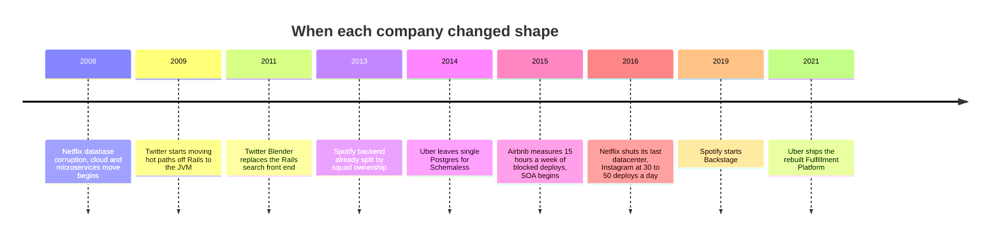
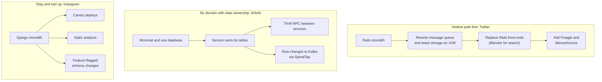
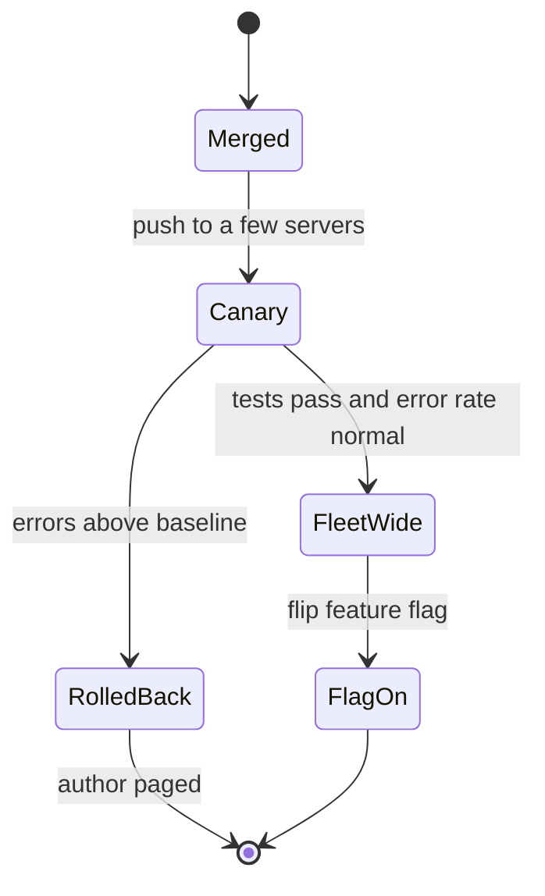
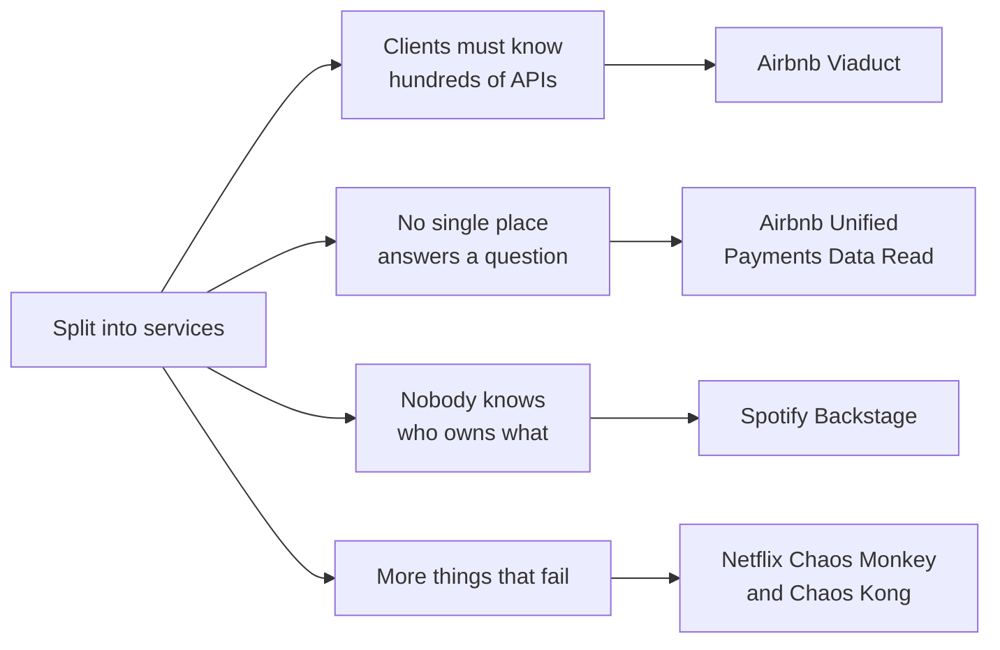

# Monolith to microservices: when should you break up one big app, and what does it really cost?

> **The hook:** Airbnb, Twitter, Uber, Netflix, and Spotify all split one big application into many
> services. Instagram serves billions of users from a Django app with millions of lines and never
> split it. Every one of them is considered a success. So "microservices or not" is the wrong
> question. The right one is: what exact pain are you paying to remove?

**Companies compared:** [Airbnb](../companies/airbnb.md) · [Twitter/X](../companies/twitter-x.md) ·
[Uber](../companies/uber.md) · [Netflix](../companies/netflix.md) ·
[Instagram](../companies/instagram.md) · [Spotify](../companies/spotify.md)

**How to read this page:** every fact comes from the linked company pages, which cite their original
sources. "(see ...)" points at the exact section.

## The shared problem

A **monolith** is one codebase that builds into one deployable application: every feature lives
together, shares one database, and ships together. **Microservices** (or the coarser
**service-oriented architecture**, SOA) split features into separate programs that each deploy on
their own and talk over the network.

A monolith is the right way to start. Everyone can read the whole codebase, a change touching three
features is one commit, and one database transaction keeps everything consistent. Problems show up
as the company grows:

- **Deploys collide.** Hundreds of engineers share one release. One bad commit blocks everyone.
- **Code tangles.** Modules take on too many jobs; nobody understands them all.
- **One database becomes one point of failure.** A slow query from one team slows every team.
- **One runtime becomes a ceiling.** The language or framework cannot use the hardware well.

Splitting fixes some of these and creates new ones: network calls instead of function calls, no
single transaction across services, hundreds of things to monitor, and "which service owns this?"
becomes a real question.

## At a glance

| Dimension | Airbnb | Twitter/X | Uber | Netflix | Instagram | Spotify |
|---|---|---|---|---|---|---|
| Started as | "Monorail": one Ruby on Rails app, one shared database | One Rails app over MySQL | Node.js (Marketplace) and Python monolith, one Postgres for trips | DVD-by-mail company in its own datacenters, big Oracle database | One Django app, one Postgres, on AWS | A backend already split by feature ownership by 2013 |
| The measured pain | ~15 hours/week of blocked deploys at ~200 engineers | Ruby's GIL, the "Fail Whale", ~1,444% user growth in a year (third-party) | Postgres near capacity; later 400+ engineers on a stack with no extension model | A 3-day database corruption in Aug 2008 stopped DVD shipping | None forced a split | 2,000+ services and nobody could find owners |
| What they did | SOA with strict data ownership, Thrift RPC, Kafka events | Moved hottest paths to the JVM first, then front ends (Blender for search) | Hundreds of services; later rebuilt fulfillment on Spanner | Rewrote as microservices while moving to AWS, 2008 to 2016 | Stayed a monolith, invested in deploy tooling | Built Backstage, a service catalog |
| How long | 2015 to 2018 for the core move | About four years from first Mesos test to full migration | Rewrites in 2015 and 2021 | About 7 years | Not applicable | Backstage first commit Oct 2019, open-sourced Mar 2020 |
| Headline result | Weekly deploys ~3,000 to ~10,000 | Per-host throughput 200-300 to 10,000-20,000 req/s | Platform for 1M+ concurrent users, 10,000+ cities | Last datacenter shut Jan 2016 | 30-50 deploys a day on one codebase (2016) | ~55% faster engineer onboarding |

## Dimension 1: what actually forced the move

The strongest lesson on this page: **every successful split started from a specific, measured
pain**, not from fashion.

- **Airbnb** had a number. At ~200 engineers and ~200 commits a day, reverts and rollbacks in the
  shared deploy queue cost an average of **~15 hours a week** of blocked deploys. One
  message-handling module had 400+ contributors (see [Airbnb: SOA
  migration](../companies/airbnb.md#soa-migration-from-the-rails-monolith)).
- **Twitter** hit a runtime ceiling. Ruby MRI has a **GIL** (global interpreter lock), so one Rails
  process ran one thread of Ruby at a time no matter how many cores the machine had. Combined with
  explosive growth, that produced the "Fail Whale" outage page of 2007 to 2010 (see [Twitter/X: the
  monolith years](../companies/twitter-x.md#the-monolith-years-2006-2011)).
- **Netflix** had a disaster. In August 2008 a database corruption stopped DVD shipping for three
  days. Netflix names that as the trigger to leave single, vertically scaled points of failure (see
  [Netflix: how it evolved](../companies/netflix.md#how-it-evolved)).
- **Uber** hit storage first (a single Postgres running out of room in 2014), then, years later,
  engineering debt: 400+ engineers working on a fulfillment system with no clear way to add new
  product types (see [Uber: how it evolved](../companies/uber.md#how-it-evolved)).
- **Instagram** never hit a forcing function. Its page puts it directly: the thing that had to scale
  was the tooling around one service, not the number of services (see [Instagram: the Django
  monolith at scale](../companies/instagram.md#the-django-monolith-at-scale)).
- **Spotify** was organized for autonomy early (squads owning features by 2013), so its pain came
  later and was about people: with 2,000+ services, 300+ websites, and 4,000+ data pipelines,
  engineers could not find the APIs they needed or who owned them (see [Spotify:
  Backstage](../companies/spotify.md#backstage-the-service-catalog-built-because-who-owns-this-stopped-having-an-answer)).

## Dimension 2: how they cut it apart

There is no single migration strategy on this page. There are four.

**Hottest path first (Twitter).** Twitter did not rewrite everything. It found the two components
buckling first, the message queue and tweet storage, and rewrote just those in Scala on the JVM
while the rest stayed on Rails. Then it replaced Rails front ends with JVM servers, starting with **Blender** for search (2011).
Only once there were many JVM services did it need **Finagle** (an RPC library, the code that lets
one service call another over the network) and **Mesos with Aurora** (a cluster scheduler that
decides which machine runs which service). Each step only became necessary because the previous one
succeeded (see [Twitter/X: from Rails to the
JVM](../companies/twitter-x.md#from-rails-to-the-jvm-blender-finagle-and-mesosaurora)).

**Split by domain, with data ownership (Airbnb).** Airbnb deliberately calls what it built SOA, not
microservices: fewer, coarser services with more shared libraries. The rule that mattered was **data
ownership**: each service owns its database, and no other service may query it. Services define
their interfaces in **Thrift**, a language that generates client and server code automatically.
Changes flow out through **SpinalTap**, a change-data-capture tool that turns database row changes
into Kafka events (see [Airbnb: SOA
migration](../companies/airbnb.md#soa-migration-from-the-rails-monolith)).

**Rewrite during a platform move (Netflix, Uber).** Netflix refused to "lift and shift" its monolith
onto AWS, because moving the same fragile design onto someone else's servers would not fix it. It
rewrote as hundreds of microservices on NoSQL stores while migrating, which took about seven years
(see [Netflix: microservices on
AWS](../companies/netflix.md#microservices-on-aws-the-control-plane-stack)). Uber's 2021 Fulfillment
Platform was also a ground-up rebuild: 100+ engineers across 30+ teams over about two years, after
six months auditing every product and writing 200+ pages of requirements (see [Uber: how it
evolved](../companies/uber.md#how-it-evolved)).

**Split the risk, not the code (Spotify's cloud move).** When Spotify moved to Google Cloud (2016 to
2018), user-facing services were moved "lift and shift" to avoid destabilizing streaming, while data
pipelines were allowed to be rewritten. The parts users feel got the most conservative treatment
(see [Spotify: the GCP
migration](../companies/spotify.md#the-gcp-migration-leaving-four-data-centers-behind)).

## Dimension 3: the counter-example, Instagram

Instagram's backend is still one Django application, several million lines and a few thousand
endpoints. It deploys 30 to 50 times a day across thousands of machines (2016). How?

- **Canary deploys.** New code goes to a small slice of servers first. A tool called **Sauron**
  tracks the release, **Jenkins** gates on test results, and **Fabric** scripts the rollout. Only a
  healthy canary is promoted to the whole fleet, and authors get paged by chat, email, or SMS if
  something breaks.
- **Feature-flagged schema changes.** Database changes ship as dual-read/dual-write code behind a
  flag instead of a one-shot migration, so a bad change can be switched off without a redeploy.
- **Static analysis.** Automated tools (the work that became the open-source `LibCST` library) scan
  the whole codebase for a known-bad pattern and flag or fix every instance at once.

The cost is real: every engineer's change lands in one shared codebase, so a slow or flaky test
suite is everyone's problem. Instagram names fixing a flaky test suite and a growing commit backlog
as prerequisites for reliable continuous deployment (see [Instagram: the Django monolith at
scale](../companies/instagram.md#the-django-monolith-at-scale)).

Compare this with Airbnb's measured pain. Airbnb's 15 hours a week of blocked deploys came from
**one shared deploy queue**. Instagram attacked the same kind of problem inside a monolith, by
making each deploy small, fast, and safe to roll back. Airbnb attacked it by giving each service its
own deploy pipeline. Both worked.

## Dimension 4: the plumbing services need

Once there are many services, they need ways to find each other, call each other, and get scheduled
onto machines.

| Need | Twitter/X | Netflix | Airbnb | Uber | Spotify |
|---|---|---|---|---|---|
| Calling other services | Finagle RPC | Not detailed on the page | Thrift RPC | TChannel RPC | gRPC (named in the 2022 incident) |
| Finding them (**service discovery**) | Self-registering "serversets" in ZooKeeper, replacing hardcoded host lists | Not detailed on the page | SmartStack (2013), later AirMesh on Istio | Hyperbahn | Google Cloud Traffic Director, with DNS still available |
| Running them | Mesos and Aurora | Titus, ~3M containers launched per week (2018) | Not detailed | Not detailed | Compute Engine and GKE |
| Front door | API gateway | Zuul 2: ~80 clusters, 1M+ requests/sec | API gateway | NGINX, HAProxy, 600+ "Frontline" endpoints | API gateway |

Sources: [Twitter/X: from Rails to the
JVM](../companies/twitter-x.md#from-rails-to-the-jvm-blender-finagle-and-mesosaurora), [Netflix:
microservices on AWS](../companies/netflix.md#microservices-on-aws-the-control-plane-stack),
[Airbnb: how it evolved](../companies/airbnb.md#how-it-evolved), [Uber: how it
evolved](../companies/uber.md#how-it-evolved), [Spotify: a shared low-level dependency
fails](../companies/spotify.md#a-shared-low-level-dependency-fails-silently-march-8-2022).

**Service discovery** means "how does service A learn the current network address of service B?"
Twitter's page shows the before and after as two lines: a hardcoded list of IP addresses, versus
asking ZooKeeper for the live set of servers for a role, environment, and service name.

Notice the same plumbing becomes a new single point of failure. Spotify's March 2022 outage came
from Google's Traffic Director (its service-discovery control plane) failing together with a gRPC
client bug. Recovery worked only because Spotify still ran the older DNS-based discovery for most
services and could fall back to it.

## Dimension 5: the new problems splitting creates

Every company that split hit a second-order problem, and most built a new system to fix it.

- **"Which service do I call?"** Airbnb's client engineers had to know which of hundreds of services
  held each piece of data and stitch results together per screen. Airbnb built **Viaduct**, a
  central-schema GraphQL layer: one schema for clients, where each backend team owns a module of it (see
  [Airbnb: Viaduct](../companies/airbnb.md#data-mesh-viaduct)).
- **"Did this reservation get paid?"** Splitting payments into pay-in, payout, ledger, and
  settlement services meant no one service could answer. Airbnb added **Unified Payments Data
  Read**, one composed read API (see [Airbnb: booking and payments
  flow](../companies/airbnb.md#booking--payments-flow)).
- **"Who owns this?"** Spotify built **Backstage**: every service, website, and pipeline registers
  itself with a small metadata file naming its owner, docs, and APIs, and engineers get one
  searchable catalog. Onboarding time was cut in half. Spotify open-sourced it in 2020 and donated
  it to the CNCF (see [Spotify:
  Backstage](../companies/spotify.md#backstage-the-service-catalog-built-because-who-owns-this-stopped-having-an-answer)).
- **"Does it survive failure?"** Netflix built **chaos engineering**: Chaos Monkey randomly kills
  production instances; Chaos Kong simulates losing an entire AWS region. The page's warning: this
  only works if every service is genuinely built to degrade gracefully (see [Netflix: chaos
  engineering](../companies/netflix.md#chaos-engineering-and-resilience-practice)).
- **"Can we still change it?"** Uber's 2014-era fulfillment stack became engineering debt:
  best-effort consistency, ad hoc cross-service choreography, and no first-class way to add food or
  packages. The 2021 rebuild added a Business Transaction Coordinator for cross-entity transactions
  (see [Uber: how it evolved](../companies/uber.md#how-it-evolved)).

## Dimension 6: org shape follows architecture

Services need owners, and ownership is an org-chart decision.

- **Spotify's** model, documented in 2012 at about 30 teams: **squads** (small cross-functional
  teams owning a long-lived area), grouped into **tribes** (kept under about 100 people), with
  **chapters** (people of one skill across squads, led by their line manager) and **guilds**
  (company-wide interest groups). The page's warning: autonomy without real investment in chapters
  and guilds tends toward duplicated effort, which is part of why Spotify later needed company-wide
  tools like Backstage and a standardized CDN (see [Spotify: squads, tribes, chapters,
  guilds](../companies/spotify.md#squads-tribes-chapters-guilds-organizing-people-to-match-a-decentralized-architecture)).
- **Airbnb** grew from ~90 to ~1,000 engineers between 2014 and 2018, and the migration was sized to
  that growth, not to traffic.
- **Netflix** frames the payoff in team terms: the recommendations team can deploy ten times a day
  without waiting on the billing team.

## Why they differ

- **What hurt.** Deploy contention (Airbnb) and a runtime ceiling (Twitter) are different diseases.
  Twitter's fix was a faster runtime on the hottest paths; Airbnb's was independent deploys and data
  ownership.
- **Whether a disaster forced it.** Netflix's database corruption and the move to AWS made a full
  rewrite unavoidable. Instagram had no such event.
- **Language fit.** Instagram's single language and framework, plus heavy tooling investment, kept
  one codebase workable. Twitter's language was the bottleneck itself.
- **Team size and growth rate.** A 10x growth in engineers (Airbnb) strains a shared codebase in
  ways a 10x growth in users does not.

## What to take into an interview

- **Have a number before you split.** "15 hours a week of blocked deploys" or "200-300 requests per
  second per host" justifies a migration. "Microservices are best practice" does not.
- **Migrate the hottest path first.** Twitter's order (queue and storage, then front end, then
  plumbing) is the realistic answer to "how do you leave a monolith without freezing feature work?"
- **Split data ownership, not just code.** Services that still share tables just move the coupling
  one network hop away.
- **A monolith can scale** with canary deploys, feature flags, and static analysis. Instagram is the
  standard counter-example.
- **Plan for the second-order problems:** a query layer (Viaduct), a service catalog (Backstage),
  failure testing (Chaos Monkey), and keeping an old fallback path alive (Spotify's DNS).
- **Big migrations take years.** Netflix took about 7, Twitter's scheduler move about 4, Airbnb's
  core SOA move about 3. Do not promise one quarter.

## Read more

- Airbnb: [SOA migration](../companies/airbnb.md#soa-migration-from-the-rails-monolith) ·
  [Viaduct](../companies/airbnb.md#data-mesh-viaduct) · [How it
  evolved](../companies/airbnb.md#how-it-evolved)
- Twitter/X: [From Rails to the
  JVM](../companies/twitter-x.md#from-rails-to-the-jvm-blender-finagle-and-mesosaurora) · [The
  monolith years](../companies/twitter-x.md#the-monolith-years-2006-2011) · [Building shared
  platforms](../companies/twitter-x.md#building-shared-platforms-2010-2015)
- Uber: [How it evolved](../companies/uber.md#how-it-evolved) ·
  [Ringpop](../companies/uber.md#ringpop-the-self-organizing-cluster)
- Netflix: [Microservices on
  AWS](../companies/netflix.md#microservices-on-aws-the-control-plane-stack) · [Chaos
  engineering](../companies/netflix.md#chaos-engineering-and-resilience-practice)
- Instagram: [The Django monolith at scale](../companies/instagram.md#the-django-monolith-at-scale)
- Spotify:
  [Backstage](../companies/spotify.md#backstage-the-service-catalog-built-because-who-owns-this-stopped-having-an-answer)
  · [Squads and
  tribes](../companies/spotify.md#squads-tribes-chapters-guilds-organizing-people-to-match-a-decentralized-architecture)
  · [The GCP migration](../companies/spotify.md#the-gcp-migration-leaving-four-data-centers-behind)
- Original sources most worth reading: [Airbnb's Great Migration: From Monolith to
  Service-Oriented](https://www.infoq.com/presentations/airbnb-soa-migration/) · [Completing the
  Netflix Cloud Migration](http://about.netflix.com/en/news/completing-the-netflix-cloud-migration)
  · [Continuous Deployment at
  Instagram](https://www.infoq.com/news/2016/04/continuous-deployment-instagram) · [How We Use
  Backstage at Spotify](https://engineering.atspotify.com/2020/04/how-we-use-backstage-at-spotify) ·
  [Uber's Fulfillment
  Platform](https://www.uber.com/us/en/blog/fulfillment-platform-rearchitecture/)
- Related comparisons: [Databases and sharding](databases-and-sharding.md) · [Money and
  correctness](money-and-correctness.md)
