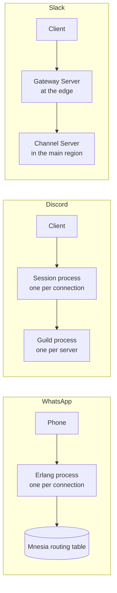
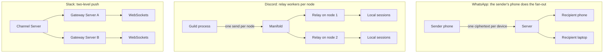
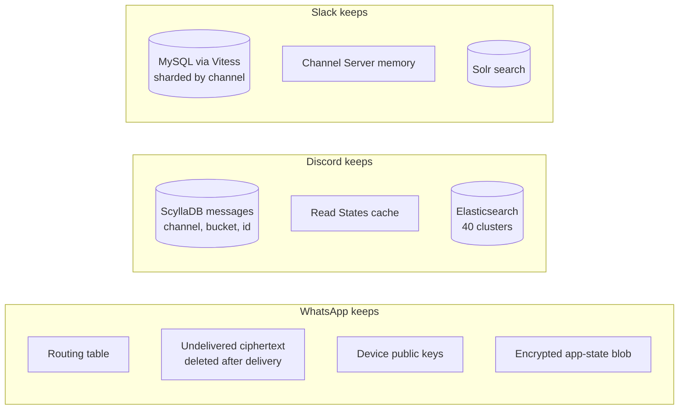
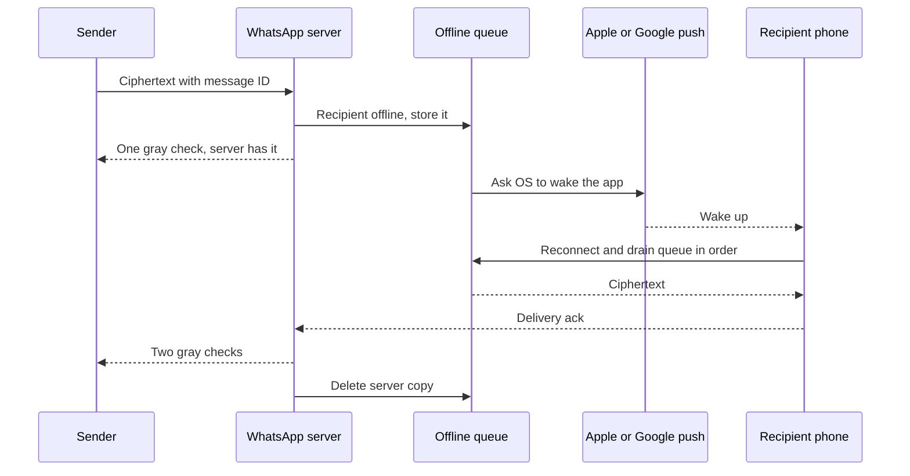

# Real-time messaging: how do WhatsApp, Discord, and Slack each get a message across in about a second?

> **The hook:** all three apps get a chat message to the other side in about a second. So why did
> one of them decide never to store your messages at all, one store trillions of them forever, and
> one split its servers into two completely different kinds just to deliver them?

**Companies compared:** [WhatsApp](../companies/whatsapp.md) · [Discord](../companies/discord.md) ·
[Slack](../companies/slack.md)

**How to read this page:** every fact here comes from the three company pages linked above. When a
sentence says "(see ...)" it points at the exact section on that page, where the original source is
cited. Nothing on this page is new research.

## The shared problem

Picture three people typing "on my way" at the same moment. One is texting a cousin on WhatsApp. One
is posting in a Discord server with a million people online. One is posting in a Slack channel at a
company with 160,000 employees.

Each app has to do the same five jobs:

1. **Keep a line open to every phone and laptop.** Asking the server "anything new?" every few
   seconds (called polling) wastes battery and adds delay. So each app keeps one connection open per
   device for hours, even while nobody is typing. A connection that stays open like this is called a
   **persistent connection**. Slack and Discord use a **WebSocket**, which is a standard two-way
   connection a browser or app can hold open. WhatsApp uses its own TLS-encrypted binary protocol
   over TCP.
2. **Find where the recipient is connected right now.** With hundreds of servers, the one that
   received your message is usually not the one holding your friend's connection.
3. **Copy the message to everyone who should see it.** Copying one event to many recipients is
   called **fan-out**. For a 1:1 chat that is one copy. For a big group it can be a million.
4. **Decide what to keep.** Store the message forever, store it until delivered, or never store it.
5. **Handle people who are offline.** Phones die, lose signal, or sit in a drawer. The message must
   arrive later, once, in the right order.

The three companies agree on job 1 and disagree on almost everything else. The reason is product
shape: WhatsApp is private conversations, Discord is huge public-ish communities, Slack is a
company's searchable work record.

## At a glance

| Dimension | WhatsApp | Discord | Slack |
|---|---|---|---|
| Main unit of conversation | 1:1 chats and groups, groups capped at 1,024 members | A "guild" (Discord's internal name for a server) with channels, up to 10M+ members | A workspace with channels, largest documented at 160,000 users |
| Who holds your connection | One Erlang process per connection on FreeBSD, ~1M connections per server (2014) | One Elixir "session" process per connection, plus one process per guild | A Gateway Server at the network edge, near you |
| How a message is routed | Look up the recipient's server in Mnesia, an in-memory database built into Erlang | The guild's process hands the event to Manifold, which relays it through one worker per node | Consistent hashing sends it to the one Channel Server that owns that channel |
| What is stored | No message archive. Undelivered ciphertext is deleted after delivery | Every message, forever, in ScyllaDB (trillions) | Every message, in MySQL sharded through Vitess |
| Group fan-out done by | The sender's own phone (one encrypted copy per device), Sender Keys for groups | Manifold relay workers, plus "passive sessions" for huge guilds | Channel Server to Gateway Servers, then Gateway Servers to sockets |
| Offline users | Durable per-recipient queue, plus Apple/Google push to wake the app | History is permanent, and a Read States service tracks what you have read | A job queue sends a push notification, and the Flannel edge cache serves a fast snapshot on reconnect |
| Can the server read messages | No, end-to-end encrypted with the Signal Protocol | Yes, it indexes message text for search in Elasticsearch | Yes, it indexes message text for search in Solr |
| Headline number | 147M concurrent connections on ~550 servers (2014) | 26M WebSocket events sent per second (2020) | Worldwide delivery within 500ms |

## Dimension 1: holding millions of open connections

Most connections are idle most of the time. A phone in a pocket holds a connection for hours and
receives maybe a dozen messages. So the real cost is not "work per message", it is "memory and
bookkeeping per idle connection".

**WhatsApp and Discord both picked the same runtime for this: BEAM**, the virtual machine that runs
Erlang (WhatsApp) and Elixir (Discord). BEAM runs millions of tiny "processes" (not operating-system
processes, they are a few hundred bytes each) on a handful of real threads. Each connected user gets
their own process. If one user sends a malformed packet and their process crashes, nobody else is
affected, and a **supervisor** (a watcher process) restarts it (see [WhatsApp: the Erlang/BEAM
concurrency model](../companies/whatsapp.md#the-erlangbeam-concurrency-model-and-freebsd-tuning)).

- WhatsApp pushed this hard. A 2012 talk showed 2 million connections on one FreeBSD server, after
  patching the BEAM itself and tuning the kernel. By 2014 the fleet ran about 1 million per server
  on purpose, trading density for headroom, across ~550 servers and 147 million concurrent
  connections (see [WhatsApp: scale](../companies/whatsapp.md#scale)).
- Discord added a second layer. On top of one session process per connection, every guild gets its
  own process that acts as the routing hub for that community. The unit of fan-out in Discord is the
  room, not the pair of friends, so the room gets a process (see [Discord: high-level
  design](../companies/discord.md#high-level-design)).

**Slack split the job across two kinds of server instead.** A **Gateway Server** holds your
WebSocket and remembers which channels you care about. It is deployed in edge regions, physically
close to users. A **Channel Server** holds the source of truth for a slice of channels and lives in
Slack's main region. The client connects to the nearest Gateway Server through Envoy, a network
proxy used as a load balancer (see [Slack: Channel Servers and Gateway
Servers](../companies/slack.md#channel-servers-and-gateway-servers-separating-storage-of-truth-from-the-edge)).

The trade-off in one line each:

- **Process per connection** (WhatsApp, Discord) gives crash isolation for free, but you have to run
  a less common language and, at the extreme, tune the VM and kernel yourself.
- **Edge plus core** (Slack) lets Slack add connection capacity (more edge regions) separately from
  channel capacity (more Channel Servers). The cost is two kinds of stateful server to operate, each
  with its own failure story.

## Dimension 2: finding where the recipient is

When your message lands on server A, something must answer "which server holds the recipient right
now?"

- **WhatsApp** keeps a shared **routing table** in Mnesia: "user X is connected to server Y".
  Because Mnesia lives in RAM and is replicated, the lookup is a same-datacenter memory read, not a
  trip to a separate database. In 2014 the table was about 2TB of RAM, split into 16 partitions,
  holding 18 billion records (see [WhatsApp: high-level
  design](../companies/whatsapp.md#high-level-design)).
- **Discord** does not look up individual users per message. The guild process already knows its
  online members' sessions. Its problem is the next step, fan-out (Dimension 3).
- **Slack** uses **consistent hashing**: hash the channel ID onto a ring of Channel Servers, and the
  ring tells you the owner. The useful property is that adding or removing one server only moves the
  channels that belonged to that server, not everything. A component called **CHARM** (Consistent
  Hash Ring Manager) watches the ring and can have a replacement Channel Server serving traffic in
  under 20 seconds after one goes unhealthy, with **Consul** (a service-discovery tool that tracks
  which servers are healthy) publishing the change (see [Slack: the Channel Server hash
ring](../companies/slack.md#3-signature-component-the-channel-server-hash-ring-and-fast-failover)).

Notice what each system routes by. WhatsApp routes by **person** (where is this user). Slack routes
by **channel** (who owns this channel). Discord routes by **guild** (which process owns this
community). That choice follows directly from what a "conversation" is in each product.

## Dimension 3: fan-out to groups

This is where the three designs differ most.

**WhatsApp: fan-out happens on the sender's device, because of encryption.** WhatsApp encrypts on
your phone before anything leaves it (end-to-end encryption, or E2E). The server never has the keys,
so it cannot make copies of readable text for each recipient. Instead, for a 1:1 chat your phone
fetches the recipient's list of devices and encrypts the message once per device. Meta calls this
**client-fanout** (see [WhatsApp: core
flow](../companies/whatsapp.md#1-core-flow-sending-an-encrypted-message-to-a-multi-device-recipient)).

For groups, one copy per member device would be far too much work, so groups use **Sender Keys**:
each member shares one symmetric key with the group once, then encrypts each group message a single
time. The sharp edge is removing a member. Every remaining member's key must be thrown away and
redistributed, a burst of work that grows with group size. That re-keying cost is one practical
reason groups are capped at 1,024 members and Communities at 2,000 (see [WhatsApp: group messaging
at scale](../companies/whatsapp.md#group-messaging-at-scale-sender-keys-re-keying-and-communities)).

**Discord: fan-out is the whole engineering story.** A guild process that sends to each member one
at a time is simple and correct, and it falls over. One Erlang `send` between processes costs
roughly 30 to 70 microseconds. Multiply by tens of thousands of members and a single event took
900ms to 2.1 seconds to fan out to a 30,000-concurrent-user guild (see [Discord: core
flow](../companies/discord.md#1-core-flow-sending-a-message-in-a-large-guild)).

Discord's fixes came in two rounds:

1. **Manifold (2017).** Group the recipients by which of ~20 remote nodes they are connected to,
   send one message per node, and let a worker on that node deliver locally. Local delivery inside
   one machine is cheap. The guild process now does a small, fixed amount of work no matter how big
   the guild is (see [Discord: Manifold's hierarchical
   fan-out](../companies/discord.md#3-signature-component-manifolds-hierarchical-fan-out)).
2. **Maxjourney (2022).** For a guild with 10 million members and 1 million online, Discord added
   **passive sessions**: if you are not looking at that server right now, you get a slimmed-down
   update stream instead of every event. Discord reports this cut fan-out work by roughly 90%. It
   also added more **relay** processes, each handling up to 15,000 sessions (see [Discord:
Maxjourney](../companies/discord.md#maxjourney-passive-sessions-and-relay-for-a-10-million-member-guild)).

**Slack: two levels of push.** The Channel Server never talks to your laptop directly. It pushes the
message to every Gateway Server subscribed to that channel. Each Gateway Server then pushes it down
its own open WebSockets. So adding another edge region full of Gateway Servers does not make Channel
Servers do more work per socket (see [Slack: posting a message and fanning it
out](../companies/slack.md#1-core-flow-posting-a-message-and-fanning-it-out)).

| | WhatsApp | Discord | Slack |
|---|---|---|---|
| Who pays for fan-out | The sender's phone (encryption) | The guild's node, split across relays | The Channel Server (per gateway), then gateways (per socket) |
| What limits group size | Re-keying burst on member removal, so hard caps | Fan-out cost, attacked with relays and passive sessions | Not a stated cap; largest documented workspace is 160,000 users |
| Key trick | Sender Keys: encrypt once per group | Batch by destination node, then deliver locally | Subscribe gateways to channels, not sockets to channels |

## Dimension 4: what the server stores

The biggest philosophical split.

**WhatsApp stores almost nothing.** There is no `MESSAGES` table. The server keeps routing info,
undelivered ciphertext in an offline queue, device public keys, and an encrypted "app state" blob
(contacts, archived chats) that only your own devices can decrypt. Once a message reaches all of the
recipient's devices, the server deletes its copy. History lives on your phone and in your own
optional encrypted backup (see [WhatsApp: what the server actually
tracks](../companies/whatsapp.md#3-data-model-what-the-server-actually-tracks)).

**Discord stores everything, and changed databases twice to do it.**

- 2015: one MongoDB replica set. At 100 million messages the data and index no longer fit in RAM and
  writes fell apart.
- 2016: Cassandra, with a new key `(channel_id, bucket, message_id)`. A **bucket** is about ten days
  of messages, which keeps each partition under about 100MB. A **partition** is the chunk of data
  one node owns; a partition that gets far more traffic than others is a **hot partition**.
- 2022: Cassandra had grown from 12 to 177 nodes, and the pain was operational: hot partitions,
  compaction backlogs, and JVM garbage-collection pauses. Discord moved to ScyllaDB, a
  Cassandra-compatible database written in C++. It dropped to 72 nodes and p99 read latency fell
  from 40-125ms to 15ms. **p99** means the time 99% of requests are faster than.

(See [Discord: three databases in under a
decade](../companies/discord.md#from-mongodb-to-cassandra-to-scylladb-three-databases-in-under-a-decade).)

Discord's message IDs are **Snowflake IDs**: 64-bit numbers whose top bits are a timestamp, so
sorting by ID is roughly sorting by time (see [Discord: data
model](../companies/discord.md#2-data-model-messages-buckets-and-read-states)).

**Slack stores everything in MySQL, and changed how it is split.** From launch in 2013, Slack
**sharded** MySQL by workspace, meaning each workspace's rows lived together on one database server.
That broke when single customers got too big for one server. Slack spent about three years moving
onto **Vitess**, a sharding layer originally built at YouTube, so message data could be split by
channel ID instead. By December 2020, 99% of Slack's MySQL traffic ran through Vitess at 2.3 million
queries per second (see [Slack: the Vitess
migration](../companies/slack.md#the-vitess-migration-from-one-shard-per-workspace-to-flexible-resharding)).

Why the split? Discord's and Slack's products need permanent, searchable history. Slack's name is
literally an acronym for "Searchable Log of All Conversation and Knowledge" (see [Slack: search at
Slack](../companies/slack.md#search-at-slack-why-it-isnt-just-run-a-query-against-solr)). WhatsApp's
product promise is the opposite: your chats are yours, and a server that holds nothing cannot leak
it. WhatsApp's own page puts it directly: this is the opposite design choice from Discord and Slack.

## Dimension 5: ordering and duplicates

Networks lose acknowledgments. When a server does not hear "got it", it sends again, and now the
recipient might see the message twice.

- **WhatsApp** attaches a sender-generated message ID. If the same ciphertext arrives twice, the
  recipient's app recognizes the ID and drops the copy. The offline queue drains in the order
  messages reached the server, so a conversation does not reassemble out of order when you reopen
  the app (see [WhatsApp: offline delivery and the receipt
  system](../companies/whatsapp.md#offline-delivery-and-the-receipt-system)).
- **Discord's** Manifold preserves per-recipient ordering, which Discord calls **linearizability**:
  messages from one sender reach each recipient in the order sent, even with the extra relay hop
  (see [Discord: Manifold, FastGlobal, and
  Semaphore](../companies/discord.md#manifold-fastglobal-and-semaphore-the-2017-scaling-toolkit)).
  Snowflake IDs give every stored message a time-sortable position.
- **Slack's** page does not describe ordering rules directly. What it does say is that one Channel
  Server owns each channel as its source of truth. A reasonable reading (an inference, not a Slack
  statement) is that having one owner per channel gives one place to decide that channel's order.

The general lesson: **"deliver exactly once" is really "deliver at least once, then drop duplicates
by ID"**. That pattern shows up again in payments; see [Money and
correctness](money-and-correctness.md).

## Dimension 6: offline users and reconnect storms

**WhatsApp** treats offline as the normal case. Each recipient device has its own durable queue. On
reconnect it drains in order and acknowledges each message. The receipts (one gray check, two gray
checks, two blue checks) are themselves messages that travel back through the same queues, because
the sender may be offline too. To wake a fully closed app, WhatsApp uses Apple's APNs and Google's
FCM **push notification** services, because only the phone's operating system vendor can wake a
suspended app (see [WhatsApp: message delivery as a state
machine](../companies/whatsapp.md#5-message-delivery-as-a-state-machine)).

**Discord** has no offline queue in the same sense, because nothing is deleted. A returning user
reads history from storage. What must be fast is "what have I not read yet?", checked on nearly
every connect, send, and read. That is a dedicated **Read States** service. Discord rewrote it from
Go to Rust because Go's **garbage collector** (the runtime part that frees unused memory) ran at
least every two minutes and scanned a cache of tens of millions of entries, causing latency spikes.
Rust frees memory as soon as it is unused, with no periodic pause (see [Discord: Go to
Rust](../companies/discord.md#go-to-rust-chasing-garbage-collection-out-of-read-states)).

**Slack** worries about the opposite of one offline user: everyone reconnecting at once. At 9:00 on
a Monday, thousands of laptops in one huge workspace wake up with stale local caches. Each would
otherwise download the whole team's user list and channel list. That surge is a **reconnect storm**.
Slack's answer is **Flannel**, an edge cache that keeps itself current over its own WebSocket and
hands clients a slimmed-down snapshot: 7x smaller for a 1,500-user team and 44x smaller for a
32,000-user team. At peak it held 4 million simultaneous connections (see [Slack:
Flannel](../companies/slack.md#flannel-solving-the-reconnect-storm-before-it-starts)). For users who
are fully offline, Slack's job queue sends a push notification.

## Dimension 7: how each one actually broke

| | WhatsApp | Discord | Slack |
|---|---|---|---|
| Incident | Oct 4, 2021, all of Meta dark for about six hours | Mar 25, 2026 voice and video outage, 3h17m | Jan 4, 2021 global outage, about five hours |
| Trigger | A backbone config change withdrew **BGP** routes (how internet routers learn where addresses live) for Meta's **DNS** servers (the internet's name-to-address phone book) | A routine Kubernetes config change killed 50% of session pods in one zone at once, dropping about 17% of sessions | An AWS Transit Gateway (network plumbing between Slack's networks) saturated as everyone returned from holidays |
| Why it got worse | The tools to fix it needed the same network that had vanished | Voice-routing processes built up mailboxes of about a million messages and could not drain | Autoscaling saw idle CPU and removed servers; the provisioning service hit its own limits |
| Lesson | A perfect app layer still dies if the network layer under it fails | One routine change cascaded through four systems with no graceful degradation | Automation that assumes a healthy network can make a network problem worse |

Sources: [WhatsApp: what happens when things
break](../companies/whatsapp.md#what-happens-when-things-break), [Discord: what happens when things
break](../companies/discord.md#what-happens-when-things-break), [Slack: what happens when things
break](../companies/slack.md#what-happens-when-things-break).

Notice that none of the three big outages was a bug in message fan-out. All three came from the
layer underneath (network, cluster config, cloud networking). The messaging cores held up; the
ground under them moved.

## Why they differ

- **Product shape decides storage.** WhatsApp sells private conversation, so the best database is no
  database. Discord and Slack sell community and work history, so they must store and search
  everything.
- **Encryption decides who does fan-out.** Once the server cannot read messages, it cannot copy them
  per recipient in readable form. WhatsApp moved that work onto the sender's phone and capped group
  sizes to keep it bounded.
- **Room size decides fan-out engineering.** WhatsApp rooms max out at 1,024. Discord rooms reach a
  million online. Discord therefore spent years on Manifold and Maxjourney; WhatsApp could solve the
  same problem with a product cap.
- **Customer shape decides shard key.** Slack sharded by workspace because B2B customers were
  natural units. It broke only when a few customers each outgrew one database server.
- **Era and team.** WhatsApp chose Erlang in 2009 and ran on a ~50-person engineering org at
  acquisition. Discord started in 2015 on Elixir, the same VM with newer tooling, and ran its chat
  infrastructure with about five engineers. Slack started in 2013 on PHP and MySQL, the mainstream
  web stack of its day.

## What to take into an interview

- **Name your unit of fan-out.** "Design a chat app" has a different answer for 1:1 chat (route by
  person), community chat (route by room), and workplace chat (route by channel). Say which one you
  are designing first.
- **Separate the connection tier from the storage tier.** All three do it: WhatsApp's connection
  servers vs. its queues, Discord's Elixir gateway vs. its Rust data service, Slack's Gateway
  Servers vs. Channel Servers and Vitess.
- **Fan-out cost grows with recipients, so attack it explicitly.** Batch by destination (Manifold),
  reduce full-fidelity recipients (passive sessions), or cap group size (WhatsApp). Saying "send to
  everyone" is correct and too slow.
- **Consistent hashing is really a failover story.** Its value is that losing one server moves only
  that server's keys, which is what makes Slack's under-20-second replacement possible.
- **Exactly-once delivery is at-least-once plus dedupe by ID.** WhatsApp's sender-generated message
  ID is the simplest example.
- **Plan for everyone reconnecting at once.** Slack's Flannel exists because "Monday 9am" is a load
  spike, not a normal morning.
- **Ask what the server should store.** WhatsApp's "almost nothing" answer is a real design choice
  you can defend, not an omission.

## Read more

- WhatsApp: [Erlang/BEAM
  concurrency](../companies/whatsapp.md#the-erlangbeam-concurrency-model-and-freebsd-tuning) ·
  [Signal Protocol](../companies/whatsapp.md#the-signal-protocol-x3dh-double-ratchet-sender-keys) ·
[Multi-device](../companies/whatsapp.md#multi-device-architecture-killing-the-phone-is-the-source-of-truth-assumption)
  · [Offline delivery](../companies/whatsapp.md#offline-delivery-and-the-receipt-system) · [Group
messaging](../companies/whatsapp.md#group-messaging-at-scale-sender-keys-re-keying-and-communities)
- Discord: [Manifold, FastGlobal,
  Semaphore](../companies/discord.md#manifold-fastglobal-and-semaphore-the-2017-scaling-toolkit) ·
  [MongoDB to Cassandra to
ScyllaDB](../companies/discord.md#from-mongodb-to-cassandra-to-scylladb-three-databases-in-under-a-decade)
  ·
[Maxjourney](../companies/discord.md#maxjourney-passive-sessions-and-relay-for-a-10-million-member-guild)
  · [Go to Rust](../companies/discord.md#go-to-rust-chasing-garbage-collection-out-of-read-states)
- Slack: [Channel and Gateway
Servers](../companies/slack.md#channel-servers-and-gateway-servers-separating-storage-of-truth-from-the-edge)
  · [Consistent hashing and
CHARM](../companies/slack.md#consistent-hashing-and-charm-turning-a-stateful-server-crash-into-a-non-event)
  · [Flannel](../companies/slack.md#flannel-solving-the-reconnect-storm-before-it-starts) · [Vitess
migration](../companies/slack.md#the-vitess-migration-from-one-shard-per-workspace-to-flexible-resharding)
- Original sources most worth reading: [How WhatsApp enables multi-device
  capability](https://engineering.fb.com/2021/07/14/security/whatsapp-multi-device/) · [How Discord
  Scaled Elixir to 5,000,000 Concurrent
  Users](https://discord.com/blog/how-discord-scaled-elixir-to-5-000-000-concurrent-users) ·
[Maxjourney](https://discord.com/blog/maxjourney-pushing-discords-limits-with-a-million-plus-online-users-in-a-single-server)
  · [Slack: Real-time Messaging](https://slack.engineering/real-time-messaging/)
- Related comparisons: [Feeds and fan-out](feeds-and-fan-out.md) · [Databases and
  sharding](databases-and-sharding.md)
